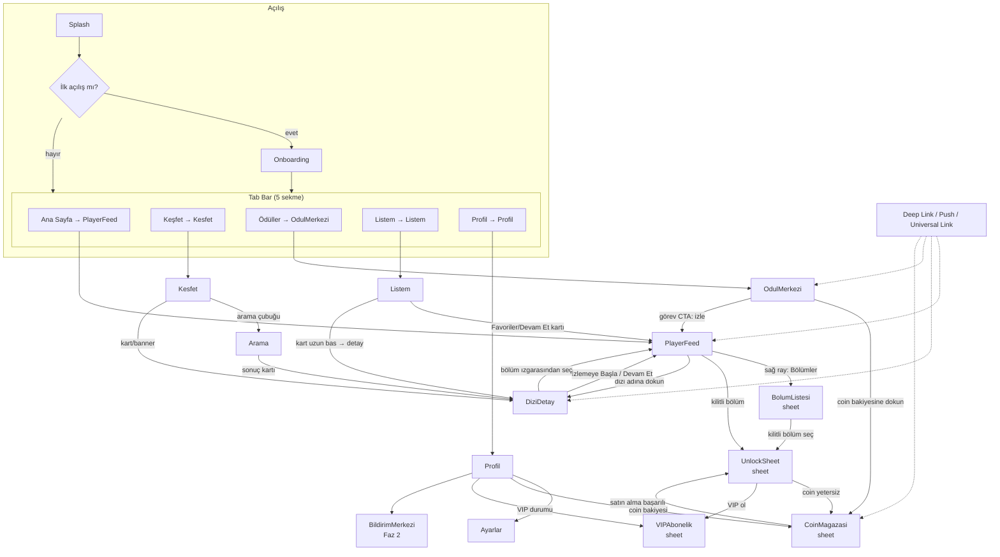

# Ekran Haritası, Navigasyon ve Ekran Spesifikasyonları

**Amaç:** Bu doküman ShortSeries iOS istemcisinin tüm ekranlarını, aralarındaki navigasyon grafiğini, her ekranın bölge bölge layout tarifini, durum makinelerini (boş/yükleniyor/hata/offline), etkileşim-jest haritalarını, edge case'lerini ve analitik eventlerini geliştirme ekibinin doğrudan uygulayabileceği ayrıntıda tanımlar. Ekran ve modül adları proje kanonundaki yazımla birebirdir; bu doküman UI davranış spesifikasyonunun tek doğruluk kaynağıdır.

**İlgili dokümanlar:** `00-genel-bakis.md` (ürün vizyonu ve kuzey yıldızı), `01-ozellik-envanteri.md` (özellik-ekran eşlemesi), `03-mimari.md` (MVVM + Coordinator, SPM modülleri), `04-player-engine.md` (PlayerPool, prefetch, performans bütçeleri), `05-veri-modeli-api.md` (Series/Episode modelleri, `unlockPrice`, feed API), `06-monetizasyon.md` (coin ekonomisi, UnlockSheet iş kuralları, StoreKit 2), `07-retention-gamification.md` (check-in, görevler, push stratejisi), `08-analitik-deney.md` (event şeması, A/B), `09-yol-haritasi-tasklar.md` (faz planı).

---

## 1. Bilgi mimarisi ve navigasyon grafiği

### 1.1 Genel ilkeler

1. **Uygulama doğrudan video ile açılır.** Kök deneyim `PlayerFeed`'dir (Ana Sayfa sekmesi). Splash'tan sonra kullanıcı bir "ana menü" değil, oynayan bir video görür. Kuzey yıldızı #1 (akıcı, kesintisiz izleme) navigasyonun her kararını belirler: izlemeyi bölen her geçiş ya sheet (modal, altta) ya da player'ı duraklatmayan overlay olarak tasarlanır.
2. **Tab bar kalıcıdır, player hariç.** 5 sekmeli tab bar tüm birincil yüzeylerde görünür. `PlayerFeed` tam ekrandır; tab bar player üzerinde yarı saydam overlay olarak durur (bkz. §4.3). Sheet'ler (BolumListesi, UnlockSheet, CoinMagazasi, VIPAbonelik) tab bar'ın üstünde açılır.
3. **Push yerine present tercih edilir** izlemeyi kesintiye uğratacak akışlarda. Örn. kilitli bölüme gelindiğinde `UnlockSheet` player'ın ÜZERİNE `.sheet` olarak gelir; player arkada duraklatılmış ama görünür kalır (bağlam kaybolmaz).
4. **Her sekme kendi navigation stack'ine sahiptir** (Coordinator başına bir `UINavigationController` / SwiftUI `NavigationStack`). Sekme değiştirmek stack'i sıfırlamaz; aynı sekmeye ikinci dokunuş stack'i köke döndürür (iOS platform konvansiyonu).
5. **Deep link her ekrana ulaşabilir.** Tüm rotalar `Route` enum'unda tanımlıdır (§8); push, universal link ve uygulama içi CTA'lar aynı route mekanizmasını kullanır.

### 1.2 Navigasyon grafiği



### 1.3 Ekran envanteri ve sahiplik

| Ekran | Sunum tipi | SPM modülü | Faz |
|---|---|---|---|
| `Splash` | Tam ekran (root replace) | `ShortSeriesApp` | 1 |
| `Onboarding` | Tam ekran (root replace) | `ProfileKit` | 1 |
| `PlayerFeed` | Tam ekran, Ana Sayfa sekmesi kökü | `PlayerKit` | 1 |
| `DiziDetay` | Push (navigation stack) | `ContentKit` (UI: DiscoverKit paylaşımlı bileşenler) | 1 |
| `BolumListesi` | Sheet (player içinden) | `PlayerKit` (veri: `ContentKit`) | 1 |
| `UnlockSheet` | Sheet (paywall) | `WalletKit` | 1 |
| `CoinMagazasi` | Sheet veya push | `WalletKit` | 1 |
| `VIPAbonelik` | Sheet veya push | `WalletKit` | 1 |
| `OdulMerkezi` | Ödüller sekmesi kökü | `RewardsKit` | 1 |
| `Kesfet` | Keşfet sekmesi kökü | `DiscoverKit` | 1 |
| `Arama` | Push (Kesfet stack'i) | `DiscoverKit` | 1 |
| `Listem` | Listem sekmesi kökü | `LibraryKit` | 1 (İndirilenler segmenti Faz 3) |
| `Profil` | Profil sekmesi kökü | `ProfileKit` | 1 |
| `Ayarlar` | Push (Profil stack'i) | `ProfileKit` | 1 |
| `BildirimMerkezi` | Push (Profil stack'i) | `ProfileKit` | 2 |

---

## 2. Tab bar yapısı

### 2.1 Kanonik 5 sekme

| # | Sekme adı | Kök ekran | SPM modülü | İkon önerisi (SF Symbols) |
|---|---|---|---|---|
| 1 | **Ana Sayfa** | `PlayerFeed` (For You akışı) | `PlayerKit` | `play.rectangle.fill` |
| 2 | **Keşfet** | `Kesfet` | `DiscoverKit` | `square.grid.2x2.fill` |
| 3 | **Ödüller** | `OdulMerkezi` | `RewardsKit` | `gift.fill` |
| 4 | **Listem** | `Listem` | `LibraryKit` | `bookmark.fill` |
| 5 | **Profil** | `Profil` | `ProfileKit` | `person.crop.circle.fill` |

### 2.2 Tab bar davranış kuralları

- **Görsel:** dark theme first — OLED siyahı zemin (`DesignSystem` token: `surface.tabBar`), seçili sekme accent renk. `PlayerFeed` üstünde tab bar %85 opaklıkta blur'suz koyu gradyan üzerine oturur; video alanını daraltmaz (video tam ekran, tab bar üstüne biner — safe area alt boşluğu overlay hesabına dahildir).
- **Ana Sayfa'ya dönüş:** başka sekmedeyken Ana Sayfa'ya dokunulduğunda `PlayerFeed` kaldığı karttan devam eder ve oynatma otomatik başlar (ayarlardaki "otomatik oynatma" kapalıysa duraklatılmış poster karesiyle döner).
- **Aynı sekmeye ikinci dokunuş:** stack köke döner. Ana Sayfa'da ikinci dokunuş feed'i en üste (aktif karta) döndürür, feed'i YENİLEMEZ (yenileme yalnızca pull-to-refresh mantığıyla değil, feed sayfalama tükenince otomatik olur — bkz. §4.6 edge case'ler).
- **Ödüller sekmesi badge:** alınmamış check-in ödülü veya tamamlanmış-ama-toplanmamış görev varsa kırmızı nokta badge. Badge durumu `RewardsKit` tarafından yayınlanır (`@Observable RewardsBadgeState`).
- **Sekme değişiminde player:** Ana Sayfa'dan ayrılırken aktif AVPlayer `pause()` edilir, pozisyon SwiftData'ya yazılır (bkz. `04-player-engine.md`), PlayerPool boşaltılmaz (geri dönüş < 100 ms hedefi).
- **Analitik:** her sekme değişimi `tab_selected {tab: home|discover|rewards|mylist|profile, previous_tab}` eventi üretir. † (08 event registry'sinde henüz yok — §3'teki † kuralı ve §9 etki notu geçerli.)

### 2.3 Koordinatör iskeleti

```swift
// ShortSeriesApp/Sources/Coordinators/AppCoordinator.swift
@MainActor
@Observable
final class AppCoordinator {
    enum RootState { case splash, onboarding, main }
    var rootState: RootState = .splash

    let homeCoordinator: HomeCoordinator       // PlayerFeed + sheet'leri
    let discoverCoordinator: DiscoverCoordinator // Kesfet, Arama, DiziDetay
    let rewardsCoordinator: RewardsCoordinator   // OdulMerkezi
    let libraryCoordinator: LibraryCoordinator   // Listem
    let profileCoordinator: ProfileCoordinator   // Profil, Ayarlar, BildirimMerkezi

    var selectedTab: Tab = .home

    func handle(_ route: Route) { /* §8'deki Route enum'unu ilgili koordinatöre yönlendirir */ }
}
```

---

## 3. Ortak durum ve bileşen sözleşmeleri

Tüm ekranlar aşağıdaki dört durumu `DesignSystem` bileşenleriyle standart biçimde işler. Ekran spesifikasyonlarındaki "Durumlar" tabloları bu sözleşmeye ekleme yapar, onu yeniden tanımlamaz.

| Durum | Standart davranış |
|---|---|
| **Yükleniyor** | Skeleton/shimmer placeholder (spinner değil — kart ızgaraları için `DS.SkeletonGrid`, feed için poster blur-up). 400 ms'den kısa yüklemelerde skeleton hiç gösterilmez (flicker önleme). |
| **Boş** | İllüstrasyon + tek cümle + tek CTA (`DS.EmptyState`). CTA her zaman kullanıcıyı içeriğe geri götürür (çoğunlukla Keşfet'e). |
| **Hata** | `DS.ErrorState`: kısa mesaj + "Tekrar Dene" butonu. Hata mesajları teknik detay içermez; hata kodu yalnız log'a gider. 3 ardışık başarısız denemede "Daha sonra tekrar deneyin" varyantına geçilir (exponential backoff, `AppFoundation` network katmanında). |
| **Offline** | Bağlantı yoksa ekran üstünde kalıcı ince banner ("Çevrimdışısın"). Cache'li içerik varsa gösterilir + banner; yoksa `DS.OfflineState`. Bağlantı dönünce banner otomatik kapanır ve bekleyen istekler yeniden denenir. `NWPathMonitor` `AppFoundation`'da tek instance'dır. |

**Analitik konvansiyonu:** `08-analitik-deney.md` §3 event kataloğu **bağlayıcıdır**; bu dokümandaki tüm event adları ve parametreler o katalogla birebir aynıdır. Event adları `snake_case`, kalıp `alan_eylem`'dir (`video_start`, `coin_purchase_success`, `search_query` vb.). Her ekran görünümü `screen_view {screen_name, source}` eventi atar. **† işareti:** † ile işaretlenmiş eventler 08 kataloğunda henüz tanımlı DEĞİLDİR; implementasyondan önce 08 §2 event registry'sine eklenmeleri zorunludur (registry'de olmayan event derlenemez — 08 CI kuralı). Toplu etki notu §9'dadır. `screen_view` da bu kapsamdadır†.

---

## 4. Ekran spesifikasyonları

### 4.1 `Splash`

**Amaç:** Marka anını 1 sn altında tutarken ilk feed'i ve ilk videonun HLS manifest + ilk segmentlerini arka planda hazırlamak. Splash bir bekleme ekranı değil, ön-yükleme maskesidir.

**Layout (bölge bölge):**
- **Merkez:** ShortSeries logosu (statik, animasyonsuz — launch screen storyboard'u ile piksel-uyumlu, geçiş hissedilmez).
- **Alt bölge:** yalnız 1.5 sn'den uzun sürerse beliren ince ilerleme göstergesi (belirsiz progress, `DS.ProgressHairline`).

**Bileşenler:** logo, koşullu progress. Başka hiçbir şey yok — buton yok, sürüm numarası yok.

**Arka planda yürüyen işler (paralel, `TaskGroup`):**
1. Anonim misafir oturumu (ilk açılışta oluştur; sonraki açılışlarda Keychain token yenile) — `AppFoundation`.
2. Remote config + feature flag fetch (500 ms timeout, cache'e düş) — `AppFoundation`.
3. Feed API'den ilk 3 kart (`ContentKit`), ilk kartın HLS manifest'i + prefetch bütçesi kadar segment (~500 KB veya ilk 2 sn — bkz. `04-player-engine.md`).
4. PlayerPool ısındırma: 3 AVPlayer instance'ı oluştur (cold-start maliyeti onlarca ms; splash sırasında öde).

**Durumlar:**

| Durum | Davranış |
|---|---|
| Yükleniyor | Yukarıdaki görsel; maksimum bekleme 2 sn (01 `ONB-01` ile aynı üst sınır) — feed hazır olmasa bile `PlayerFeed`'e geçilir, feed kendi skeleton'ını gösterir. |
| Hata (auth/config) | Config hatası sessizce cache'e düşer. Auth tamamen başarısızsa `PlayerFeed`'e yine geçilir; feed hata durumunu kendisi gösterir. Splash'ta hata UI'ı YOK. |
| Offline | Cache'li feed varsa onunla açıl (izlenmemiş cache'li bölüm oynatılabilir); yoksa `PlayerFeed` offline durumunu gösterir. |

**Etkileşimler:** hiçbiri (dokunma yutulur).

**Edge case'ler:**
- Uygulama versiyonu zorunlu güncelleme eşiğinin altındaysa (remote config `min_supported_version`), Splash'tan sonra zorunlu güncelleme overlay'i gösterilir (spesifikasyon: §4.16).
- Deep link ile açılışta (cold start) Splash yine çalışır ama hedef rota `PendingRoute` olarak saklanır ve root hazır olunca işlenir (§8.4).
- Keychain token'ı geçersizse (401) sessizce yeni misafir hesabı oluşturulur; kullanıcı verisi backend'de cihaz kimliğiyle kurtarılmaya çalışılır (bkz. `05-veri-modeli-api.md`).

**Analitik:** `app_open {launch_type: cold|warm, entry_point: icon|push|deeplink, cold_start_ms}` (08 §3.1 — splash süresi ayrı event değildir, `cold_start_ms` parametresiyle taşınır).

**Kabul kriterleri:**
- [ ] Dönen kullanıcıda Splash → ilk video karesi toplamı < 3 sn (P75, iPhone 12 üstü, iyi ağ).
- [ ] Splash tek başına ≤ 2 sn'de her koşulda terk edilir (01 `ONB-01`).

---

### 4.2 `Onboarding`

**Amaç:** İlk açılışta minimum sürtünmeyle dil ve (isteğe bağlı) tür tercihi almak; bildirim izni ve ATT istemini Onboarding'in SON adımında, değer önerisi ekranından SONRA sunmak (kanon §3, 01 `ONB-05`). Onboarding videoya giden yolda bir baraj değil, hızlandırıcıdır.

**Adımlar (2-3 adım, kanonik):**

| Adım | İçerik | Atlanabilir mi |
|---|---|---|
| 1. Dil seçimi | Cihaz dilinden ön-seçili liste (EN başta; TR/ES/PT ikinci dalga). Tek dokunuş + "Devam". | Hayır (ön-seçim varsayılanla devam edilebilir) |
| 2. Tür tercihi | 8-12 tür kartı (çoklu seçim, görsel ağırlıklı). "Atla" sağ üstte belirgin. Seçimler ilk feed kişiselleştirmesine gider. | Evet |
| 3. Bildirim izni + ATT | **Onboarding'in son adımı, değer önerisi ekranından SONRA** (kanon §3, 01 `ONB-05`, 07 §5.1, 08 §9.1): önce değer önerisi ekranı ("Yeni bölüm çıkınca haber verelim + coin kazan"), ardından uygulama-içi ön-izin (pre-permission) ekranı; kullanıcı kabul ederse sistem bildirim izni diyaloğu. ATT istemi bildirim izninden AYRI bir sistem diyaloğu olarak hemen ardından sunulur. Ön-izinde "Şimdi değil" denirse sistem diyaloğu HİÇ tetiklenmez (hak yakılmaz) ve istem bağlamsal anlara ertelenir (ör. ilk favorileme sonrası — 01 `ONB-05` edge case). | Evet |

**Layout:** tam ekran, üstte ilerleme noktaları (3 nokta), altta birincil CTA (`Devam`), adım 2'de sağ üst `Atla`. Dark zemin, tür kartları 3 sütun ızgara.

**Durumlar:** Onboarding tamamen offline çalışır (dil listesi ve tür listesi bundle'da gömülü; tür listesi remote config ile güncellenebilir ama fallback gömülüdür). Hata durumu yoktur; seçimler UserDefaults + backend'e fire-and-forget senkronize edilir.

**Etkileşimler:** dokunma (seçim), CTA, atla. Jest yok; swipe ile adım geçişi bilinçli olarak kapalı (yanlış pozitif atlamaları önlemek için).

**Edge case'ler:**
- Kullanıcı onboarding ortasında uygulamayı öldürürse: tamamlanan adımlar kaydedilir, sonraki açılışta kalan adımdan devam ETMEZ — doğrudan `PlayerFeed`'e geçilir (dil = cihaz dili, tür = boş). Onboarding'i yarıda bırakan kullanıcıyı tekrar barajlamak retention'a zarar verir. İzin adımı (adım 3) gösterilmeden çıkıldıysa istemler bağlamsal anlara taşınır (ilk favorileme sonrası vb. — 01 `ONB-05` edge case).
- ATT istemi iOS ayarlarından global kapalıysa (`ATTrackingManager.trackingAuthorizationStatus == .restricted/.denied`), ATT ön-açıklaması hiç gösterilmez; bildirim izni adımı etkilenmez.
- Bildirim izni ön-izinde ertelenirse veya sistem diyaloğunda reddedilirse: 30 gün boyunca tekrar sorulmaz; `OdulMerkezi`'ndeki "bildirim izni ver → coin kazan" görevi Ayarlar'a yönlendirir.

**Analitik (08 §3.1):** `onboarding_start`, `onboarding_step_view {step: language|genre|permissions, step_index}`, `onboarding_language_select {language}`, `onboarding_genre_select {genres, genre_count}`, `onboarding_push_prompt {action: grant|deny}`, `onboarding_att_prompt {action: authorized|denied|restricted|not_determined}`, `onboarding_skip {skipped_at_step}`, `onboarding_complete {duration_s}`.

**Kabul kriterleri:**
- [ ] Onboarding, feed prefetch'ini bloklamaz (Splash'ta başlayan TaskGroup arka planda sürer).
- [ ] İlk açılışta hiçbir sistem izni istemi (push/ATT) onboarding adım 1-2 sırasında görünmez; istemler yalnız adım 3'te, değer önerisi ekranından sonra sunulur.
- [ ] Sistem diyaloğundan önce her zaman uygulama-içi ön-izin ekranı gelir; "Şimdi değil" sistem diyaloğunu tetiklemez (01 `ONB-05`).

---

### 4.3 `PlayerFeed` (Ana Sayfa) — birincil yüzey

**Amaç:** Dikey tam ekran For You akışı. Bölüm ilerledikçe aynı dizinin sonraki bölümü otomatik yüklenir; dizi bitince veya kullanıcı diziyi atlayınca yeni dizi önerisi gelir. Uygulamanın kalbi; tüm performans bütçeleri burada geçerlidir (time-to-first-frame < 500 ms, swipe-to-next < 100 ms, 60 fps — bkz. `04-player-engine.md`).

**Teknik zemin:** UIKit `UICollectionView` (dikey paging) + AVPlayer havuzu (3–5 instance, `PlayerPool` actor), SwiftUI'ye `UIViewControllerRepresentable` köprüsü. Overlay UI katmanları SwiftUI ile hücre üzerine bindirilir. Ayrıntı `04-player-engine.md`'de; bu bölüm yalnız UI/UX sözleşmesini tanımlar.

#### 4.3.1 Feed kompozisyon kuralları

- Her kart = bir `Episode`. Kartlar dikey tam ekran, `isPagingEnabled` benzeri snap davranışı (bir seferde tek kart).
- **Dizi-içi ilerleme:** kullanıcı bölümü bitirirse (veya %90'ı geçip yukarı kaydırırsa) bir sonraki kart AYNI dizinin sonraki bölümüdür.
- **Dizi değişimi:** (a) dizi biterse, (b) kullanıcı aynı dizinin ardışık 2 bölümünü < 10 sn izleyip atlarsa, feed yeni dizi önerisine geçer. Öneri mantığı backend'dedir (`05-veri-modeli-api.md`); istemci yalnız `feed/next` sayfalarını tüketir.
- **Kilitli bölüm kartı:** kilitli bölüme gelindiğinde video OYNAMAZ; kart, bulanık poster + kilit rozeti gösterir ve `UnlockSheet` otomatik açılır (§4.3.5).

#### 4.3.2 Overlay UI katmanları (z-sırası, alttan üste)

| Z | Katman | İçerik | Etkileşim |
|---|---|---|---|
| 0 | Video yüzeyi | `AVPlayerLayer` (aspect-fill, portrait) | Jest haritasının hedefi |
| 1 | Gradyan maskeleri | Üstte ve altta %25 yükseklikte siyah→şeffaf gradyan (okunabilirlik için; videoyu karartmaz) | Yok (hit-test kapalı) |
| 2 | **Üst bilgi bölgesi** | Sol: dizi adı (dokunulabilir → `DiziDetay`), altında "Bölüm 7 / 64" etiketi. Mute butonu bilinçli olarak YOKTUR — feed sesli deneyimdir; ses kontrolü donanım volume tuşlarıyladır (`04-player-engine.md` §10.1). | Dizi adı → push `DiziDetay` |
| 3 | **Sağ aksiyon rayı** (dikey, sağ kenara yaslı, alt üçte birlikte) | Yukarıdan aşağıya (04 §8.4 ile birebir aynı liste): **Favori** (kalp + sayaç), **Paylaş** (ok + sayaç), **Bölümler** (liste ikonu, `BolumListesi`'ni açar), **Hız** (0.75x–2x menüsü; seçim dizi bazında korunur — `04-player-engine.md` §8.4), **Altyazı** (dil seçim sheet'i; global tercih, Ayarlar ile senkron — `04-player-engine.md`). Her buton 44×44 pt hit alanı, ikon + altında kısa etiket. | Dokunma; favori YALNIZ bu ray butonundan tetiklenir (çift dokunma seek jestidir, §4.3.3) |
| 4 | **Alt bilgi bölgesi** | Dizi adı (tekrar, kısaltılmış) + bölüm no; altında **ilerleme çubuğu** (tam genişlik, 2 pt; sürüklemeyle scrub — sürükleme sırasında 6 pt'e kalınlaşır + zaman balonu) | Scrub jesti (§4.3.3) |
| 5 | Tab bar | 5 sekme, yarı saydam | Sekme geçişi |
| 6 | Geçici katman | Toast'lar (örn. "Listeme eklendi"), çift-dokunma ±10 sn seek göstergesi (yarım daire ripple + "10" etiketi — 01 `PLR-02`), buffering spinner'ı (yalnız stall ≥ 250 ms olursa — 08 `video_stall` eşiğiyle aynı) | Yok |
| 7 | Sheet'ler | `BolumListesi`, `UnlockSheet` (ve onun açtığı `CoinMagazasi`/`VIPAbonelik`) | Kendi spesifikasyonları |

**Overlay görünürlük kuralı:** katman 2-3-4, video oynarken 4 sn dokunulmazlıktan sonra %40 opaklığa iner (kaybolmaz); herhangi bir dokunuşta tam opaklığa döner. Duraklatıldığında her zaman tam opak.

#### 4.3.3 Jest haritası

| Jest | Bölge | Davranış |
|---|---|---|
| Yukarı kaydır | Tüm kart | Sonraki bölüm/kart. Oynatma < 100 ms'de başlar (havuzdan hazır player). |
| Aşağı kaydır | Tüm kart | Önceki kart. Feed başındaysa elastik bounce (yenileme tetiklemez). |
| Tek dokunma | Video yüzeyi (overlay butonları hariç) | Oynat/duraklat toggle. Duraklatmada büyük yarı saydam play ikonu belirir. |
| Çift dokunma (sağ %40) | Video yüzeyinin sağ %40'ı | **+10 sn seek** (01 `PLR-02`, 04 §8.1). Görsel geri bildirim: yarım daire ripple + "10" etiketi (katman 6). Art arda çift tap'ler birikir (3 kez sağ = +30 sn tek seek). Bölüm sonuna < 10 sn kala bölüm sonuna gider, auto-next tetiklenmez. |
| Çift dokunma (sol %40) | Video yüzeyinin sol %40'ı | **−10 sn seek**. Başa < 10 sn kala 0'a gider. |
| Çift dokunma (orta %20) | Orta bölge | Yok — orta bölge yalnız tek dokunmadır (01 `PLR-02` bölge ayrımı). Favori çift dokunmaya BAĞLI DEĞİLDİR; yalnız sağ ray butonundan tetiklenir. |
| Uzun basma | Video yüzeyi | 2x hız (basılı tutulduğu sürece); bırakınca 1x. Hız rozeti üst ortada. |
| Yatay sürükleme | Alt ilerleme çubuğu ± 24 pt dikey tolerans | Scrub. Sürükleme sırasında player duraklamaz, bırakınca seek (`04-player-engine.md`'deki hassas seek politikası). |
| Sağa kaydır (kenardan) | Sol kenar | Yok (Ana Sayfa kök ekrandır; edge-swipe geri jesti yalnız push edilmiş ekranlarda). |

**Jest çakışma kuralları:** tek/çift dokunma ayrımı için 250 ms bekleme YAPILMAZ — tek dokunma anında oynat/duraklat uygular; sağ/sol %40 bölgesinde 250 ms içinde ikinci dokunma gelirse duraklatma geri alınır ve ±10 sn seek uygulanır (algılanan gecikme sıfır, TikTok kalıbı). Orta %20 bölgede çift dokunma beklenmez (anında tek dokunma davranışı). Scrub jesti dikey kaydırmayı kilitler (`UIGestureRecognizer` öncelik: scrub > paging).

#### 4.3.4 Durumlar

| Durum | Davranış |
|---|---|
| Yükleniyor (ilk) | Splash'tan hazır gelinemediyse: bulanık poster (feed API'den `posterBlurhash`) + shimmer; manifest gelince otomatik oynatma. |
| Yükleniyor (stall) | Video ortasında buffer stall ≥ 250 ms (08 `video_stall` eşiği): ince spinner (katman 6) + otomatik bitrate düşürme (player engine sorumluluğu). |
| Boş | Feed boş dönerse (yalnız ağ/backend arızasında olası): `DS.ErrorState` "Şu an önerecek bir şey bulamadık" + "Tekrar Dene" + Keşfet'e giden ikincil CTA. |
| Hata | Feed API hatası: cache'li son feed sayfası varsa onunla devam + toast; yoksa `DS.ErrorState`. |
| Offline | Cache'li segmentlerle mevcut bölüm izlenmeye devam eder (disk cache ~200 MB LRU); sonraki kart cache'te yoksa kart yerine `DS.OfflineState` kartı ("Bağlantı yok — bağlanınca devam edeceğiz"). Bağlantı dönünce otomatik devam. |
| Veri tasarrufu (hücresel) | Ayarlar'da "veri tasarrufu" açıksa: 480p tavan + prefetch durdurulur (kanonik kural). Feed davranışı değişmez, yalnız kalite/prefetch. |

#### 4.3.5 Kilitli bölüme geliş → `UnlockSheet` akışı

1. Kullanıcı kilitli bölümün kartına kaydırır (veya önceki bölüm biter ve otomatik geçiş kilitli bölüme denk gelir).
2. Kart: bulanık poster + kilit rozeti + "Bölüm 12 · 70 coin" etiketi. **Video oynamaz, ses çalmaz.**
3. `UnlockSheet` 300 ms gecikmeyle otomatik present edilir (kaydırma animasyonu bitince). Kullanıcı sheet'i kapatırsa kart görünür kalır; karttaki "Kilidi Aç" butonu sheet'i yeniden açar.
4. Kullanıcı kilidi açarsa: sheet kapanır, video anında oynar (manifest kilit açılmadan prefetch edilmiş olmalı — imzalı URL yalnız unlock sonrası verilir; bu yüzden prefetch kilitli bölümde manifest DEĞİL poster düzeyindedir, unlock yanıtı imzalı URL döner ve oynatma < 1 sn hedeflenir, bkz. `04-player-engine.md` + `05-veri-modeli-api.md`).
5. Kullanıcı sheet'i kapatıp yukarı kaydırırsa: feed kilitli bölümü ATLAMAZ; bir sonraki kart yeni dizi önerisidir (kilitli bölümler duvarının arkasındaki bölümlere kaydırarak ulaşılamaz).
6. Aşağı kaydırma her zaman serbesttir (önceki, izlenmiş bölümlere dönüş).

Cliffhanger noktasına yerleştirilen kilit (kanon §5) bu akışın dönüşüm anıdır; `UnlockSheet` spesifikasyonu §4.6'dadır, iş kuralları `06-monetizasyon.md`'dedir.

#### 4.3.6 Edge case'ler

- **Bölüm sonu otomatik geçiş:** bölüm bittiğinde 0 gecikmeyle sonraki karta otomatik kaydırma animasyonu (kullanıcı ayarından kapatılabilir: Ayarlar → oynatma tercihleri → otomatik oynatma). Kapalıysa bölüm sonunda tekrar-izle + sonraki-bölüm butonları gösterilir.
- **Arka plana geçiş:** `scenePhase != .active` olduğunda pause; dönüşte kaldığı kareden devam, otomatik oynatma AÇIK. Kilit ekranından/CarPlay'den ses devam ETMEZ (video uygulaması, background audio yok — Faz 1).
- **Kulaklık/AirPods çıkarılması:** pause (platform konvansiyonu).
- **Arama/FaceTime kesintisi:** `AVAudioSession` interruption → pause; kesinti bitiminde `.ended` + `.shouldResume` seçeneği VARSA otomatik sürdürülür (`playImmediately`), yoksa paused kalır ve kullanıcı dokunuşuyla sürer (01 `FEED-09`, `04-player-engine.md` §10.2).
- **Aynı bölümü ikinci kez izleme:** ilerleme çubuğu sıfırdan başlar ama `watch history` korunur; "Devam Et" konumu yalnız ileri gider (regresyon yazılmaz).
- **Feed tükenmesi:** son sayfadan sonra backend `hasMore=false` dönerse: "Hepsini gördün 🎉 Keşfet'e göz at" kartı + Keşfet CTA. Pratikte öneri havuzu döngüseldir, bu kart nadirdir.
- **VIP kullanıcı:** kilitli kart hiç oluşmaz; tüm bölümler açık akar (entitlement kontrolü karta bağlanmadan feed compose edilirken yapılır).
- **Çocuk kilidi/ScreenTime:** iOS ekran süresi kısıtları uygulamayı kapatırsa özel davranış yok (sistem seviyesi).

#### 4.3.7 Analitik eventleri

| Event | Tetik | Ana parametreler (08 §3.2–3.3) |
|---|---|---|
| `feed_impression` | Hücre ekranın ≥ %50'sini ≥ 500 ms kapladığında (oturumda hücre başına 1 kez) | `series_id, episode_id, feed_position, source` |
| `video_start` | İlk kare render edildiğinde | `series_id, episode_id, episode_number, is_locked_content, start_type(auto_advance\|swipe\|tap\|resume), resume_position_s, ttff_ms` |
| `video_progress` | Oynatma konumu %25/50/75/100'ü İLK geçtiğinde (checkpoint başına 1 kez; seek ile atlanan checkpoint gönderilmez) | `series_id, episode_id, checkpoint(25\|50\|75\|100), watch_time_s`. Ayrı bir `video_complete` eventi YOKTUR — tamamlanma ölçümü `checkpoint=100` iledir; feed'in "bölümü bitirdi" kuralı %90 eşiğidir (§4.3.1). |
| `video_stall` | Buffer beklemesi ≥ 250 ms sürüp oynatma durduğunda (stall bitince gönderilir) | `series_id, episode_id, stall_duration_ms, position_s, network_type` |
| `swipe_next` / `swipe_prev` | Kullanıcı kaydırması tamamlandığında (bölüm sonu otomatik geçiş `swipe_next` DEĞİLDİR — yeni bölüm `video_start.start_type=auto_advance` alır) | `from_episode_id, to_episode_id, swipe_latency_ms, watch_pct_at_swipe` (yalnız next) |
| `series_skipped` † | Dizi değişim kuralı (b) tetiklenince | `series_id, episodes_sampled` |
| `favorite_add` / `favorite_remove` | Sağ ray favori butonu (yalnız buton — çift dokunma seek jestidir); event sunucu onayında | `series_id, source` |
| `share_tap` | Paylaş butonu | `series_id, episode_id?, source` → `share_complete {series_id, episode_id?, channel}` |
| `episode_list_opened` † | Bölümler butonu | `series_id, current_episode` |
| `locked_card_shown` † | Kilitli karta geliş | `series_id, episode_number, unlock_price` |
| `scrub_used` † | Scrub bırakılınca | `from_ms, to_ms` |
| `seek_double_tap` † | Çift dokunma seek'i (birikimli seek tek event) | `direction(fwd\|back), total_offset_s` |

**Kabul kriterleri:**
- [ ] Swipe-to-next sonrası ilk kare < 100 ms (P90, prefetch edilmiş kart).
- [ ] 60 fps kaydırma (Instruments ile 1 dk sürekli kaydırmada dropped frame < %1).
- [ ] Overlay butonlarının tamamı VoiceOver etiketli; jestlerin tümünün buton karşılığı var (favori/hız/altyazı = ray butonları; oynat-duraklat ve ±10 sn seek = VoiceOver rotor aksiyonları).
- [ ] Kilitli bölüme kaydırmada ses sızıntısı yok (önceki player mute+pause garanti).

---

### 4.4 `DiziDetay`

**Amaç:** Bir dizinin vitrini: kapak, özet, etiketler, bölüm ızgarası ve izlemeye başlama/devam CTA'sı. Keşfet/Arama'dan gelen kullanıcıyı en kısa yoldan player'a sokmak.

**Layout (yukarıdan aşağıya):**
- **Hero bölge (üst ~%45):** tam genişlik kapak görseli (portrait), üstüne alt-gradyan; sol üst geri butonu, sağ üst paylaş. Gradyan üzerinde: dizi adı (2 satır maks), meta satırı (bölüm sayısı · tür etiketleri · yayın durumu "Tamamlandı / Devam ediyor — Çarşamba yeni bölüm").
- **CTA bölge:** tam genişlik birincil buton: izleme geçmişi yoksa **"İzlemeye Başla"**, varsa **"Devam Et · Bölüm 7"**. Yanında ikincil ikon buton: **listeye ekle** (toggle).
- **Özet bölge:** 3 satır özet, "devamını gör" ile açılır; etiket çipleri (dokununca Kesfet'in o tür filtresine gider).
- **Bölüm ızgarası:** 5 sütun numara hücreleri (1…N). Hücre durumları: izlendi (soluk + tik), kaldığı bölüm (accent çerçeve), açık (normal), **kilitli (kilit ikonu + coin fiyatı `unlockPrice`)**. 30+ bölümlü dizilerde 30'luk aralık sekmeleri ("1-30", "31-60"...).

**Bileşenler:** `DS.HeroCover`, `DS.PrimaryCTA`, `DS.TagChip`, `DS.EpisodeGridCell`, paylaşım `UIActivityViewController`.

**Durumlar:**

| Durum | Davranış |
|---|---|
| Yükleniyor | Hero skeleton + ızgara shimmer. Kapak görseli feed/keşfet kartından `Hero transition` ile taşınırsa anında görünür (matched geometry). |
| Hata | `DS.ErrorState` tam ekran + geri butonu her zaman çalışır. |
| Offline | Cache'li metadata (SwiftData) varsa göster + offline banner; CTA'lar çalışır ama oynatma cache'e bağlı. |
| Boş | Geçersiz `series_id` (kaldırılmış içerik): "Bu dizi artık yayında değil" + Keşfet CTA. Deep link'ten gelişte kritik (bkz. §8). |

**Etkileşimler ve jestler:**
- CTA → `PlayerFeed`'e o dizinin ilgili bölümüyle geçiş: Ana Sayfa sekmesine atlanmaz; player, Keşfet stack'i üzerinde tam ekran push edilir (bağlamsal player). Geri jesti DiziDetay'a döner. Bağlamsal player teknik olarak aynı `PlayerFeed` bileşenidir, feed kaynağı "bu dizinin bölümleri" ile sınırlıdır.
- Izgarada açık bölüme dokun → o bölümden oynat. Kilitli bölüme dokun → `UnlockSheet`.
- Listeye ekle → toggle + toast; `Listem`/Favoriler'e yazar.
- Hero'da aşağı çekme (scroll offset < -80) → dismiss (kapak büyüyerek kapanır).

**Edge case'ler:**
- Devam bölümü kilitliyse CTA "Devam Et · Bölüm 12 🔒" olarak render edilir; dokununca `UnlockSheet`.
- Yayın takvimli dizide (release schedule) gelecek bölümler ızgarada "🗓 Çarşamba" hücresiyle gösterilir; dokununca "hatırlat" (bildirim izni akışına bağlanır, `07-retention-gamification.md`).
- Paylaşım linki universal link üretir (§8.2); dizi kaldırılmışsa link `Kesfet`'e düşer.

**Analitik (08 §3.3):** `series_detail_view {series_id, source, free_episode_count, total_episode_count}`, `favorite_add`/`favorite_remove {series_id, source: dizi_detay}` (listeye ekle toggle'ı), `share_tap`/`share_complete {series_id, channel}`, `series_cta_tapped {type: start|continue, episode_number}` †, `episode_grid_tapped {episode_number, locked}` †, `tag_tapped {tag_id}` †.

---

### 4.5 `BolumListesi`

**Amaç:** Player'dan çıkmadan bölüm atlamayı sağlamak. Player içinden açılan sheet; kilitli bölümler kilit ikonu + coin fiyatıyla işaretlidir.

**Sunum:** `.sheet`, medium detent (%55) + large detent'e sürüklenebilir; arka planda video görünür ve DURAKLATILMAZ (ses sürer) — kullanıcı yalnızca göz atıyor olabilir.

**Layout:**
- **Başlık bölgesi:** dizi adı + toplam bölüm + kapat (X). Sağda mini "dizi detayına git" ok butonu → sheet kapanır, `DiziDetay` push edilir.
- **Izgara:** `DiziDetay` ile aynı `DS.EpisodeGridCell` bileşeni (tek doğruluk kaynağı); mevcut oynayan bölüm accent çerçeveli ve otomatik görünür konuma scroll edilmiş.
- **Alt bölge (koşullu):** kullanıcı VIP değilse ince VIP banner'ı ("Tüm bölümler VIP ile açık") → `VIPAbonelik`.

**Durumlar:** liste zaten player'a yüklenmiş `Series` modelinden beslenir → yükleme durumu pratikte yok; ızgara anında açılır. Metadata bayatsa arka planda tazelenir (fiyat değişimi olabilir — `unlockPrice` API'den dinamik).

**Etkileşimler:**
- Açık bölüm → sheet kapanır, player o bölüme atlar (< 500 ms hedef; manifest prefetch'i sheet açıkken görünür hücreler için başlar).
- Kilitli bölüm → sheet İÇİNDE `UnlockSheet`'e geçiş (sheet stack: BolumListesi üstüne push benzeri içerik değişimi, iOS 17 sheet içi navigation). Unlock başarılıysa player o bölüme atlar.
- Aşağı sürükleme → kapat.

**Edge case'ler:**
- Kullanıcı şu an oynayan bölüme dokunursa: sheet kapanır, hiçbir şey değişmez (yeniden başlatmaz).
- Sıralı kilit atlama: kullanıcı 12 kilitliyken 15'i açmak isterse buna İZİN VERİLİR (her bölüm bağımsız `unlockPrice`); ancak `UnlockSheet` "Önceki 3 bölüm de kilitli" uyarısı gösterir (iş kuralı: `06-monetizasyon.md`).
- 100+ bölümlü dizide ızgara lazy render (`LazyVGrid`), aralık sekmeleri sticky.

**Analitik:** `episode_list_opened` † (player eventi, §4.3.7), `episode_list_item_tapped {episode_number, locked, current_episode}` †, `subscription_view {source}` (VIP banner'ından `VIPAbonelik` açılışında, 08 §3.4). Kilitli bölüm seçiminde `UnlockSheet` açılırsa `episode_unlock_prompt {source: bolum_listesi}` atılır (§4.6).

---

### 4.6 `UnlockSheet` (paywall)

**Amaç:** Kilitli bölüme gelen kullanıcıya üç kilit açma yolunu (coin / rewarded ad / VIP) tek kararlık ekranda sunmak. Coin yetersizse `CoinMagazasi`'na akıtmak. Kategori pratiğinde paywall cliffhanger anına denk gelir (kanon §5); bu ekran uygulamanın en kritik dönüşüm yüzeyidir ve A/B deneylerinin birincil hedefidir (`08-analitik-deney.md`).

**Sunum:** `.sheet`, sabit yükseklik (~%60), arka planda kilitli kart görünür. Sürükleyerek veya X ile kapatılabilir (kapatma her zaman mümkün — karanlık desen yok).

**Layout (yukarıdan aşağıya):**
- **Bağlam bölgesi:** mini poster + "Bölüm 12" + tek satır cliffhanger metni (API'den `teaserText`, varsa).
- **Bakiye satırı:** "Bakiyen: 🪙 35" (WalletStore'dan canlı; `@Observable`). Bakiyeye dokunmak `CoinMagazasi`'nı açar.
- **Seçenek kartları (dikey üç kart):**
  1. **Coin ile aç** — "🪙 70 ile kilidi aç" (fiyat = `unlockPrice`, API'den). Bakiye yeterliyse birincil stil; yetersizse kart "🪙 70 — 35 coin eksik" alt metniyle `CoinMagazasi` CTA'sına dönüşür ("Coin Al").
  2. **Reklam izle** — "Reklam izle, bu bölümü aç (bugün 3/5)" — kalan hak remote config'ten (günde 5–10 cap, kanon §5); 30 sn tamamlama şartı. Cap dolduysa kart devre dışı + "yarın yine gel".
  3. **VIP ol** — "Tüm bölümler + günlük bonus coin" → `VIPAbonelik`. VIP intro teklifi varsa rozet: "İlk hafta $3.99".
- **Alt satır:** "Otomatik aç" toggle'ı (açıksa sonraki kilitli bölümler sorulmadan coin'le açılır; bakiye bitince sheet yine gelir) + gizlilik/şartlar mini linkleri.

**Durumlar:**

| Durum | Davranış |
|---|---|
| Yükleniyor | `unlockPrice` feed metadata'sında gelir → sheet anında dolu açılır. Unlock isteği sürerken birincil buton spinner'lı ve kilitli (çift dokunma koruması). |
| Hata (unlock isteği) | Kart altında satır içi hata: "Açılamadı, tekrar dene". İdempotent istek (aynı `transaction_id` ile güvenli retry — cüzdan backend kuralı, kanon §5). Coin DÜŞMÜŞ ama yanıt kaybolmuşsa retry aynı yanıtı döner, çift harcama olmaz. |
| Offline | Tüm seçenekler devre dışı + offline banner. Sheet kapatılabilir. |
| Rewarded ad dolum hatası | Ad yüklenemezse kart "şu an reklam yok" durumuna düşer (fill yokluğu normaldir), diğer yollar etkilenmez. |

**Etkileşimler:**
- **Coin ile aç (bakiye yeterli):** dokunuş → optimistik UI (buton "Açılıyor…") → `WalletStore.unlock(episodeId)` (actor) → başarıda haptic + sheet kapanır + video başlar. Earned coin önce harcanır (kanon §5); harcama anında kırılım ayrıca gösterilmez, sadece toplam düşer (kırılım görünümü bakiye dokunuşundadır — 01 `PAY-04`, §4.9).
- **Coin ile aç (bakiye yetersiz):** dokunuş → `CoinMagazasi` sheet içi push (§4.7). Satın alma tamamlanınca `UnlockSheet`'e OTOMATİK dönülür, bakiye güncel, birincil buton artık aktif — kullanıcı kaldığı karardan devam eder (akış #3, §5.3).
- **Reklam izle:** tam ekran rewarded ad (AdMob köprüsü `RewardsKit`'te; Faz 2 — Faz 1'de bu kart feature flag ile gizli). 30 sn tamamlanmadan kapatılırsa ödül yok, sheet'e dönülür, hak DÜŞMEZ.
- **VIP ol:** `VIPAbonelik` sheet içi push; abonelik başarılıysa tüm sheet yığını kapanır, video başlar.

**Edge case'ler:**
- Sheet açıkken fiyat değişirse (metadata tazelendi): buton fiyatı günceller + tek seferlik ince vurgu animasyonu. Kullanıcının bastığı andaki fiyat backend'de doğrulanır; uyuşmazlıkta backend fiyatı geçer ve hata satırı "fiyat güncellendi" gösterir.
- VIP kullanıcı bu sheet'i hiç görmez (giriş noktalarında entitlement kontrolü); abonelik sheet açıkken aktifleşirse (başka cihazdan) sheet kendini kapatır ve bölüm açılır.
- "Otomatik aç" toggle durumu kullanıcı hesabına yazılır (cihazlar arası tutarlı).
- Aynı anda iki cihazdan unlock: idempotency backend'de; ikinci istek "zaten açık" döner, coin bir kez düşer.

**Analitik (08 §3.4 — kritik yol, `critical` flush):** `episode_unlock_prompt {series_id, episode_id, unlock_price, coin_balance, options_shown, source(auto_advance|bolum_listesi|dizi_detay)}`, `unlock_coin {series_id, episode_id, unlock_price, earned_spent, purchased_spent, balance_after}` (backend onayında), `unlock_ad {series_id, episode_id, ad_unlocks_used_today, daily_cap}` (Faz 2), `unlock_vip_upsell {series_id, episode_id}` (VIP seçeneğine dokunuş), `coin_store_view {source: unlock_sheet, coin_balance}` (yetersiz bakiye CTA'sı), `unlock_failed {reason}` †, `unlock_sheet_dismissed {watched_options_ms}` †, `auto_unlock_toggled {on}` †.

**Kabul kriterleri:**
- [ ] Unlock başarısı → ilk video karesi < 1 sn (imzalı URL yanıtla gelir).
- [ ] Çift dokunma/çift harcama imkânsız (UI kilidi + idempotent API).
- [ ] Sheet kapatma her durumda tek jestle mümkün.

---

### 4.7 `CoinMagazasi`

**Amaç:** Coin paketlerini bonus kademeleriyle satmak; ilk yükleme teklifini öne çıkarmak. `UnlockSheet` bağlamından gelindiğinde satın alma sonrası kullanıcıyı kaldığı karara geri döndürmek.

**Giriş noktaları:** `UnlockSheet` (sheet içi push — birincil), `OdulMerkezi` bakiye kartı, `Profil` bakiye satırı, deep link `shortseries://store/coins`.

**Layout:**
- **Üst bölge:** mevcut bakiye (büyük, 🪙 + sayı) + "Coin'ler bölüm kilidi açar" tek satır açıklama.
- **İlk yükleme teklifi (koşullu, en üstte):** kullanıcı hiç satın alma yapmadıysa vurgulu kart — "İlk yüklemeye özel 2x bonus" (kanon §5) + geri sayım YOK (sahte aciliyet kullanılmaz).
- **Paket ızgarası (2 sütun):** kanonik 6 kademe — $0.99 / $4.99 / $9.99 / $19.99 / $49.99 / $99.99, artan bonus coin (%0→%100). Her kart: coin miktarı, "+%X bonus" rozeti, StoreKit yerel fiyatı (`Product.displayPrice` — asla hard-coded USD gösterme). En iyi birim fiyat kartında "En avantajlı" rozeti.
- **Alt bölge:** "Satın Alımı Geri Yükle" (restore), şartlar/gizlilik linkleri, "Coin'ler iade edilemez, yalnız uygulama içinde geçerlidir" yasal satırı.

**Bileşenler:** `DS.CoinPackCard`, StoreKit 2 `Product` listesi (`WalletKit`), `DS.Badge`.

**Durumlar:**

| Durum | Davranış |
|---|---|
| Yükleniyor | `Product.products(for:)` sürerken paket kartları skeleton. Timeout 5 sn → hata durumu. |
| Hata | "Mağaza şu an yüklenemedi" + Tekrar Dene. StoreKit hatası ile ağ hatası ayrı loglanır. |
| Offline | Mağaza kapalı durumda; offline banner. |
| Satın alma sürüyor | Seçilen kart spinner'lı, diğer kartlar devre dışı; sistem IAP sheet'i üstte. |
| Pending (Ask to Buy) | "Onay bekleniyor" bilgi durumu; sheet kapatılabilir, sonuç `Transaction.updates` dinleyicisiyle asenkron işlenir. |

**Etkileşimler:**
- Paket → StoreKit 2 `product.purchase()` → başarıda server-side receipt doğrulama (App Store Server API, kanon §2) → cüzdan güncellenir → başarı haptic + coin sayacı animasyonu → **`UnlockSheet`'ten gelindiyse otomatik geri dönüş** (§5.3), aksi halde bu ekranda kalınır.
- Restore → `AppStore.sync()`; coin consumable olduğundan restore edilmez, restore VIP entitlement'ı içindir — kullanıcıya bu ayrım kısa metinle açıklanır.

**Edge case'ler:**
- Satın alma başarılı ama backend doğrulama gecikirse: "Coin'lerin birkaç saniye içinde hesabında" bilgi toast'ı; `Transaction.updates` ile telafi. Coin, doğrulama TAMAMLANMADAN bakiyeye yazılmaz (fraud kuralı, kanon §5).
- `purchase()` iptal (`userCancelled`): sessiz, event loglanır.
- Aile Paylaşımı/Ask to Buy reddi: pending işlem `revoked` gelirse sessizce düşer.
- Fiyat gösterimi: pazarlar arası fiyat App Store tarafından yerelleştirilir; dokümandaki USD rakamları referans kademelerdir — **lansman öncesi güncel App Store fiyatları doğrulanmalı** (rakip fiyatları kaynaklar arasında tutarsız raporlanmaktadır).

**Analitik (08 §3.4):** `coin_store_view {source(unlock_sheet|profil|odul_merkezi|deeplink), coin_balance}`, `coin_purchase_start {product_id, price_usd, coin_amount, bonus_coin_amount, is_first_purchase_offer}` (pakete dokunulup `purchase()` çağrılmadan hemen önce — ayrı bir "pakete dokundu" eventi yoktur), `coin_purchase_success {product_id, price_usd, coin_amount, bonus_coin_amount, transaction_id, balance_after}` (yalnız server-side doğrulama sonrası), `coin_purchase_fail {product_id, error_domain, error_code, stage(storekit|verification|wallet)}`, `coin_purchase_cancel {product_id}`, `restore_tapped` †.

---

### 4.8 `VIPAbonelik`

**Amaç:** Abonelik planlarını ve ayrıcalıkları satmak: tüm bölümler açık + günlük bonus coin + reklamsız (kanon §5).

**Giriş noktaları:** `UnlockSheet` "VIP ol", `BolumListesi` alt banner, `Profil` VIP durumu, `OdulMerkezi` (VIP değilse tanıtım kartı), deep link `shortseries://store/vip`.

**Layout:**
- **Üst bölge:** VIP değer önerisi — üç ikonlu satır: "Tüm bölümler açık", "Her gün bonus coin", "Reklamsız".
- **Plan seçici (dikey 3 kart):** haftalık $5.99 (rozet: "İlk hafta $3.99" intro teklifi), aylık $14.99, yıllık $49.99 (rozet: "En avantajlı — haftalık maliyetin çok altında"). Fiyatlar StoreKit `displayPrice` ile yerel; USD değerleri kanonik referanstır.
- **CTA:** tek birincil buton, seçili plan metniyle ("Haftalık başlat — ilk hafta $3.99").
- **Alt bölge:** otomatik yenileme açıklaması (App Store zorunlu metni), Restore, şartlar/gizlilik. Mevcut aboneyse bu ekran "yönetim" moduna döner: aktif plan, yenileme tarihi, "Aboneliği Yönet" (`manageSubscriptionsSheet`).

**Durumlar:** `CoinMagazasi` ile aynı yükleme/hata/offline sözleşmesi. Ek: **intro teklifi uygunluğu** — StoreKit `subscription.introductoryOffer` uygunluk kontrolü; uygun değilse rozet gizlenir, normal fiyat gösterilir.

**Etkileşimler:** plan seç → CTA → `purchase()` → başarıda entitlement anında güncellenir (`Transaction.currentEntitlements`), tüm kilitli içerik açılır, açık sheet yığını kapanır ve bağlama dönülür (kilitli bölümden gelindiyse video başlar).

**Edge case'ler:**
- Yükseltme/düşürme (haftalık→yıllık): StoreKit aynı abonelik grubunda otomatik yönetir; UI "mevcut planın yerine geçer" notu gösterir.
- Süresi dolan abonelik: entitlement düşünce daha önce VIP'le izlenen kilitli bölümler tekrar kilitlenir; kullanıcının coin ile açtıkları AÇIK kalır (kalıcı unlock — iş kuralı `06-monetizasyon.md`).
- Grace period / billing retry: entitlement `Transaction` yenilenene dek korunur (Server Notifications V2 sinyaliyle, `05-veri-modeli-api.md`).

**Analitik (08 §3.4):** `subscription_view {source(unlock_sheet|profil|onboarding|deeplink)}`, `subscription_start {product_id(vip_weekly|vip_monthly|vip_yearly), price_usd, has_intro_offer}` (`purchase()` öncesi — plan seçimi ayrı event değildir), `subscription_success {product_id, price_usd, is_intro, transaction_id}`, `subscription_fail {product_id, error_domain, error_code, stage}`, `subscription_cancel_intent {product_id}` ("Aboneliği Yönet" açılışında). Yenileme/iade/grace period event'leri istemciden GÖNDERİLMEZ (Server Notifications V2 — 08 §3.4 notu).

---

### 4.9 `OdulMerkezi` (Ödüller sekmesi)

**Amaç:** Ödeme yapmayan kullanıcıya coin kazandıran retention motoru: günlük check-in takvimi, görev listesi, rewarded ad kartı ve coin bakiyesi tek yüzeyde. Mekanik ayrıntıları `07-retention-gamification.md`'de.

**Layout (yukarıdan aşağıya, dikey scroll):**
- **Bakiye kartı:** 🪙 toplam bakiye (büyük, tek sayı) + "Coin Al" mini CTA (→ `CoinMagazasi`). Toplam bakiyeye dokununca purchased/earned kırılımı ve (varsa) yaklaşan son kullanma tarihi uyarısı görünür (01 `PAY-04`, 06 §2.4/§7.1; vade çipi `RWD-05`).
- **Günlük check-in takvimi:** 7 hücreli yatay şerit (Gün 1…7), artan ödüller (10–50 coin aralığı, kanon §5; kesin değerler remote config). Bugünün hücresi vurgulu; geçmiş günler tik, gelecek günler kilitli. Tek dokunuşla "Ödülü Al" → coin uçuş animasyonu bakiyeye. Streak bonusu 7. günde rozetli. Gün kaçırılırsa döngü 1'e döner (streak kuralları `07-retention-gamification.md`).
- **Rewarded ad kartı (Faz 2, feature flag):** "Reklam izle +X coin (bugün 3/5)". Cap remote config (günde 5–10).
- **Görev listesi:** dikey kartlar — örnek görev tipleri (kanon §5): "Bugün 3 bölüm izle (2/3)", "Bir dizi favorile", "Bir bölüm paylaş", "Bildirimleri aç". Her kart: ilerleme çubuğu + ödül + duruma göre CTA ("Git" → ilgili yüzeye deep link; "Topla" → coin animasyonu). Earned coin'lerin son kullanma tarihi varsa kartta "X gün içinde kullan" notu.
- **VIP tanıtım kartı (VIP değilse, en altta):** → `VIPAbonelik`.

**Durumlar:**

| Durum | Davranış |
|---|---|
| Yükleniyor | Check-in şeridi + görev kartları skeleton. |
| Hata | Bakiye cache'ten gösterilir (SwiftData) + hata banner'ı; "Topla" aksiyonları devre dışı (ödül verme her zaman server-authoritative). |
| Offline | Görüntüleme cache'ten; tüm toplama aksiyonları devre dışı + offline banner. |
| Boş | Görev listesi boş dönerse (config hatası): yalnız check-in + bakiye gösterilir. |

**Etkileşimler:** ödül toplama (server round-trip, optimistik DEĞİL — coin bakiyesi asla istemcide uydurulmaz), görev CTA deep link'leri (`shortseries://home`, `shortseries://discover` vb.), pull-to-refresh.

**Edge case'ler:**
- Gün sınırı saat dilimi: check-in günü kullanıcının cihaz saat dilimiyle değil, backend'in kullanıcıya sabitlediği takvimle hesaplanır (seyahatte çifte check-in engellenir; kural `07-retention-gamification.md`).
- Aynı anda iki cihazdan "Topla": idempotent; ikinci istek "zaten toplandı" döner, UI durumu senkronlar.
- Görev ilerlemesi gerçek zamanlı değildir; sekmeye her gelişte tazelenir + izleme görevleri lokal sayaçla iyimser gösterilir, toplama anında server doğrular.
- Bildirim izni görevi: izin zaten verilmişse görev otomatik tamamlanmış gelir.

**Analitik (08 §3.5):** `checkin_view {current_streak_day, can_claim_today}`, `checkin_claim {streak_day, coin_reward, is_streak_bonus}` (backend onayında), `checkin_streak_break {broken_at_day, previous_streak_length}`, `mission_view {mission_ids, mission_count}`, `mission_progress {mission_id, progress_pct}`, `mission_complete {mission_id, mission_type}`, `mission_claim {mission_id, coin_reward, expires_at?}`, `rewarded_ad_start`/`rewarded_ad_complete`/`rewarded_ad_fail {placement: odul_merkezi, ads_used_today, daily_cap}` (Faz 2), `task_cta_tapped {task_id}` †, `rewards_vip_card_tapped` †.

---

### 4.10 `Kesfet` (Keşfet sekmesi)

**Amaç:** Discovery kuzey yıldızını taşıyan editoryal + algoritmik vitrin: banner, koleksiyon rafları, sıralamalar (Trend, Yeni, Top 10) ve tür filtreleri.

**Layout (dikey scroll, raf mimarisi):**
- **Üst sabit bölge:** arama çubuğu görünümlü buton (dokununca `Arama`'ya push — klavye orada açılır) + yatay tür filtre çipleri ("Tümü", tür listesi; tek seçim).
- **Banner karuseli:** tam genişlik, otomatik kayan (5 sn, kullanıcı dokununca durur), 3-6 editoryal banner; her banner bir diziye veya koleksiyona gider.
- **Raflar (sıralama backend'den, `layout API`):**
  - **Trend** — yatay kart rafı (poster 2:3, başlık + tür alt yazı)
  - **Yeni** — yatay raf
  - **Top 10** — büyük sıra numaralı özel raf (numara poster'ın soluna taşar)
  - **Koleksiyonlar** — temalı raflar ("CEO Romance", "İntikam" vb., backend editoryal)
  - **Senin İçin** — kişiselleştirilmiş raf (feed'le aynı öneri motoru)
- Her raf başlığının sağında "Tümü" → dikey ızgara sayfası (aynı stack'te push, başlık = raf adı).

**Tür filtresi davranışı:** çip seçilince raf yapısı korunur, içerik filtrelenir (yeni layout API çağrısı `genre` parametresiyle). "Tümü" seçiliyken varsayılan kompozisyon.

**Durumlar:**

| Durum | Davranış |
|---|---|
| Yükleniyor | Banner + 3 raf skeleton'ı. Cache'li layout varsa önce o, arkada tazeleme (stale-while-revalidate). |
| Hata | Cache varsa cache + banner; yoksa `DS.ErrorState`. |
| Offline | Cache'li vitrin + offline banner; kartlara dokunulabilir (DiziDetay cache'ten). |
| Boş | Filtre sonucu boşsa: "Bu türde henüz içerik yok" + filtre temizleme CTA. |

**Etkileşimler:** kart → `DiziDetay` (kapak matched-geometry geçişi), banner → dizi/koleksiyon, pull-to-refresh (layout yenile), raf içi yatay scroll (prefetch: görünür + 4 kart poster ön-yükleme).

**Edge case'ler:**
- Layout API sürümlemesi: istemci bilmediği raf tipini SESSİZCE atlar (ileri uyumluluk).
- Banner'da kampanya derin linki olabilir (`shortseries://store/coins` dahil) — banner action'ları da Route enum'undan geçer.
- Top 10 rafında bölge parametresi backend'den gelir (ABD önceliği, kanon §1).

**Analitik:** `screen_view {screen_name: kesfet}` †, `discover_banner_tapped {banner_id, position}` †, `discover_card_tapped {series_id, shelf_id, position}` †, `discover_shelf_see_all {shelf_id}` †, `genre_filter_selected {genre_id}` †, `discover_refreshed` †. Karttan `DiziDetay` açılışı `series_detail_view {source: kesfet}` atar (08 §3.3).

---

### 4.11 `Arama`

**Amaç:** Ada/etikete göre hızlı bulma: otomatik tamamlama, popüler aramalar, sonuç ızgarası.

**Layout:**
- **Üst:** arama çubuğu (otomatik odak + klavye), sağında "İptal" (Kesfet'e döner).
- **Boş sorgu durumu (varsayılan):** iki bölüm — **Son aramaların** (yatay çipler, tek tek silinebilir, "temizle") ve **Popüler aramalar** (backend'den, numaralı dikey liste).
- **Yazarken:** otomatik tamamlama listesi (debounce 300 ms — 01 `DSC-03`, 03 §7.3 ve 08 §3.3 ile aynı değer; min 2 karakter): dizi adı eşleşmeleri (mini poster + ad) + sorgu önerileri. Enter/öneri seçimi → sonuç moduna geçer.
- **Sonuç modu:** 3 sütun poster ızgarası (`DS.PosterGridCell`: kapak + ad + tür). Sonsuz scroll sayfalama.

**Durumlar:**

| Durum | Davranış |
|---|---|
| Yükleniyor | Otomatik tamamlama: satır shimmer (spinner yok). Sonuçlar: ızgara skeleton. |
| Boş (sonuç yok) | "'X' için sonuç yok" + popüler aramalar tekrar gösterilir + Keşfet CTA. Sıfır-sonuç sorguları analitikte ayrıca izlenir (içerik boşluğu sinyali). |
| Hata | Satır içi hata + Tekrar Dene; yazılan sorgu korunur. |
| Offline | Arama devre dışı + offline banner; son aramalar görünür ama dokunulamaz durumda değil — cache'li `DiziDetay`'ı açabilir. |

**Etkileşimler:** yazma (debounce'lı öneri), öneri/sonuç dokunuşu → `DiziDetay`, çip dokunuşu → sorguyu doldur + ara, klavye "Ara" → sonuç modu, scroll başlayınca klavye kapanır (`.interactively`).

**Edge case'ler:**
- Yapıştırılan uzun metin 100 karakterde kırpılır.
- Otomatik tamamlama yanıtları sorgu sırası dışı gelirse (race), yalnız en güncel sorgunun yanıtı render edilir (`Task` iptali, `async let` yerine tek aktif arama Task'i).
- Arama geçmişi cihazda tutulur (SwiftData, en çok 10 — 01 `DSC-03`), hesaba senkronlanmaz (Faz 1).

**Analitik (08 §3.3):** `search_open {source}`, `search_query {query, result_count, is_autocomplete}` (sonuçlar render edildiğinde, 300 ms debounce sonrası — sonuç sayısı ayrı event değil, `result_count` parametresidir), `search_no_result {query}`, `search_result_tap {query, series_id, result_position}`.

---

### 4.12 `Listem` (Listem sekmesi)

**Amaç:** Kullanıcının kişisel kütüphanesi: üç segment — **Favoriler**, **Devam Et** (izleme geçmişi + kaldığı yer), **İndirilenler** (Faz 3).

**Layout:**
- **Üst:** segment kontrolü (3 segment; İndirilenler Faz 3'e kadar gizli — feature flag).
- **Favoriler:** 3 sütun poster ızgarası, eklenme tarihine göre yeni→eski. Sağ üst "Düzenle" → çoklu seçim + kaldır.
- **Devam Et:** dikey liste kartları — mini poster + dizi adı + "Bölüm 7 · %62" + ilerleme çubuğu + son izleme zamanı ("dün"). Sıralama: son izlenen en üstte. Kartta hızlı oynat butonu.
- **İndirilenler (Faz 3):** indirilen bölümler + kapladığı alan + yönetim; `AVAssetDownloadTask` altyapısı (`04-player-engine.md`).

**Durumlar:**

| Durum | Davranış |
|---|---|
| Yükleniyor | Veri SwiftData'dan → pratikte anlık. Uzak senkron arka planda (server izleme geçmişi ile birleşme kuralı: en ileri konum kazanır). |
| Boş (Favoriler) | "Henüz favorin yok — kalbe dokun, burada birikir" + Keşfet CTA. |
| Boş (Devam Et) | "İzlemeye başladıkların burada görünür" + Ana Sayfa CTA. |
| Hata/Offline | Lokal veri her zaman gösterilir; yalnız senkron sessizce ertelenir. Bu sekme offline'da tam işlevseldir (oynatma cache'e bağlı). |

**Etkileşimler:**
- Devam Et kartı → `PlayerFeed` bağlamsal player, kaldığı konumdan (startTime) oynatma.
- Favori kartı → dokunma: diziyi kaldığı yerden oynat (izlenmemişse 1. bölüm); **uzun basma** → context menu: "Detaya Git" (`DiziDetay`), "Favorilerden Kaldır", "Paylaş".
- Devam Et kartında sola kaydırma → "Kaldır" (izleme geçmişinden gizler; geçmiş verisi silinmez, `is_hidden`).

**Edge case'ler:**
- Devam bölümü kilitliyse kart rozeti 🔒; dokununca `UnlockSheet`.
- Dizi yayından kalktıysa kart soluk + "yayında değil"; dokununca kaldırma önerisi.
- Misafir → hesap bağlama sonrası: lokal liste server'la birleştirilir (union; çakışmada en ileri izleme konumu).

**Analitik:** `screen_view {screen_name: listem, segment}` †, `mylist_segment_changed {segment}` †, `continue_watching_tapped {series_id, episode_number, progress_pct}` †, `favorite_opened {series_id}` †, `favorite_remove {series_id, source: listem}` (favori kaldırma — 08 §3.3), `mylist_item_removed {segment, series_id}` † (Devam Et gizleme). Karttan oynatma `video_start {start_type: resume}` atar (08 §3.2).

---

### 4.13 `Profil` (Profil sekmesi)

**Amaç:** Hesap durumu, coin/VIP durumu, izleme geçmişi ve Ayarlar'a giriş.

**Layout (dikey liste):**
- **Hesap kartı:** misafir ise "Misafir" + **"Hesabını bağla"** CTA (Apple/Google/e-posta — ilerlemeyi kaybetme mesajıyla); bağlıysa avatar + ad + e-posta.
- **Cüzdan satırı:** 🪙 bakiye + "Coin Al" (→ `CoinMagazasi`).
- **VIP satırı:** VIP değilse "VIP'e geç" tanıtımı (→ `VIPAbonelik`); VIP ise plan + yenileme tarihi (→ `VIPAbonelik` yönetim modu).
- **İzleme geçmişi satırı:** → `Listem`/Devam Et segmentine atlar (sekme değişimi ile).
- **BildirimMerkezi satırı (Faz 2):** → `BildirimMerkezi`, okunmamış rozeti.
- **Ayarlar satırı:** → `Ayarlar`.
- **Alt bölge:** yardım/destek (→ Destek/Yardım, aşağıda), uygulama sürümü.

**Durumlar:** hesap/cüzdan verisi cache-first; hata durumunda son bilinen değerler + banner. Offline'da satın alma satırları devre dışı.

**Etkileşimler:** satır dokunuşları (push/sheet), hesap bağlama akışı (`ProfileKit` auth UI; Apple/Google/e-posta — `05-veri-modeli-api.md` kimlik bölümü).

**Edge case'ler:**
- Hesap bağlama çakışması: bağlanan kimlik başka hesaba kayıtlıysa "hesap birleştirme" akışı (hangi ilerleme korunacak seçimi) — ayrıntı `05-veri-modeli-api.md`.
- Çıkış yap: misafir moduna döner; lokal izleme verisi cihazda kalır, cüzdan server'da hesaba bağlı kalır.

#### 4.13.1 Destek/Yardım

Fiyat/ödeme şikayeti kategorinin 1 numaralı puan riskidir (00 §7.4: şikayet sinyali veren kullanıcıya önce destek akışı gösterilir); tanımlı bir destek yüzeyi olmadan bu sinyal iade ve 1-yıldıza dönüşür. Bu alt bölüm destek yüzeyinin UI sözleşmesidir.

**Giriş noktaları:**
- `Profil` alt bölgesindeki "Yardım/Destek" satırı (birincil).
- Satın alma/unlock hata durumları: `CoinMagazasi`/`UnlockSheet`/`VIPAbonelik` hata satırlarında "Sorun mu var? Destek" linki; özellikle `RECEIPT_INVALID` sonucu destek akışına yönlendirilir (`06-monetizasyon.md`).
- Ayarlar → hesap yönetimi (hesap/cüzdan sorunları).

**Layout (push, Profil stack'i):**
- **SSS bölümü:** remote config/backend'den beslenen SSS listesi (kategoriler: coin & satın alma, VIP abonelik, oynatma sorunları, hesap & cihaz değişimi); offline fallback bundle'da gömülü temel set.
- **"Destek talebi oluştur" formu:** kategori seçimi + serbest metin + e-posta (hesap bağlıysa ön-dolu). Ödeme kategorisinde ilgili işlemin **destek kodu otomatik iliştirilir** — destek kodu `transactionID`'ye bağlıdır (03 §10.2); kullanıcı elle kod aramaz. Cihaz/OS/uygulama sürümü ve `user_id` (opak) otomatik eklenir; PII kuralları `08-analitik-deney.md` §2 ile uyumlu.
- **Apple iade yönlendirmesi:** satın alma sorunlarında "İade talep et" satırı → `Transaction.beginRefundRequest(in:)` sistem sheet'i (uygulama içi, StoreKit 2); alternatif olarak Apple "Sorun Bildir" (reportaproblem.apple.com) linki. İade kararı Apple'ındır; sonuç Server Notifications V2 ile backend'e düşer (`06-monetizasyon.md`).
- **Misafir hesap/cüzdan kurtarma:** cihaz kaybı/değişiminde misafir cüzdanının kurtarılması için talep satırı — kullanıcıdan eski cihaza dair kanıt (son satın alma destek kodu / `transactionID`) istenir, talep destek formu üzerinden backend'e gider (kimlik doğrulama ve birleştirme kuralı `05-veri-modeli-api.md`). Önleyici mesaj: "Hesabını bağla, ilerlemen güvende olsun" CTA'sı bu ekranda da gösterilir.

**Durumlar:**

| Durum | Davranış |
|---|---|
| Yükleniyor | SSS listesi skeleton; form her zaman kullanılabilir (içerik gömülü). |
| Hata | SSS yüklenemezse gömülü temel set + banner; form gönderimi başarısızsa taslak lokalde saklanır, "Tekrar Dene". |
| Offline | SSS gömülü set; form taslağı kaydedilir, bağlantı dönünce gönderilir + bilgi toast'ı. |
| Gönderildi | Talep numarası gösterilir + "e-postandan takip edebilirsin". |

**Analitik:** `support_opened {source(profil|coin_store|unlock_sheet|vip|ayarlar)}` †, `support_faq_viewed {faq_id}` †, `support_ticket_submitted {category, has_transaction_ref}` †, `refund_request_opened {product_id}` †, `wallet_recovery_requested` †.

**Etki notları:** Bu yüzeyin 01'e özellik kaydı (yeni `SUP-XX` maddeleri) ve 09'a task açılması gerekir (bkz. §9).

**Analitik (ekran geneli):** `screen_view {screen_name: profil}` †, `link_account_started {provider}` †, `link_account_success/failed {provider}` †, `profile_row_tapped {row}` †.

---

### 4.14 `Ayarlar`

**Amaç:** Dil (uygulama + altyazı), bildirim tercihleri, oynatma tercihleri, hesap yönetimi ve yasal sayfalar.

**Layout (gruplu liste):**

| Grup | Satırlar |
|---|---|
| Dil | Uygulama dili; Altyazı dili (bağımsız seçim — çok dilli altyapı, kanon §1) |
| Bildirimler | Ana anahtar (sistem iznine bağlı; kapalıysa Ayarlar'a yönlendir); tip bazlı anahtarlar: yeni bölüm, devam hatırlatması, coin/ödül, öneriler (push stratejisi `07-retention-gamification.md`) |
| Oynatma | Otomatik oynatma (bölüm sonu otomatik geçiş) — varsayılan AÇIK; Veri tasarrufu (hücreselde 480p + prefetch durdur) — varsayılan KAPALI |
| Hesap | Hesap bağla/yönet; Çıkış yap; **Hesabı sil** (App Store zorunluluğu — onay akışı + server silme) |
| Yasal | Şartlar, Gizlilik, Açık kaynak lisansları |

**Durumlar:** tercihi anında uygular (UserDefaults + hesap senkronu fire-and-forget). Ağ gerektiren tek işlem hesap silme — spinner + hata durumu.

**Edge case'ler:**
- Uygulama dili değişimi: yeniden başlatma GEREKTİRMEZ (SwiftUI locale environment yeniden inject edilir); feed içeriği yeni dile göre tazelenir.
- Altyazı dili değişimi aktif player'a anında uygulanır (sonraki segment sınırında).
- Hesap silme: 2 adımlı onay ("SİL" yazma değil, düz onay diyaloğu + geri alınamaz uyarısı); silme sonrası misafir moduna sıfırlanır.

**Analitik:** `settings_changed {key, value}` † (tek generic event), `account_delete_started/completed` †. Bildirim ana anahtarı kapatıldığında ayrıca `push_disabled {source: ayarlar}` atılır (08 §3.6).

---

### 4.15 `BildirimMerkezi` (Faz 2)

**Amaç:** Push'a paralel uygulama içi bildirim listesi: yeni bölüm duyuruları, ödül hatırlatmaları, kampanyalar. Push izni vermeyen kullanıcıya da retention yüzeyi sağlar.

**Layout:** dikey liste — ikon (tip bazlı) + başlık + gövde + zaman + okunmamış nokta. Üstte "tümünü okundu say".

**Durumlar:** boş ("Henüz bildirimin yok"), yükleniyor (skeleton satırlar), hata/offline (cache'li liste + banner).

**Etkileşimler:** satır dokunuşu → bildirimin `route` alanı Route enum'una çözülür (yeni bölüm → player, ödül → `OdulMerkezi`...); sola kaydır → sil.

**Edge case'ler:** bildirim hedefi artık geçersizse (dizi kaldırıldı) → `Kesfet` fallback (§8.4 ile aynı kural). Liste server-side 90 gün saklanır.

**Analitik:** `notification_center_opened {unread_count}` †, `notification_item_tapped {type, route}` †.

---

### 4.16 Zorunlu güncelleme & bakım modu overlay'i

**Amaç:** Desteklenmeyen sürümleri güvenle durdurmak ve backend bakım pencerelerinde kullanıcıya net durum göstermek. Overlay `AppCoordinator`'dan yönetilir (03 §3.1) ve root'un ÜZERİNE tam ekran biner; hangi ekranda tetiklenirse tetiklensin görünür.

**Layout:**
- **Zorunlu güncelleme:** uygulama ikonu + başlık ("Güncelleme gerekli") + kısa açıklama + tek birincil CTA: **"App Store'da Güncelle"** (App Store ürün sayfasına yönlendirir). Başka aksiyon yok.
- **Bakım modu:** bakım ikonu + mesaj (remote config'ten, fallback gömülü metin) + varsa tahmini bitiş saati + "Tekrar Dene" butonu.

**Tetik kaynakları:**
1. HTTP `426 UPGRADE_REQUIRED` yanıtı (herhangi bir API çağrısından — 05).
2. Remote config `min_supported_version` < mevcut sürüm karşılaştırması (Splash'ta ve foreground dönüşlerinde kontrol edilir — §4.1 edge case).
3. Remote config `maintenance` bayrağı (bakım modu). **Etki notu:** `GET /config` yanıtına `maintenance {enabled, message, estimated_end?}` ve `min_supported_version` alanlarının eklenmesi 05'e işlenmelidir (bkz. §9).

**Kurallar:**
- Overlay **kapatılamaz** (swipe/tap ile dismiss yok); zorunlu güncellemede tek çıkış App Store CTA'sıdır.
- Bakım modunda "Tekrar Dene" + 30 sn'de bir otomatik config yoklaması; bayrak düşünce overlay kendini kapatır ve bekleyen istekler yeniden denenir.
- Aktif oynatma varsa overlay gelmeden player `pause()` edilir ve pozisyon yazılır; IAP işlemi SÜRÜYORSA overlay işlem sonuçlanana dek bekletilir (§8.4 kural 2 ile aynı ilke).
- Deep link'ler `PendingRoute` olarak saklanır; overlay kalkınca işlenir.

**Durumlar:** overlay'in kendisi tek durumdur; ağ yoksa bakım yoklaması sessizce bekler (offline banner kuralı §3).

**Analitik:** `force_update_shown {current_version, min_supported_version}` †, `force_update_cta_tapped` †, `maintenance_shown {estimated_end?}` †, `maintenance_ended {duration_s}` †.

---

## 5. Kritik uçtan uca akışlar

Aşağıdaki akışlar sprint kabul testlerinin temelidir. Her adımda köşeli parantez içinde atılan analitik eventi verilmiştir.

### 5.1 Akış 1 — İlk açılış → ilk video < 3 sn

**Hedef:** cold start'tan ilk video karesine ≤ 3 sn (P75, iPhone 12+, iyi ağ). Onboarding adımlarında kullanıcının seçim süresi bütçeye dahil değildir; teknik boru hattı kullanıcıyı asla bekletmez.

| # | Adım | Sorumlu | Bütçe |
|---|---|---|---|
| 1 | Process launch + `Splash` render | iOS + `ShortSeriesApp` | ~400 ms |
| 2 | Paralel: misafir auth + remote config + **feed API (ilk 3 kart)** [`app_open`] | `AppFoundation`, `ContentKit` | ~700 ms |
| 3 | Paralel: ilk kartın HLS manifest + ~500 KB / ilk 2 sn segment prefetch; PlayerPool ısındırma (3 instance) | `PlayerKit` | ~900 ms |
| 4 | İlk açılışsa `Onboarding` adım 1-3 (dil, tür, izinler — izin adımı değer önerisi ekranından SONRA, §4.2) — prefetch arka planda sürer; değilse doğrudan 5 | `ProfileKit` | kullanıcı hızı |
| 5 | `PlayerFeed` görünür, hazır player'a `play()` [`video_start {ttff_ms}`] | `PlayerKit` | TTFF < 500 ms |

**Toplam teknik yol (adım 1+2+3+5):** ~2.5 sn < 3 sn hedefi. Adım 2-3 çakışık yürür (TaskGroup).

**Hata dalları:** feed gecikirse Splash 2 sn'de terk edilir → `PlayerFeed` skeleton; auth başarısızsa içerik anonim public feed'den başlar (imzalı URL gerektirmeyen ücretsiz bölümler — `05-veri-modeli-api.md`). Bildirim/ATT istemleri onboarding adım 1-2 sırasında ve `PlayerFeed`'e teknik geçiş yolunda YOKTUR; yalnız Onboarding'in son adımında, değer önerisi ekranından sonra sunulur (§4.2, 01 `ONB-05`).

### 5.2 Akış 2 — Kilitli bölüme gelme → coin ile açma (bakiye yeterli)

1. Kullanıcı Bölüm 11'i bitirir; otomatik geçiş Bölüm 12'ye kaydırır — Bölüm 12 kilitli (kilit cliffhanger'a denk, kanon §5). [`locked_card_shown` †]
2. Kart: bulanık poster + "Bölüm 12 · 🪙 70". Ses yok. 300 ms sonra `UnlockSheet` otomatik açılır. [`episode_unlock_prompt {source: auto_advance}`]
3. Kullanıcı "🪙 70 ile kilidi aç"a dokunur (bakiye 120); UI kilitlenir.
4. `WalletStore.unlock(episodeId, idempotencyKey)` → backend earned-önce düşer (70 = 50 earned + 20 purchased), imzalı HLS URL döner. [`unlock_coin {earned_spent: 50, purchased_spent: 20, balance_after: 50}`]
5. Sheet kapanır, haptic, bakiye 120→50 animasyonu, video < 1 sn'de oynar. [`video_start {is_locked_content: true}`]
6. "Otomatik aç" açıksa sonraki kilitli bölümler sheet'siz açılır (bakiye yettiği sürece).

**Hata dalları:** unlock isteği timeout → aynı idempotency key ile 2 otomatik retry → hâlâ başarısızsa satır içi hata, coin düşmediği garanti (idempotent). Fiyat sunucuda değişmişse 409 → sheet fiyatı günceller, kullanıcı yeniden onaylar.

### 5.3 Akış 3 — Coin yetersiz → `CoinMagazasi` → satın alma → geri dönüş

1. Akış 5.2 adım 2'deki sheet'te bakiye 35 < 70. Birincil kart "🪙 70 — 35 coin eksik / **Coin Al**". [`episode_unlock_prompt {coin_balance: 35}`]
2. "Coin Al" → `CoinMagazasi` sheet içi push; dönüş bağlamı (`returnTo: .unlockSheet(episodeId)`) saklanır. [`coin_store_view {source: unlock_sheet}`]
3. İlk satın almaysa 2x bonus teklifi en üstte. Kullanıcı $4.99 paketini seçer. [`coin_purchase_start {is_first_purchase_offer: true}`]
4. StoreKit 2 sistem sheet'i → Face ID → başarı. İstemci `Transaction`'ı server'a iletir → server-side doğrulama (App Store Server API) → cüzdana coin yazılır. [`coin_purchase_success {balance_after}`]
5. `CoinMagazasi` otomatik kapanır → `UnlockSheet`'e dönülür; bakiye canlı güncellenmiş, birincil buton aktif ve VURGULU. [`episode_unlock_prompt` tekrar ATILMAZ — aynı oturum devam eder]
6. Kullanıcı kilidi açar → Akış 5.2 adım 4-5. [`unlock_coin`]

**Hata dalları:** satın alma iptal → `CoinMagazasi`'nda kalınır. Doğrulama gecikmesi → "coin'lerin yolda" toast + `UnlockSheet`'te bakiye `Transaction.updates` gelince güncellenir; kullanıcı beklemeden sheet'i kapatabilir, bölüm kilitli kalır (coin kaybolmaz). Ask-to-Buy pending → bilgi durumu, akış sonlanır, onay push'la geri çağrılır.

**Kabul kriteri:** satın alma başarısından `UnlockSheet`'e dönüş ≤ 1 sn; kullanıcı hangi bölümü açmak istediğini asla yeniden bulmak zorunda kalmaz.

### 5.4 Akış 4 — Arama → `DiziDetay` → izleme

1. Keşfet sekmesi → arama çubuğu → `Arama` push, klavye açık. [`search_open {source: kesfet}`]
2. "ceo" yazar → 300 ms debounce → otomatik tamamlama: 4 dizi + 2 öneri. [`search_query {is_autocomplete: true}`]
3. İlk dizi önerisine dokunur → `DiziDetay` push (kapak geçiş animasyonu). [`search_result_tap {result_position: 0}`, `series_detail_view {source: arama}`]
4. Kullanıcı özeti okur, "İzlemeye Başla"ya dokunur. [`series_cta_tapped {type: start}` †]
5. Bağlamsal `PlayerFeed` tam ekran push — Bölüm 1 oynar; feed kaynağı bu dizinin bölümleriyle sınırlı. [`video_start {start_type: tap}`]
6. Geri jesti → `DiziDetay`'a döner (izleme konumu kartlara işlenmiş); ikinci geri → `Arama` (sorgu ve sonuçlar korunmuş).

**Hata dalları:** sıfır sonuç → popüler aramalar + Keşfet CTA [`search_no_result`]. Dizi detayı 404 → "yayında değil" durumu.

### 5.5 Akış 5 — Günlük check-in

1. Kullanıcı uygulamayı açar; `RewardsKit` açılışta claimable check-in olduğunu görür → Ödüller sekmesine kırmızı nokta.
2. Kullanıcı Ödüller sekmesine dokunur → `OdulMerkezi`. [`tab_selected {tab: rewards}` †, `checkin_view {current_streak_day: 3, can_claim_today: true}`]
3. Check-in şeridinde Gün 3 vurgulu ("+20 coin"). "Ödülü Al" → server isteği → başarı: coin uçuş animasyonu, bakiye güncellenir, Gün 3 tik. [`checkin_claim {streak_day: 3, coin_reward: 20, is_streak_bonus: false}`]
4. Görev listesi görünür [`mission_view`]; "Bugün 3 bölüm izle (1/3)" kartındaki "Git" → Ana Sayfa sekmesine geçiş, izlemeye devam. [`task_cta_tapped` †]
5. (Opsiyonel push kolu) Kullanıcı o gün girmediyse akşam hatırlatma push'u → deep link `shortseries://rewards/checkin` → adım 2'ye bağlanır (frekans/sessiz saat kuralları `07-retention-gamification.md`).

**Hata dalları:** claim isteği başarısız → buton eski durumuna döner + hata toast (coin verilmedi, tekrar denenebilir — idempotent). Gün zaten toplandıysa (başka cihaz) → UI senkronlar, "bugünkü ödül alındı".

### 5.6 Akış 6 — Push'tan deep link ile bölüme gelme

1. APNs rich push gelir: "Dizi X'in yeni bölümü yayında! 🎬" + kapak görseli; payload: `{"route": "shortseries://series/srs_123/episode/13", "campaign_id": "new_ep"}`.
2. Kullanıcı push'a dokunur. [`push_open {campaign_id, push_type: new_episode}`]
3. **Cold start ise:** Splash çalışır, rota `PendingRoute` olarak saklanır; root hazır olunca işlenir. **Warm ise:** rota anında işlenir.
4. Route çözümü: Ana Sayfa sekmesi seçilir → `PlayerFeed` bağlamsal olarak `srs_123 / bölüm 13`e konumlanır. Bölüm metadata'sı feed cache'inde yoksa tekil `episode` fetch edilir (spinner'lı geçiş kartı, hedef < 1.5 sn).
5. Bölüm 13 AÇIKSA: doğrudan oynar. [`video_start {start_type: tap}`] KİLİTLİYSE: kilitli kart + `UnlockSheet` [`episode_unlock_prompt` — `source` enum'una `deeplink` değerinin eklenmesi 08'e etki notudur, bkz. §9] → Akış 5.2/5.3'e bağlanır.
6. Geri davranışı: kullanıcı feed'de yukarı/aşağı kaydırarak normal For You akışına devam eder (bağlamsal konumlandırma feed'i bozmaz; dizinin sonraki bölümleri kuyruğa alınmıştır).

**Hata dalları:** dizi/bölüm yayından kalkmış → `Kesfet`'e fallback + "içerik artık yayında değil" toast [`deeplink_fallback {reason: not_found}`]. Push izni yokken kampanya linki dışarıdan (Safari universal link) gelirse aynı rota mekanizması çalışır.

---

## 6. Navigasyon geçiş matrisi (özet referans)

| Kaynak → Hedef | Geçiş tipi | Geri davranışı |
|---|---|---|
| Splash → PlayerFeed / Onboarding | Root replace (fade) | Yok |
| Onboarding → PlayerFeed | Root replace | Yok |
| PlayerFeed → BolumListesi / UnlockSheet | Sheet | Sürükle/X → player'a |
| UnlockSheet → CoinMagazasi / VIPAbonelik | Sheet içi push | Sheet içi geri → UnlockSheet |
| PlayerFeed → DiziDetay (dizi adı) | Push (Ana Sayfa stack) | Geri → player (oynatma sürer) |
| Kesfet → Arama → DiziDetay | Push zinciri | Edge-swipe destekli |
| DiziDetay → PlayerFeed (bağlamsal) | Tam ekran push | Geri → DiziDetay |
| Herhangi → CoinMagazasi/VIPAbonelik (Profil, Ödüller) | Push veya sheet (girişe göre) | Standart |
| Deep link → herhangi | Route enum üzerinden sekme + push/sheet kompozisyonu | §8.4 |

---

## 7. Erişilebilirlik ve yerelleştirme (tüm ekranlar + kritik ekran matrisi)

### 7.1 Genel kurallar

- **Dynamic Type:** player overlay'leri hariç tüm metinler ölçeklenir; overlay metinleri `xxxLarge`'a kadar ölçeklenir, ötesinde sabitlenir (video kaplamasını önleme).
- **VoiceOver:** her jestin buton karşılığı vardır (§4.3.7 kabul kriteri); player kartı tek erişilebilirlik öğesi olarak "Dizi X, Bölüm 7, oynatılıyor" özetini okur; rotor aksiyonları: oynat/duraklat, ±10 sn seek, favori, bölümler, sonraki bölüm.
- **Reduce Motion:** otomatik kaydırma animasyonları çapraz geçişe (crossfade) düşer; coin uçuş animasyonları kapanır.
- **Kontrast:** tüm metin/zemin çiftleri WCAG AA (normal metin ≥ 4.5:1, büyük metin ≥ 3:1); `DesignSystem` token'ları bu eşiğe göre denetlenir. Dark theme first olduğundan gradyan üstü metinlerde en kötü kare üzerinden ölçülür.
- **Yerelleştirme:** tüm string'ler `String Catalog`'da; EN temel, TR/ES/PT ikinci dalga (kanon §1). Coin/fiyat gösterimi daima StoreKit yerel fiyatı; tarih/sayı `Locale` duyarlı.
- **45+ ikincil kitle:** kanonda anılan 25–45 kadın birincil demografinin üstündeki kitle için Dynamic Type ve kontrast kriterleri pazarlık edilemezdir; aşağıdaki matris 09 `SS-162` task'ının kabul kapsamıdır (etki notu, bkz. §9).

### 7.2 Ekran bazlı erişilebilirlik kabul matrisi (öncelik: para akışı ekranları)

| Ekran | VoiceOver (etiket + odak sırası) | Dynamic Type XL davranışı | Kontrast (WCAG AA) | Reduce Motion |
|---|---|---|---|---|
| `PlayerFeed` | §4.3.7 kabul kriterleri geçerli (tek öğe özeti, rotor aksiyonları, tüm ray butonları etiketli) | Overlay `xxxLarge` tavanı (§7.1) | Gradyan üstü metinler en kötü karede AA | Otomatik geçiş → crossfade; seek ripple animasyonu sadeleşir |
| `UnlockSheet` | Odak sırası: bağlam (bölüm adı) → bakiye → coin kartı → reklam kartı → VIP kartı → "otomatik aç" toggle → kapat. Fiyat etiketi "70 coin ile kilidi aç, bakiyen 35" gibi TAM cümle okur; devre dışı kart durumunu ("reklam hakkı doldu") belirtir | Kartlar dikey büyür, sheet large detent'e geçer; buton metni kesilmez (2 satıra sarar) | Birincil CTA ve "coin eksik" uyarısı AA; rozetler (intro fiyat) AA | Sheet spring animasyonu düz fade'e düşer; fiyat vurgu animasyonu kapanır |
| `CoinMagazasi` | Odak sırası: bakiye → ilk yükleme teklifi → paket kartları (ızgara sırası) → restore → yasal. Paket kartı "1000 coin, %25 bonus, $9.99" tam okur; "En avantajlı" rozeti etikete dahil | 2 sütun ızgara XL'de tek sütuna düşer | Fiyat/bonus rozetleri AA | Coin sayaç animasyonu yerine anlık değer + VoiceOver duyurusu (`UIAccessibility.post(notification: .announcement)`) |
| `VIPAbonelik` | Odak sırası: değer önerisi satırları → plan kartları → CTA → otomatik yenileme metni → restore/yasal. Seçili plan durumu (`isSelected` trait) okunur | Plan kartları dikey genişler; CTA metni kesilmez | Zorunlu abonelik metni dahil AA (küçük gri metin tuzağı yok) | Plan seçim vurgusu fade'e düşer |
| `OdulMerkezi` | Odak sırası: bakiye → check-in şeridi (gün hücreleri "Gün 3, 20 coin, alınabilir" okur) → görev kartları (ilerleme yüzdesiyle) → VIP kartı. "Ödülü Al"/"Topla" butonları duruma göre etiket değiştirir | Check-in şeridi yatay scroll'da kalır ama hücre içi metin ölçeklenir; görev kartları dikey büyür | İlerleme çubukları ve rozetler AA | Coin uçuş animasyonu kapanır → anlık bakiye + duyuru |

Matristeki her hücre test edilebilir kabul kriteridir (Accessibility Inspector + VoiceOver smoke test); 09 `SS-162` bu matrisi kapsam listesi olarak kullanır.

---

## 8. Deep link / universal link şeması

### 8.1 Şema tanımı

- **Custom scheme:** `shortseries://` (push payload'ları ve uygulama içi rotalar için birincil).
- **Universal link:** `https://shortseries.app/…` (paylaşım linkleri, web'den geçiş; Associated Domains ile). Universal link path'leri custom scheme kalıplarıyla bire bir eşlenir.

#### 8.1.1 Web fallback ve AASA (uygulama yüklü değilken davranış)

- **Doğru davranış tanımı:** uygulama yüklü DEĞİLKEN `https://shortseries.app/...` linki App Store'a düşmez — **Safari'de açılır** (iOS platform davranışı). App Store'a yönlendirme, o path'te sunulan web sayfasının sorumluluğudur. 01 `SHR-02` kabul kriterindeki "link App Store'a düşer (standart davranış)" cümlesi yanlıştır ve düzeltilmelidir (etki notu, bkz. §9).
- **Landing/redirect sayfası gereksinimi:** `/s/{seriesId}`, `/s/{seriesId}/e/{n}` ve diğer paylaşılabilir path'ler için hafif bir landing sayfası servis edilir: dizi kapağı + adı (Open Graph meta'larıyla — paylaşım önizlemeleri de buna bağlıdır) + "App Store'dan indir" CTA'sı. Sayfa `<meta name="apple-itunes-app" content="app-id={APP_ID}, app-argument={url}">` ile **Smart App Banner** taşır; uygulama yüklüyse banner "Aç" gösterir. Kampanya path'leri App Store yönlendirmesine kampanya parametrelerini geçirir.
- **AASA dosyası:** `https://shortseries.app/.well-known/apple-app-site-association` — `applinks` bölümünde `appIDs: ["{TeamID}.com.shortseries.app"]` ve §8.2'deki universal link path'lerini kapsayan `components` listesi (`/s/*`, `/play/*`, `/discover`, `/search`, `/rewards*`, `/store/*`, `/mylist`, `/profile`, `/settings`, `/notifications`, `/home`). Dosya `Content-Type: application/json` ile, redirect OLMADAN, TLS üzerinden servis edilmelidir; Apple CDN'i tarafından cache'lenir (güncelleme yayılımı saatler sürebilir — lansman planına dahil edilir).
- **Sorumluluk ve doğrulama:** AASA dosyasının ve landing sayfalarının hosting'i backend/web ekibindedir; iOS tarafı Associated Domains entitlement'ını (`applinks:shortseries.app`) ekler. Doğrulama adımı release checklist'e girer: `swcutil`/Console `swcd` logları + gerçek cihazda yüklü/yüklü-değil senaryolarının testi. Paylaşım dönüşümü (`SHR-01`) ve UA kampanya linklerinin kurulum dönüşümü bu zincire bağlıdır. **Etki notu:** 09 `E16`'ya "AASA + landing sayfası" task'ı açılmalıdır (bkz. §9).

### 8.2 URL kalıpları

| Kalıp (custom scheme) | Universal link eşleniği | Hedef | Parametreler | Davranış |
|---|---|---|---|---|
| `shortseries://home` | `/home` | Ana Sayfa → `PlayerFeed` | — | Sekme geçişi, feed kaldığı yerden |
| `shortseries://series/{seriesId}` | `/s/{seriesId}` | `DiziDetay` | `seriesId` | Keşfet stack'ine push |
| `shortseries://series/{seriesId}/episode/{n}` | `/s/{seriesId}/e/{n}` | `PlayerFeed` (bağlamsal) | `seriesId`, `n` | Bölüm açıksa oynat; kilitliyse kart + `UnlockSheet` (Akış 5.6) |
| `shortseries://play/{seriesId}?t={sec}` | `/play/{seriesId}?t={sec}` | `PlayerFeed` | `t` başlangıç saniyesi (ops.) | Devam-et push'ları için; `t` yoksa kaldığı yer |
| `shortseries://discover` | `/discover` | `Kesfet` | `genre` (ops.) | `genre` varsa filtre uygulanır |
| `shortseries://search?q={query}` | `/search?q={query}` | `Arama` | `q` (ops.) | `q` doluysa sonuç modu |
| `shortseries://rewards` | `/rewards` | `OdulMerkezi` | — | Sekme geçişi |
| `shortseries://rewards/checkin` | `/rewards/checkin` | `OdulMerkezi` | — | Check-in şeridine scroll + vurgu |
| `shortseries://store/coins` | `/store/coins` | `CoinMagazasi` | `offer` (ops. kampanya) | Aktif sekme üstüne sheet |
| `shortseries://store/vip` | `/store/vip` | `VIPAbonelik` | `plan` (ops. ön-seçim) | Aktif sekme üstüne sheet |
| `shortseries://mylist` | `/mylist` | `Listem` | `segment` (ops.: `favorites|continue|downloads`) | Sekme + segment |
| `shortseries://profile` | `/profile` | `Profil` | — | Sekme geçişi |
| `shortseries://settings` | `/settings` | `Ayarlar` | `section` (ops.) | Profil stack push |
| `shortseries://notifications` | `/notifications` | `BildirimMerkezi` (Faz 2) | — | Profil stack push |

### 8.3 Route enum iskeleti

```swift
// ShortSeriesApp/Sources/Routing/Route.swift
enum Route: Equatable {
    case home
    case series(id: String)
    case episode(seriesId: String, number: Int)
    case play(seriesId: String, startSeconds: Int?)
    case discover(genre: String?)
    case search(query: String?)
    case rewards(anchor: RewardsAnchor?)   // .checkin
    case coinStore(offer: String?)
    case vip(preselectedPlan: String?)
    case myList(segment: MyListSegment?)
    case profile
    case settings(section: String?)
    case notifications                     // Faz 2

    init?(url: URL) { /* custom scheme + universal link path parser; bilinmeyen path → nil */ }
}
```

### 8.4 Çözümleme kuralları

1. **Cold start:** rota `PendingRoute` olarak saklanır; `AppCoordinator.rootState == .main` olunca işlenir. Splash/Onboarding rotayı DÜŞÜRMEZ. İlk açılış onboarding'i sürüyorsa rota onboarding sonrasına kuyruğa alınır.
2. **Warm/foreground:** açık sheet'ler kapatılır (satın alma işlemi SÜRÜYORSA rota tamamlanana dek bekletilir — IAP asla kesilmez), ardından hedef sekme + push/sheet kompozisyonu uygulanır.
3. **Doğrulama:** `seriesId`/`n` backend'de yoksa → `Kesfet` fallback + toast [`deeplink_fallback {reason}`]. Bilinmeyen path → `home` fallback [`deeplink_fallback {reason: unknown_path}`].
4. **Güvenlik:** rota parametreleri hiçbir zaman doğrudan API path'ine gömülmez (injection); ID format regex'i (`^[a-z]{3}_[A-Za-z0-9]{6,24}$`) geçmeyen değerler düşürülür. Kilit/ödeme durumu daima server-authoritative — deep link kilidi BYPASS EDEMEZ.
5. **Analitik:** her başarılı çözüm `deeplink_opened {route_type, source: push|universal|qr|internal, campaign_id?}` † atar; başarısız çözüm `deeplink_fallback {reason}` † (her ikisi 08 registry'sine eklenmeli — bkz. §9).

---

## 9. Açık sorular ve sonraki adımlar

| Konu | Sahip doküman | Not |
|---|---|---|
| Feed öneri algoritması parametreleri ve `feed/next` sayfalama sözleşmesi | `05-veri-modeli-api.md` | Bu doküman yalnız istemci davranışını tanımlar |
| `UnlockSheet` varyant A/B planı (seçenek sırası, "otomatik aç" varsayılanı) | `08-analitik-deney.md` | Event şeması buradaki adlarla hizalanmalı |
| **† işaretli eventlerin registry'ye eklenmesi** (`screen_view`, `tab_selected`, `series_skipped`, `episode_list_*`, `locked_card_shown`, `scrub_used`, `seek_double_tap`, `unlock_failed`, `unlock_sheet_dismissed`, `auto_unlock_toggled`, `restore_tapped`, `discover_*`, `genre_filter_selected`, `mylist_*`, `continue_watching_tapped`, `favorite_opened`, `task_cta_tapped`, `rewards_vip_card_tapped`, `series_cta_tapped`, `episode_grid_tapped`, `tag_tapped`, `link_account_*`, `profile_row_tapped`, `support_*`, `refund_request_opened`, `wallet_recovery_requested`, `settings_changed`, `account_delete_*`, `notification_center_*`, `deeplink_opened`, `deeplink_fallback`, `force_update_*`, `maintenance_*`) + `episode_unlock_prompt.source` enum'una `deeplink` değeri | `08-analitik-deney.md` | Registry'de olmayan event derlenemez (08 CI kuralı); bu doküman implementasyona girmeden 08 §2.4 güncellenmeli |
| **İzin zamanlaması kararının yayılması:** bildirim izni + ATT artık Onboarding'in son adımında (değer önerisinden sonra) — 00 §5.1'deki "ATT ve bildirim istemleri ilk video izlenmeden önce gösterilmez" kabul kriteri ve 09 `SS-064` açıklaması bu karara göre yeniden yazılmalı | `00-genel-bakis.md`, `09-yol-haritasi-tasklar.md` | Kanon §3 ve 01 `ONB-05` esas alındı (bkz. §4.2) |
| **Destek/Yardım yüzeyi (§4.13.1):** 01'e özellik kaydı (`SUP-XX`), 09'a task açılması (SSS, destek formu + destek kodu iliştirme, `Transaction.beginRefundRequest`, misafir cüzdan kurtarma) | `01-ozellik-envanteri.md`, `09-yol-haritasi-tasklar.md` | Fiyat şikayeti kategorinin 1 numaralı puan riski (00 §7.4) |
| **AASA + landing sayfası (§8.1.1):** 09 `E16`'ya "AASA dosyası + web landing/redirect + Smart App Banner" task'ı; 01 `SHR-02` kabul kriterindeki "uygulama yüklü değilken link App Store'a düşer" cümlesinin düzeltilmesi | `09-yol-haritasi-tasklar.md`, `01-ozellik-envanteri.md` | Doğru davranış: https link Safari'de açılır; App Store yönlendirmesi landing sayfasının işidir |
| **`GET /config` alanları (§4.16):** `min_supported_version` ve `maintenance {enabled, message, estimated_end?}` alanlarının API sözleşmesine eklenmesi | `05-veri-modeli-api.md` | 426 `UPGRADE_REQUIRED` zaten tanımlı; config alanları eksik |
| **Erişilebilirlik matrisi (§7.2):** 09 `SS-162` kapsamının bu matrise bağlanması | `09-yol-haritasi-tasklar.md` | Matris test edilebilir kabul listesi olarak kullanılmalı |
| Rewarded ad yerleşim ve cap değerlerinin remote config anahtarları | `06-monetizasyon.md`, `07-retention-gamification.md` | Faz 2 |
| İndirilenler segmenti UX ayrıntısı (`AVAssetDownloadTask`) | `04-player-engine.md` | Faz 3 |
| Rakip fiyat karşılaştırmaları | `06-monetizasyon.md`, `10-arastirma-raporu.md` | Kaynaklar arası tutarsız; **lansman öncesi güncel App Store fiyatları doğrulanmalı** |
