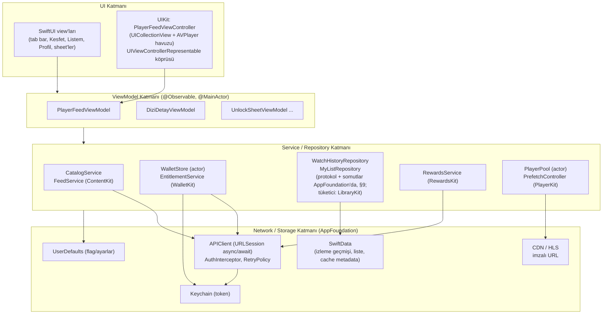
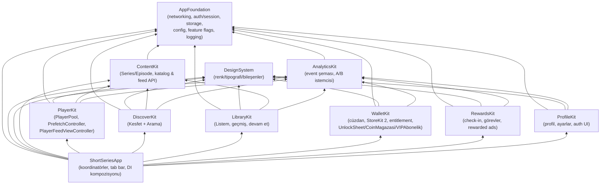

# iOS Mimari Dokümanı

**Amaç:** Bu doküman, ShortSeries iOS istemcisinin uygulama mimarisini — katmanlama, MVVM + Coordinator kalıbı, SPM modül grafiği ve bağımlılık kuralları, dependency injection, Observation/concurrency kalıpları, ağ ve persistence katmanları, hata yönetimi, feature flag altyapısı, test stratejisi ve CI/CD hattı — geliştirme ekibinin doğrudan uygulayabileceği ayrıntı düzeyinde tanımlar. Ürün gereksinimleri değil, bu gereksinimleri taşıyacak teknik iskelet burada belirlenir; buradaki kararlar tüm feature modülleri için bağlayıcıdır.

**İlgili dokümanlar:** [00-genel-bakis.md](00-genel-bakis.md) (proje kimliği ve hedefler), [01-ozellik-envanteri.md](01-ozellik-envanteri.md) (özellik kapsamı), [02-ekran-haritasi-navigasyon.md](02-ekran-haritasi-navigasyon.md) (ekran ve akış tanımları), [04-player-engine.md](04-player-engine.md) (PlayerKit iç mimarisi ve performans bütçeleri), [05-veri-modeli-api.md](05-veri-modeli-api.md) (API sözleşmeleri ve veri modelleri), [06-monetizasyon.md](06-monetizasyon.md) (WalletKit iş kuralları), [08-analitik-deney.md](08-analitik-deney.md) (AnalyticsKit event şeması ve A/B altyapısı), [09-yol-haritasi-tasklar.md](09-yol-haritasi-tasklar.md) (fazlama).

---

## 1. Mimari hedefler ve ilkeler

Mimari kararların tamamı kuzey yıldızına hizmet eder: **(1) akıcı, kesintisiz izleme deneyimi, (2) retention, (3) discovery.** Teknik düzlemde bu üç hedef şu mimari ilkelere çevrilir:

| # | İlke | Somut karşılığı | Kabul kriteri |
|---|------|-----------------|---------------|
| 1 | **Player yolu kutsaldır** | `PlayerFeed`'e giden kod yolunda senkron I/O, ağır layout, main-thread blokajı yasak. Player feed UIKit'tir (`UICollectionView` + AVPlayer havuzu). | time-to-first-frame < 500 ms; swipe-to-next < 100 ms; 60 fps kaydırma (bkz. [04-player-engine.md](04-player-engine.md)) |
| 2 | **Test edilebilirlik** | Tüm ViewModel'ler ve Service'ler protokol arkasındaki bağımlılıklarla init-injection alır; hiçbir ViewModel singleton'a doğrudan erişmez. | Her ViewModel, ağ/disk olmadan unit test edilebilir; yeni feature PR'ında ViewModel test coverage ≥ %70 |
| 3 | **Modülerlik** | Kanonik SPM paketleri (§4). Feature modülleri birbirini import ETMEZ; kompozisyon yalnız `ShortSeriesApp` koordinatör seviyesinde. | `swift package show-dependencies` çıktısında feature→feature kenarı yok; CI'da bağımlılık lint'i kırmızıya düşürür |
| 4 | **Derleme süresi** | Küçük, sığ bağımlılık grafiği; feature'lar paralel derlenir. Üçüncü parti bağımlılık minimum (Firebase ve aktif reklam SDK'sı dışında yeni bağımlılık mimari onayı gerektirir). | Temiz build < 120 sn (M-serisi CI runner), incremental build < 15 sn hedefi |
| 5 | **Tek yönlü bağımlılık** | UI → ViewModel → Service/Repository → Network/Storage. Alt katman üst katmanı asla bilmez; geri bildirim `async` dönüş değeri veya `Observable` state ile. | Alt katmanda `import SwiftUI`/`import UIKit` yok (DesignSystem ve PlayerKit'in view katmanı hariç) |
| 6 | **Yeni kodda Combine yok** | Reaktif ihtiyaçlar `@Observable` + `AsyncSequence`/`AsyncStream` ile. | PR review checklist maddesi; `import Combine` yeni dosyada reddedilir |
| 7 | **Çevrimdışına ve hataya dayanıklılık** | Her ekran boş/yükleniyor/hata/içerik durumlarını (loading-state machine) açıkça modeller; ağ hatası player deneyimini kesmez (cache'ten devam). | Uçuş modunda uygulama açılır, `Listem` ve izleme geçmişi görünür, cache'lenmiş içerik oynar |

Hedef platform ve araç seti (kanon): **iOS 17.0+, iPhone-only (Faz 1), portrait-locked, Swift 5.10+, Xcode 16+.** iOS 17 tabanı `@Observable` (Observation framework) ve SwiftData'yı koşulsuz kullanmamızı sağlar; geriye dönük `ObservableObject` köprüsü YOKTUR.

---

## 2. Katman diyagramı



Katman sözleşmeleri:

- **UI**: Salt görsel durum. SwiftUI view'ları `@State private var viewModel = ...` ile ViewModel sahipliği alır ya da koordinatörden hazır ViewModel enjekte edilir. UIKit tarafı (yalnız `PlayerKit`) delegate/closure ile ViewModel'e konuşur. UI katmanında iş kuralı YOK — "coin yeter mi?" sorusunun cevabı ViewModel'den gelir.
- **ViewModel**: `@Observable`, `@MainActor`. Kullanıcı niyetini (intent) metotlarla alır (`func didTapUnlock()`), servis çağrılarını `Task` içinde yürütür, sonucu observable state'e yazar. Navigasyon KARARI verir ama navigasyon YAPMAZ — koordinatöre closure/delegate ile bildirir (§3.3).
- **Service/Repository**: İş kuralları ve veri erişim soyutlaması. Protokol + somut tip çifti (`CatalogServicing` / `CatalogService`). Repository'ler cache-then-network gibi stratejileri kapsüller; ViewModel bu stratejiyi bilmez.
- **Network/Storage**: `AppFoundation`'da yaşar. `APIClient` HTTP taşımadan sorumludur; endpoint bilgisini feature'ın kendi `Endpoint` tanımlarından alır (§8). Storage üçlüsü kanonla sabittir: **SwiftData** (izleme geçmişi, liste, cache metadata), **Keychain** (token), **UserDefaults** (flag/ayarlar).

Katman ihlali örnekleri (PR'da reddedilir): View içinde `URLSession` çağrısı; ViewModel'in `SwiftData` `ModelContext`'e doğrudan dokunması (Repository üzerinden olmalı); Service'in `UIApplication`/`UIKit`'e erişmesi.

---

## 3. MVVM + Coordinator

### 3.1 Koordinatör hiyerarşisi

Navigasyon mantığı view'lardan tamamen ayrılır. Koordinatörler `ShortSeriesApp` target'ında yaşar ve feature modüllerinin public giriş noktalarını (root view factory'leri) birleştirir.

```
AppCoordinator                     (uygulama yaşam döngüsü, launch routing)
├── SplashCoordinator              (Splash: ön-yükleme, ilk feed hazırlığı)
├── OnboardingCoordinator          (Onboarding: dil, tür tercihi, izinler)
└── TabCoordinator                 (5 sekme: Ana Sayfa, Keşfet, Ödüller, Listem, Profil)
    ├── HomeCoordinator            (Ana Sayfa → PlayerFeed, BolumListesi sheet, UnlockSheet)
    ├── DiscoverCoordinator        (Keşfet → Kesfet, Arama, DiziDetay)
    ├── RewardsCoordinator         (Ödüller → OdulMerkezi, rewarded ad akışı)
    ├── LibraryCoordinator         (Listem → Listem, DiziDetay, PlayerFeed'e derin geçiş)
    └── ProfileCoordinator         (Profil → Profil, Ayarlar, auth bağlama akışı)
    └── (çapraz) WalletFlowCoordinator  (UnlockSheet → CoinMagazasi → VIPAbonelik; her sekmeden çağrılabilir)
```

Sorumluluk dağılımı:

- **AppCoordinator**: Cold launch'ta `Splash` gösterir; `SessionState`'e göre (ilk açılış mı, misafir hesabı var mı) `Onboarding` ya da doğrudan `TabCoordinator`'a geçer. Deep link (push'tan gelen `series/{seriesId}/episode/{n}`) çözümlemesini yapar ve ilgili sekme koordinatörüne delege eder (sözleşme: §3.2 kural 6). Zorunlu güncelleme / bakım modu overlay'leri buradan yönetilir.
- **TabCoordinator**: `TabView` sahibidir; sekme seçimini state olarak tutar. Uygulama DOĞRUDAN video ile açıldığı için varsayılan sekme **Ana Sayfa**'dır ve `PlayerFeed` ilk frame'de hazırdır (Splash sırasında prefetch — bkz. [04-player-engine.md](04-player-engine.md)). Sekme değişiminde `PlayerFeed`'e pause/resume sinyali TabCoordinator'dan gider.
- **Feature koordinatörleri**: Kendi `NavigationStack` path'lerinin sahibi. Feature modülü, koordinatöre "şu ekrana gitmek istiyorum" niyetini tip-güvenli route enum'u ile bildirir; push/sheet kararı koordinatörde kalır.
- **WalletFlowCoordinator**: Monetizasyon akışı (UnlockSheet → coin yetersiz → CoinMagazasi → satın alma → geri dönüp kilidi açma) birden çok sekmeden tetiklenebildiği için çapraz bir alt-koordinatördür; tetikleyen koordinatör tarafından başlatılır ve sonuç (`unlocked` / `cancelled` / `vipPurchased`) async olarak döner.

### 3.2 Route tanımı ve ekran geçiş sözleşmesi

Her feature koordinatörü kendi route enum'unu tanımlar. Route'lar `Hashable`'dır ve `NavigationStack(path:)` ile sürülür:

```swift
// ShortSeriesApp — HomeCoordinator.swift
enum HomeRoute: Hashable {
    case diziDetay(seriesID: SeriesID)
    case arama                       // Ana Sayfa üst arama ikonu → Arama
}

enum HomeSheet: Identifiable {
    case bolumListesi(seriesID: SeriesID, currentEpisode: Int)
    case unlockSheet(UnlockRequest)  // kilitli bölüm bağlamı
    var id: String { ... }
}

@Observable @MainActor
final class HomeCoordinator {
    var path = NavigationPath()
    var activeSheet: HomeSheet?
    var fullScreenCover: HomeFullScreen?   // ör. rewarded ad player

    private let deps: Dependencies

    func show(_ route: HomeRoute) { path.append(route) }

    func presentUnlockSheet(for request: UnlockRequest) async -> UnlockOutcome {
        // WalletFlowCoordinator'ı başlatır, sheet'i sürer, sonucu await eder
    }
}
```

**Ekran geçiş sözleşmesi (bağlayıcı kurallar):**

1. **Push vs sheet vs fullScreenCover** — Push: hiyerarşide derinleşme (`Kesfet` → `DiziDetay`). Sheet: mevcut bağlamı koruyup üstüne geçici iş (`BolumListesi`, `UnlockSheet`, `CoinMagazasi`, filtreler). FullScreenCover: bağlam değişimi/kaplama (rewarded ad oynatma, `VIPAbonelik` kampanya tam sayfası, `Onboarding`).
2. `PlayerFeed` üzerine açılan HER yüzey sheet'tir ve **player'ı durdurmaz, sesi kısmaz** — yalnız `UnlockSheet` göründüğünde video kilit karesinde bekler (bkz. [04-player-engine.md](04-player-engine.md) paywall davranışı).
3. Sheet'ler `detents` kullanır: `BolumListesi` `.medium/.large`, `UnlockSheet` `.height(~420pt)` sabit, `CoinMagazasi` `.large`.
4. Bir koordinatör başka bir feature'ın ekranını AÇAMAZ; yalnız kendi route'larını ve ortak alt-koordinatörleri (WalletFlow) kullanır. Sekmeler arası geçiş (`OdulMerkezi`'ndeki görev → `PlayerFeed`) TabCoordinator üzerinden `switchTab(.anaSayfa, then:)` API'siyle yapılır.
5. Geri dönüş sonuçları closure değil `async` dönüş değeriyle taşınır (Swift concurrency; `CheckedContinuation` sheet dismiss'e bağlanır). Edge case: kullanıcı sheet'i swipe ile kapatırsa continuation `cancelled` ile TAMAMLANMAK ZORUNDADIR (sızıntı testi var, §12).
6. Deep link sözleşmesi: kanonik URL kalıpları [02-ekran-haritasi-navigasyon.md](02-ekran-haritasi-navigasyon.md) §8.2'dekilerle birebirdir — bölüm hedefi `shortseries://series/{seriesId}/episode/{n}` (universal link eşleniği `/s/{seriesId}/e/{n}`). AppCoordinator rotayı çözer ve hedef sekme koordinatörüne delege eder. Soğuk açılışta rota `PendingRoute` olarak saklanır, root hazır olunca işlenir (Splash/Onboarding rotayı düşürmez). Sıcak açılışta açık sheet'ler kapatılır (süren satın alma işlemi ASLA kesilmez; rota işlem tamamlanana dek bekletilir) ve **mevcut yığının üstüne doğru rota push edilir** — hedef sekme + push/sheet kompozisyonu ([01-ozellik-envanteri.md](01-ozellik-envanteri.md) SHR-02 ve 02 §8.4 çözümleme kurallarıyla aynı davranış).

### 3.3 ViewModel ↔ Coordinator iletişimi

ViewModel navigasyonu bilmez; koordinatörün verdiği `Navigator` protokolüne konuşur:

```swift
// ContentKit — public protokol
// (UnlockRequest/UnlockOutcome: AppFoundation/SharedDomain tipleri — §4 R8)
public protocol DiziDetayNavigating: AnyObject {
    func openPlayer(seriesID: SeriesID, episode: Int)
    func openUnlockSheet(_ request: UnlockRequest) async -> UnlockOutcome
}

// ContentKit — ViewModel
@Observable @MainActor
public final class DiziDetayViewModel {
    private weak var navigator: (any DiziDetayNavigating)?
    // "İzlemeye Başla / Devam Et" CTA
    func didTapWatch() {
        navigator?.openPlayer(seriesID: series.id, episode: resumeEpisode)
    }
}
```

Koordinatör bu protokolü uygular. Böylece feature modülü, `ShortSeriesApp`'i import etmeden test edilebilir navigasyon niyeti üretir.

---

## 4. SPM modül grafiği ve bağımlılık kuralları

Kanonik modüller (§4 kanon) ve izin verilen kenarlar:



**Bağımlılık kuralları (bağlayıcı):**

| Kural | Açıklama |
|-------|----------|
| R1 | `AppFoundation` ve `DesignSystem` temel katmandır; **herkes** bağımlı olabilir. Kendileri hiçbir iç modüle bağımlı olamaz. `AppFoundation` UI içermez; `DesignSystem` networking içermez. |
| R2 | **Feature modülleri birbirine BAĞIMLI DEĞİLDİR.** `PlayerKit`, `DiscoverKit`, `LibraryKit`, `WalletKit`, `RewardsKit`, `ProfileKit` arasında import yasak. Kompozisyon koordinatör seviyesinde (`ShortSeriesApp`). |
| R3 | `ContentKit` paylaşılan alan modelidir (Series/Episode + katalog/feed istemcileri); içerik gösteren feature'lar (`PlayerKit`, `DiscoverKit`, `LibraryKit`) ona bağımlı olabilir. `WalletKit`/`RewardsKit`/`ProfileKit` içerik modeline ihtiyaç duyarsa ID tipleri ve dar DTO'lar `AppFoundation`'daki paylaşılan tiplerle taşınır — `ContentKit`'i çekmez. |
| R4 | `AnalyticsKit`'e tüm feature'lar bağımlı olabilir (event atmak için); `AnalyticsKit` yalnız `AppFoundation`'a bağımlıdır. |
| R5 | Feature'lar arası veri ihtiyacı (ör. `UnlockSheet`'in bölüm başlığına ihtiyacı) çağıran tarafın parametre geçmesiyle çözülür (`UnlockRequest` value tipi), modül bağımlılığıyla DEĞİL. R5 yalnız **tek seferlik value geçirme** içindir; sürekli akış veya protokol tabanlı ihtiyaç R8'e tabidir. |
| R6 | Üçüncü parti SDK'lar tek modülde hapsedilir: Firebase Analytics/Crashlytics → `AnalyticsKit` (Crashlytics logging köprüsü `AppFoundation` protokolü üzerinden), reklam SDK'sı (aktif: AdMob) → `RewardsKit`/`AdBridge`. Hiçbir feature üçüncü parti SDK'yı doğrudan import etmez. **Kabul kriteri:** reklam sağlayıcı değişimi `RewardsKit` + app target Info.plist (`SKAdNetworkItems`) dışına taşamaz. |
| R7 | Her modülün `Tests/` hedefi vardır; test hedefleri mock'lar için `AppFoundationTestSupport` paylaşılan test kütüphanesini kullanabilir. |
| R8 | Feature'lar arası tüketilen **protokol ve value tipleri** (`EntitlementChecking`, `UnlockRequest`/`UnlockOutcome`, cüzdan bakiye stream arayüzü, canlı sayaç/olay portları) `AppFoundation/SharedDomain`'de tanımlanır. Somut uygulama üretici feature'da yaşar (ör. `EntitlementChecking`'in canlısı `WalletKit`'tedir); kompozisyon `ShortSeriesApp`'te DI ile kurulur. Böylece tüketici feature, üreticiyi import etmeden (R2 korunur) canlı veriye bağlanır. |

CI'da bu kurallar bir bağımlılık lint script'iyle (Package.swift parse + izin matrisi) doğrulanır; ihlal build'i kırar.

### 4.1 DesignSystem token sözleşmesi

`DesignSystem` token'ları üç katmandır; erişim tek yönlüdür (primitive → semantic → bileşen):

1. **Primitive** — ham palet/ölçek değerleri (`gray900`, `spacing4`, `fontSize17`). Yalnız semantic katman tarafından referans alınır; feature kodunda geçmesi YASAKTIR.
2. **Semantic** — anlam taşıyan token'lar (`background.primary`, `text.secondary`, `accent.coinGold`). **Feature'lar YALNIZ bu katmanı kullanır**; kural lint'e bağlıdır — primitive token adı bir feature paketinde geçerse PR/build kırmızıya düşer.
3. **Bileşen** — bileşen-içi türetimler (buton dolgu rengi, sheet grabber rengi); yalnız `DesignSystem` bileşenlerinin içinde yaşar.

Ek kurallar:

- **Theme-invariant token sınıfı:** Player overlay token'ları (overlay gradyanı, overlay metin/ikon renkleri) ayrı bir `overlay.*` theme-invariant sınıfında tanımlanır ve **her temada koyu kalır** — video üstü okunabilirlik tema tercihinden bağımsızdır; ileride tema ekseni eklense bile bu sınıf değişmez.
- **UIKit köprüsü:** `PlayerKit`'in UIKit tarafı renk/tipografi değerlerine hard-coded değil, `DesignSystem`'in token uzantıları (`UIColor`/`UIFont` türetimleri) üzerinden erişir.
- **Rebrand prosedürü:** Marka değişikliği = yalnız `DesignSystem` token DEĞERLERİ değişir + snapshot testleri yeniden kaydedilir (§12); feature kodunda diff OLUŞMAZ. Oluşuyorsa semantic katman ihlali var demektir.

---

## 5. Dependency Injection

Kanon kararı: **init-injection + hafif, protokol tabanlı `Dependencies` konteyneri, EnvironmentKey ile SwiftUI'ye köprü.** Üçüncü parti DI framework'ü YOK.

### 5.1 Konteyner

```swift
// AppFoundation — Dependencies.swift
public protocol Dependencies: Sendable {
    var apiClient: any APIClientProtocol { get }
    var session: any SessionManaging { get }          // anonim misafir → Apple/Google/e-posta bağlama
    var featureFlags: any FeatureFlagReading { get }
    var logger: any Logging { get }
    var analytics: any AnalyticsTracking { get }
    var secureStore: any SecureStoring { get }        // Keychain
    var preferences: any PreferencesStoring { get }   // UserDefaults
}

// ShortSeriesApp — canlı kompozisyon
struct LiveDependencies: Dependencies {
    let apiClient: any APIClientProtocol = APIClient(configuration: .production)
    let session: any SessionManaging
    // ... tek yerde, uygulama başlangıcında kurulur
}
```

`Dependencies` **yalnız `AppFoundation`'da tanımlı cross-cutting protokolleri** taşır (R1: `AppFoundation` hiçbir iç modüle bağımlı olamaz). Bunun iki bağlayıcı sonucu vardır:

- **`analytics` type-erased'dır.** `AnalyticsTracking` protokolü ve parametre değeri `AnalyticsValue`, `AppFoundation`'da tanımlanır; canlı uygulama `AnalyticsKit.AnalyticsClient`'tır. Tipli `AnalyticsEvent` yüzeyi (event kataloğu, parametre şemaları — [08-analitik-deney.md](08-analitik-deney.md)) `AnalyticsKit`'te kalır ve çağrı anında bu protokole map edilir; feature'lar tipli yüzeyi R4 üzerinden kullanır.

```swift
// AppFoundation — AnalyticsTracking.swift (type-erased)
public enum AnalyticsValue: Sendable, Equatable {
    case string(String), int(Int), double(Double), bool(Bool)
}
public protocol AnalyticsTracking: Sendable {
    func track(_ name: String, parameters: [String: AnalyticsValue])
}
// Canlı uygulama: AnalyticsKit.AnalyticsClient: AnalyticsTracking
```

- **Feature'a özgü servisler konteynere GİREMEZ.** `PlayerPool`/`PrefetchController` (`PlayerKit`), `WalletStore` (`WalletKit`) gibi tipler `Dependencies`'te TANIMLANAMAZ — aksi `AppFoundation`'ı feature'a bağımlı kılar (R1 ihlali). `PlayerPool` ve `PrefetchController`, `ShortSeriesApp` kompozisyon kökünde kurulur ve `PlayerFeedViewController`/ViewModel'e **init-injection** ile verilir; `dependencies.playerPool` gibi environment erişimi YOKTUR ([04-player-engine.md](04-player-engine.md) §2.3 SwiftUI köprüsü bu kurala göre init-injection kullanır).

Feature modülleri geniş konteyneri değil, **ihtiyaç duydukları dar protokolleri** alır (interface segregation). Koordinatör, ViewModel'i kurarken konteynerden dar bağımlılıkları seçip init'e verir:

```swift
// HomeCoordinator içinde
let viewModel = PlayerFeedViewModel(
    feedService: FeedService(apiClient: deps.apiClient),
    entitlements: walletKit.entitlementService,  // tip: any EntitlementChecking
                                                 // (AppFoundation/SharedDomain'de tanımlı R8 portu,
                                                 //  canlı uygulaması WalletKit'te)
    analytics: deps.analytics
)
```

### 5.2 SwiftUI köprüsü (EnvironmentKey)

Derin view ağaçlarında (ör. `DesignSystem` bileşenlerinin analytics'e dokunması gerektiğinde) Environment kullanılır; ancak Environment **yalnız cross-cutting servisler** içindir (analytics, feature flag, theme). ViewModel bağımlılıkları HER ZAMAN init-injection'dır.

```swift
// AppFoundation
private struct DependenciesKey: EnvironmentKey {
    static let defaultValue: any Dependencies = PreviewDependencies()
}
public extension EnvironmentValues {
    var dependencies: any Dependencies {
        get { self[DependenciesKey.self] }
        set { self[DependenciesKey.self] = newValue }
    }
}

// ShortSeriesApp kökünde
WindowGroup {
    AppRootView(coordinator: appCoordinator)
        .environment(\.dependencies, liveDependencies)
}
```

`defaultValue` olarak `PreviewDependencies` (in-memory mock seti) verilir; böylece her `#Preview` sıfır konfigürasyonla çalışır.

### 5.3 Test için mock injection

Her protokolün `Mock*` uygulaması `AppFoundationTestSupport`'ta yaşar; çağrı kaydı (spy) + programlanabilir cevap kalıbı:

```swift
// AppFoundationTestSupport
public final class MockAPIClient: APIClientProtocol, @unchecked Sendable {
    public var stubbedResponses: [String: Result<Data, AppError>] = [:]
    public private(set) var receivedEndpoints: [any Endpoint] = []
    public func send<E: Endpoint>(_ endpoint: E) async throws -> E.Response { ... }
}

// Örnek test
@Test @MainActor
func kilitliBolumeGelindigindeUnlockSheetIstenir() async {
    let entitlements = MockEntitlementService(unlockedEpisodes: [])
    let vm = PlayerFeedViewModel(feedService: MockFeedService.withLockedEpisode(at: 6),
                                 entitlements: entitlements,
                                 analytics: MockAnalytics())
    await vm.didScroll(toEpisodeIndex: 6)
    #expect(vm.pendingUnlockRequest != nil)
}
```

---

## 6. Observation framework kalıpları ve state sahipliği

### 6.1 Kalıplar

- Tüm ViewModel'ler `@Observable` sınıftır (Observation framework, iOS 17). `ObservableObject`/`@Published` YASAK (yeni kod).
- View, ViewModel'i sahipleniyorsa `@State private var viewModel: X`; koordinatörden geliyorsa düz saklanan property (Observation izlemeyi otomatik yapar) + gerekiyorsa `@Bindable` (form/`Ayarlar` gibi two-way binding'lerde).
- Observable sınıflarda hesaplanmış görünüm durumu **computed property** olarak modellenir (`var canUnlock: Bool { balance >= price }`) — Observation, erişilen saklanan property'ler üzerinden hassas invalidation yapar; elle senkron tutulan ikiz state yasak.
- View'a sızmaması gereken iç state `@ObservationIgnored` ile işaretlenir (ör. `@ObservationIgnored private var loadTask: Task<Void, Never>?`).
- Servislerden ViewModel'e sürekli veri akışı `AsyncStream` ile: `for await balance in walletStore.balanceUpdates { self.balance = balance }`. Bu döngüler ViewModel'in yaşam döngüsüne bağlı `Task`'ta koşar ve `deinit`/`onDisappear`'da iptal edilir.

### 6.2 State sahipliği kuralları (bağlayıcı)

| State | Sahibi | Erişim |
|-------|--------|--------|
| Oturum/kimlik (`SessionState`) | `AppFoundation.SessionManager` | Feature'lar sadece okur; mutasyon yalnız auth akışları (`ProfileKit`) üzerinden servis çağrısıyla |
| Coin bakiyesi + entitlement | `WalletKit.WalletStore` (actor) — **tek doğruluk kaynağı** | Diğer feature'lar `balanceUpdates` stream'inden okur; bakiyeyi asla kendileri hesaplamaz/cache'lemez |
| Oynatma durumu (aktif bölüm, pozisyon) | `PlayerKit.PlayerPool` + `PlayerFeedViewModel` | `LibraryKit` yalnız persist edilmiş "kaldığı yer" kaydını okur (`AppFoundation` persistence repository protokolü üzerinden, §9) |
| Navigasyon state (path, sheet) | İlgili koordinatör | ViewModel'ler navigasyon state'i TUTMAZ |
| Feature flag / remote config değerleri | `AppFoundation.FeatureFlagStore` | Salt-okunur snapshot; oturum içinde flag değişimi §11 kurallarına tabi |
| Ekrana özgü geçici UI state | İlgili ViewModel | Ekran kapanınca yok olur; kalıcılaşması gereken her şey Repository'ye yazılır |

Kural: **Aynı verinin iki sahibi olamaz.** Bir feature başka feature'ın state'ine ihtiyaç duyuyorsa (ör. `OdulMerkezi`'nde coin bakiyesi) sahibinin public stream/servis arayüzünden okur (mekanizma: §4 R8 — arayüz `AppFoundation/SharedDomain`'de, canlı uygulama sahip feature'da, bağlama `ShortSeriesApp` DI kompozisyonunda).

---

## 7. Concurrency mimarisi

Kanon: Swift structured concurrency (async/await, actors); `PlayerPool` ve `WalletStore` **actor'dür**; Combine yok.

### 7.1 Actor kullanımı

```swift
// PlayerKit — PlayerPool.swift (ayrıntılı davranış: 04-player-engine.md)
public actor PlayerPool {
    private var players: [PooledPlayer]   // 3–5 instance (kanon performans bütçesi)
    private var assignments: [EpisodeID: PooledPlayer] = [:]

    // AVFoundation tipleri PlayerKit-internal'dır (04 §2.4 modül sınırı; KANON §2):
    // AVPlayer döndüren erişim internal'dır — public API imzasında AVFoundation tipi bulunamaz.
    func player(for episode: Episode) async -> AVPlayer { ... }   // internal
    public func prepareNext(_ episode: Episode) async { ... }  // prefetch ~500 KB / ilk 2 sn
    public func recycle(keeping window: ClosedRange<Int>) async { ... }
}

// WalletKit — WalletStore.swift
public actor WalletStore {
    private var balance: CoinBalance          // purchased + earned ayrı alanlar (kanon §5)
    private var pendingTransactions: [WalletTransaction]

    public nonisolated let balanceUpdates: AsyncStream<CoinBalance>

    /// İdempotent: aynı transactionID ile tekrar çağrı güvenli (server sözleşmesi, 05-veri-modeli-api.md)
    public func spend(_ amount: Int, on episode: EpisodeID,
                      transactionID: UUID) async throws -> UnlockReceipt { ... }
}
```

Actor seçim gerekçesi: her ikisi de birden çok bağlamdan (UI, prefetch task'ları, StoreKit transaction listener, push handler) eşzamanlı erişilen mutable state tutar. Actor, veri yarışını derleyici garantisiyle kapatır.

### 7.2 MainActor sınırları

- Tüm ViewModel'ler, koordinatörler ve view kodu `@MainActor`.
- Service/Repository katmanı MainActor DEĞİLDİR (çoğu `Sendable` struct ya da actor). ViewModel `await` ile geçiş yapar; dönüşte otomatik main'e döner.
- `PlayerFeedViewController` (UIKit) `@MainActor`'dır; `PlayerPool` (actor) ile konuşurken hop maliyeti swipe yolunda ölçülür — aktif player referansı ViewController'da `nonisolated(unsafe)` DEĞİL, senkron erişim gereken sıcak yol için pool'dan önceden alınmış `AVPlayer` referansı MainActor'da tutulur (pool yalnız atama/geri dönüşümü yönetir). Ayrıntı: [04-player-engine.md](04-player-engine.md).
- Kural: `DispatchQueue.main.async` yasak; `MainActor.run` yalnız UIKit callback köprülerinde.

### 7.3 Task cancellation kalıpları

1. **Ekrana bağlı işler**: ViewModel'deki yüklemeler `.task { await viewModel.load() }` ile view yaşam döngüsüne bağlanır — view kaybolunca otomatik iptal. Elle yönetilen `Task`'lar `@ObservationIgnored private var` olarak saklanır ve yenisi başlatılmadan önce `cancel()` edilir (ör. `Arama`'da her tuş vuruşunda önceki arama task'ı iptal + ~300 ms debounce).
2. **Prefetch işleri**: `PrefetchController` scroll yönü değişince veya hücresel veri tasarrufu modunda mevcut prefetch task'larını iptal eder; iptal edilen indirme kısmi cache'i korur (bkz. [04-player-engine.md](04-player-engine.md)).
3. **İptal edilemez kritik bölgeler**: Cüzdan harcaması gibi işlemler iptal ile YARIM KALAMAZ. Kalıp: `spend` çağrısı kendi bağımsız `Task`'ında koşar ve UI iptali yalnız sonucun gösterimini keser, işlemi değil; sunucu idempotency (transactionID) yeniden denemeyi güvenli kılar.
4. Her `for await` döngüsü `Task.isCancelled` üzerinden değil, stream'in bitmesi/iptaliyle sonlanacak şekilde yazılır; uzun döngülerde `try Task.checkCancellation()`.
5. `Task.detached` yalnız gerekçesi yazılı istisnalarda (ör. analytics flush at-exit) kullanılır — varsayılan yapı structured (`async let`, `TaskGroup`).

---

## 8. Ağ katmanı

REST + JSON, `URLSession` async/await, `Codable` (kanon). **Taşıma katmanı** (`APIClient`, interceptor'lar, retry, pinning) `AppFoundation`'dadır; **`Endpoint`/istek TANIMLARI ise feature'larda yaşar** — her feature kendi `Endpoint` tanımlarını ve tip-güvenli istemci sarmalayıcılarını yazar. API sözleşmelerinin tamamı: [05-veri-modeli-api.md](05-veri-modeli-api.md).

### 8.1 Endpoint tanımı ve APIClient iskeleti

Aşağıdaki `Endpoint`/`APIClientProtocol` tanımı istemci networking arayüzünün **tek normatif tanımıdır**; [05-veri-modeli-api.md](05-veri-modeli-api.md) §5 buraya çapraz referans verir (oradaki `APIRequest`/`APIClient` adlarıyla tek tanımda birleştirilmiştir).

```swift
// AppFoundation — Endpoint.swift
public protocol Endpoint: Sendable {
    associatedtype Response: Decodable & Sendable
    var path: String { get }                 // versiyon öneki İÇERMEZ (aşağıya bkz.)
    var method: HTTPMethod { get }
    var query: [URLQueryItem] { get }
    var body: Encodable? { get }
    var requiresAuth: Bool { get }           // varsayılan: true
    var retryPolicy: RetryPolicy { get }     // varsayılan: .default
    var idempotencyKey: String? { get }      // varsayılan: nil (header eklenmez)
    var cachePolicy: APICachePolicy { get }  // .networkOnly | .cacheFirst(ttl:) | .staleWhileRevalidate
                                             // varsayılan: .networkOnly
}

// ContentKit — örnek kullanım
struct FeedEndpoint: Endpoint {
    typealias Response = FeedPage
    let cursor: String?
    var path: String { "/feed" }   // versiyon öneki (/v1) baseURL'in sahipliğindedir, path'e YAZILMAZ
    var method: HTTPMethod { .get }
    var query: [URLQueryItem] { cursor.map { [.init(name: "cursor", value: $0)] } ?? [] }
    var body: Encodable? { nil }
}

// AppFoundation — APIClient.swift
public protocol APIClientProtocol: Sendable {
    func send<E: Endpoint>(_ endpoint: E) async throws -> E.Response
}

public struct APIClient: APIClientProtocol {
    let baseURL: URL                             // versiyon önekinin sahibi (ör. https://api.shortseries.app/v1)
    let urlSession: URLSession
    let interceptors: [any RequestInterceptor]   // sıralı: [AuthInterceptor, LocaleInterceptor, ...]
    let decoder: JSONDecoder                     // .useDefaultKeys + ISO8601 (wire camelCase — 05 kural 7)

    public func send<E: Endpoint>(_ endpoint: E) async throws -> E.Response {
        var attempt = 0
        while true {
            do {
                var request = try makeRequest(endpoint)
                for i in interceptors { request = try await i.adapt(request) }
                let (data, response) = try await urlSession.data(for: request)
                try validate(response, data: data)   // HTTP durum → AppError.network eşlemesi
                return try decoder.decode(E.Response.self, from: data)
            } catch let error as AppError {
                guard let delay = endpoint.retryPolicy.delay(afterAttempt: attempt, error: error)
                else { throw error }
                attempt += 1
                try await Task.sleep(for: delay)     // iptal edilirse retry döngüsü de biter
            }
        }
    }
}
```

JSON adlandırma: wire formatı `camelCase`'dir ve decoder anahtar dönüşümü YAPMAZ (`.useDefaultKeys`) — [05-veri-modeli-api.md](05-veri-modeli-api.md) kural 7 ile birebir. Bilinçli istisna: analitik ingest ucunun `snake_case` alanları (05 §4.11) event şemasının kendi sözleşmesidir; bu decoder'dan geçmez ve genel kurala emsal oluşturmaz.

### 8.2 Auth interceptor

- Kimlik modeli (kanon): ilk açılışta **anonim misafir hesabı otomatik** oluşturulur; token Keychain'e yazılır; sonradan Apple/Google/e-posta bağlanır (aynı kullanıcı ID'si korunur).
- `AuthInterceptor` her isteğe `Authorization: Bearer <access>` ekler. `401` yanıtında: (1) tekil bir refresh task'ı üzerinden token yenilenir (eşzamanlı 401'ler aynı task'ı `await` eder — "single-flight" kalıbı, actor ile), (2) istek bir kez yeniden denenir, (3) refresh de düşerse `SessionManager` misafir hesabını yeniden kurar; kullanıcı bağlı hesaptaysa oturum-düştü akışı `Profil` üzerinden yürür.
- İçerik erişimi **imzalı URL** iledir; imza süresi dolduğunda player katmanı `ContentKit`'ten URL tazeler (FairPlay DRM Faz 2 — bkz. [04-player-engine.md](04-player-engine.md)).

### 8.3 Retry/backoff politikası

| Durum | Davranış |
|-------|----------|
| `5xx`, timeout, bağlantı kopması | Exponential backoff + jitter: 0.5 sn, 1 sn, 2 sn (maks 3 deneme). Yalnız **idempotent** istekler (GET ve idempotency-key taşıyan POST'lar) otomatik retry alır. |
| `429` | `Retry-After` header'ına uyulur; yoksa backoff. |
| `401` | Retry değil, refresh akışı (§8.2). |
| `4xx` (diğer) | Retry yok; `AppError` olarak yüzer. |
| Cüzdan/satın alma uçları | Otomatik retry YOK; idempotency-key ile kullanıcı tetikli yeniden deneme (bkz. [06-monetizasyon.md](06-monetizasyon.md)). |
| Feed/prefetch istekleri | Tek deneme; başarısızlık sessizce loglanır, kullanıcı akışı kesilmez. |

### 8.4 Ağ ve istemci güvenliği

Cüzdan/fraud hassasiyeti yüksek bir üründe (kanon: receipt replay, jailbreak, anormal kazanç hızı fraud kontrolleri) ağ ve istemci güvenliği mimari düzeyde sabitlenir:

- **TLS certificate pinning — KARAR: API domain'inde SPKI (public key) pinning YAPILIR; CDN domain'lerinde YAPILMAZ.** Gerekçe: cüzdan/IAP/entitlement trafiği MITM'e karşı en değerli hedeftir; SPKI pinning, aynı anahtar çifti korunduğu sürece sertifika yenilemesinden etkilenmez. CDN sertifikaları üçüncü tarafça sık rotasyona girdiği için pin edilmez — içerik erişimi zaten HTTPS + imzalı URL ile korunur ve kilit/ödeme durumu server-authoritative'dir. Uygulama noktası: `URLSession` delegate'inde SPKI hash doğrulaması (`AppFoundation.APIClient` taşıma katmanı; interceptor DEĞİL). Pin seti her zaman aktif anahtar + en az bir yedek (backup) anahtar hash'i içerir.
- **Pin rotasyon planı + kill-switch:** Yeni sunucu anahtarı önce yedek pin olarak release'e girer; sunucu anahtar değişiminden sonraki release'te asıl pin olur — her an en az iki geçerli pin yayında olmalıdır. Acil durumda pinning, `security.pinning_enabled` kill-switch flag'i ile devre dışı bırakılabilir (§11'deki acil kill-switch sınıfı, push/foreground'da yeniden okunur). Pin doğrulama hatası sessiz fallback ile GEÇİŞTİRİLMEZ: istek `AppError.network` olarak düşer ve `security_pinning_failure` telemetrisi atılır.
- **ATS istisnasızlığı:** `NSAppTransportSecurity` istisnası YASAK — `NSAllowsArbitraryLoads` veya domain bazlı `NSExceptionAllowsInsecureHTTPLoads` hiçbir build'de bulunamaz; tüm trafik HTTPS + TLS 1.2+. ATS istisnası gerektiren üçüncü parti SDK, mimari onaydan geçemez (§1 ilke 4 ile tutarlı).
- **Gömülü secret yasağı:** Binary'ye API secret'ı, imzalama anahtarı veya hard-coded token GÖMÜLMEZ; istemcide yalnız public tanımlayıcılar bulunur (Firebase config plist'i, reklam SDK'sının app ID'si gibi — bunlar secret değildir). İmzalı URL'ler ve receipt doğrulama anahtarları yalnız sunucudadır; istemci imza ÜRETMEZ. Ortam bazlı konfigürasyon `GET /config` remote config yolu ile dağıtılır (§11); CI gizleri yalnız CI secret store'dadır (§14).
- **Jailbreak/tamper sinyal toplama:** Sinyal toplama modülünün sahibi **`AppFoundation`**'dır (`DeviceIntegrity`: jailbreak göstergeleri, debugger/tamper tespiti). Sinyaller cihazda karar VERMEZ — uygulama bloklanmaz, kullanıcıya gösterilmez; yalnız sunucuya taşınır ve fraud kararının otoritesi sunucudur (double-entry + audit trail). `WalletKit`, cüzdan isteklerine (unlock, IAP verify, ödül claim) bu sinyalleri header olarak ekler (SS-100, Faz 2 — [09-yol-haritasi-tasklar.md](09-yol-haritasi-tasklar.md)); header adları ve payload sözleşmesi backend ile birlikte [05-veri-modeli-api.md](05-veri-modeli-api.md) §1.1 ortak header tablosunda karara bağlanır (`X-Device-Id` bugünden fraud sinyalidir).

---

## 9. Persistence

Kanonik ayrım — hangi veri nereye:

| Depo | Ne saklar | Ne SAKLAMAZ | Sahip modül |
|------|-----------|-------------|-------------|
| **SwiftData** | İzleme geçmişi + kaldığı yer (`WatchProgressEntity`), `Listem` favorileri (`FavoriteEntity`), video cache metadata'sı (`CachedAssetRecordEntity`: URL, boyut, lastAccessAt — ~200 MB LRU tahliyesinin defteri), (Faz 3) indirme kayıtları | Token, coin bakiyesi (sunucu otoritedir), feed içeriği | Tüm `@Model` entity'ler + `ModelContainer` **`AppFoundation/Storage/Persistence`**'tadır; `LibraryKit`/`ContentKit`/`PlayerKit` yalnız `AppFoundation`'da tanımlı repository/indeks protokolleri (`WatchHistoryRepository`/`MyListRepository` arayüzleri, `AssetCacheIndexing`) üzerinden erişir |
| **Keychain** | Access/refresh token, anonim hesap kimliği, (Faz 2) FairPlay ile ilişkili gizler | Büyük veri, tercih | `AppFoundation.SecureStore` (kSecAttrAccessible: `afterFirstUnlockThisDeviceOnly`) |
| **UserDefaults** | Feature flag son snapshot'ı, dil/altyazı tercihi, oynatma tercihleri (otomatik oynatma, veri tasarrufu), onboarding tamamlandı bayrağı, bildirim tercihi kopyası | Gizli/kişisel veri, token | `AppFoundation.Preferences` (tip-güvenli anahtar sarmalayıcı) |

SwiftData kuralları:

- Tüm `@Model` entity'ler ve tek `ModelContainer` `AppFoundation/Storage/Persistence`'ta tanımlanır; container `ShortSeriesApp` kompozisyon kökünde kurulup Repository'lere init ile verilir. ViewModel/View `ModelContext`'e DOKUNMAZ ve `@Query` KULLANILMAZ — tek yol Repository'dir.
- `import SwiftData` YALNIZ `AppFoundation/Storage/Persistence` modülünde geçer; CI bağımlılık lint'i (§4) buna bakar. Persistence vendor değişimi (ör. SwiftData → başka store) = yalnız bu klasör + migration; feature modülleri ve repository arayüzleri etkilenmez. (Sahiplik kararı [05-veri-modeli-api.md](05-veri-modeli-api.md) §3.2 ve [09-yol-haritasi-tasklar.md](09-yol-haritasi-tasklar.md) SS-023 ile hizalıdır.)
- Yazmalar arka plan context'inde (`ModelContext(container)` + actor'a hapsedilmiş) yapılır; `WatchProgress` güncellemesi oynatma sırasında ~5 sn'de bir ve her pause/bölüm geçişinde debounce'lı yazılır (main thread'e I/O sokmama ilkesi).
- Şema migration: `VersionedSchema` + `SchemaMigrationPlan` gün birinden kurulur; her şema değişikliği PR'ında migration testi zorunludur.
- Cüzdan verisi cihazda YALNIZ görüntüleme cache'i olarak tutulur (UserDefaults'ta değil, bellek içinde); doğruluk kaynağı sunucudur (kanon: idempotent işlemler, double-entry — [06-monetizasyon.md](06-monetizasyon.md)).

---

## 10. Hata yönetimi

### 10.1 AppError taksonomisi

```swift
// AppFoundation — AppError.swift
public enum AppError: Error, Sendable {
    case network(NetworkError)        // .offline, .timeout, .server(status:), .decoding
    case auth(AuthError)              // .sessionExpired, .linkingFailed, .guestBootstrapFailed
    case playback(PlaybackError)      // .assetUnavailable, .drmDenied, .signedURLExpired (detay: 04-player-engine.md)
    case wallet(WalletError)          // .insufficientCoins, .purchaseFailed(StoreKitStatus),
                                      // .receiptValidationFailed, .transactionConflict
    case content(ContentError)        // .notFound, .regionBlocked, .episodeLockedStateStale
    case storage(StorageError)        // .migrationFailed, .diskFull, .keychainUnavailable
    case featureDisabled(flag: String)
    case unexpected(underlying: String)
}
```

Kurallar: feature'lar kendi alt-error tiplerini tanımlayıp `AppError`'a sarar; `Error` protokolüyle "düz" fırlatma katman sınırından geçemez — sınırda mutlaka `AppError`'a map edilir. Her `AppError` iki metadata taşır: `isRetryable: Bool`, `userFacingMessage: LocalizedStringResource?`.

### 10.2 Kullanıcıya gösterim stratejisi

| Bağlam | Gösterim | Örnek |
|--------|----------|-------|
| `PlayerFeed` (izleme kesintisi en pahalı hata) | Asla modal alert YOK. Kısa toast + otomatik retry; ağ dönünce kaldığı yerden devam. Uzun kesintide feed hücresi içinde inline "Tekrar dene" durumu. | Segment yüklenemedi → sessiz retry → 3 sn sonra toast |
| Liste/detay ekranları (`Kesfet`, `DiziDetay`, `Listem`) | Tam ekran empty-state bileşeni (DesignSystem `ErrorStateView`): ikon + mesaj + "Tekrar dene". | Feed isteği offline'da düştü |
| İşlem akışları (`UnlockSheet`, `CoinMagazasi`) | Sheet içinde inline hata + eylem; satın alma hatalarında StoreKit mesajı KULLANICI DİLİNE çevrilir, transactionID ile "destek koduna" bağlanır. `insufficientCoins` bir "hata" değil akıştır → CoinMagazasi'na yönlendirir. | Receipt doğrulaması düştü → "Satın alma doğrulanıyor, coin'lerin birazdan hesabında" (pending durumu) |
| Arka plan işleri (prefetch, analytics, cache) | Kullanıcıya HİÇ gösterilmez; yalnız log. | Prefetch 404 |

### 10.3 Logging

- `AppFoundation.Logging` protokolü; canlı uygulamada `os.Logger` (subsystem: `com.shortseries.app`, kategori = modül adı) + Crashlytics breadcrumb köprüsü (`AnalyticsKit` üzerinden, R6 kuralı).
- Seviyeler: `debug` (yalnız DEBUG build), `info` (akış kilometre taşları), `error` (yakalanan AppError'lar, non-fatal olarak Crashlytics'e), `fault` (invariant ihlali).
- PII kuralı: log'a e-posta, token, receipt YAZILMAZ; kullanıcı yalnız opak `userID` ile anılır. `privacy: .private` os_log işaretleri zorunlu.
- Crash-free hedefi kanonla sabit: **≥ %99.8**; Crashlytics velocity alert'leri release sürecine bağlıdır (§14).

---

## 11. Feature flag / remote config mimarisi

Kanon: A/B deneyleri için feature-flag/remote-config altyapısı; deney tarafı [08-analitik-deney.md](08-analitik-deney.md)'de.

- **Katmanlar:** (1) derleme zamanı flag'leri (`#if DEBUG`, faz kapıları), (2) remote config (sunucudan `GET /config` — launch'ta çekilir, UserDefaults'a snapshot), (3) deney atamaları (`AnalyticsKit` deney istemcisi variant döndürür; flag store'a overlay edilir).
- **Okuma modeli:** `FeatureFlagStore` launch'ta *tek snapshot* dondurur; oturum ortasında flag değişimi UI'ı canlı değiştirmez (tutarsız deneyim + deney kirliliği önlenir). İstisna: acil kill-switch anahtarları (`player.hevc_enabled`, `ads.rewarded_enabled` gibi) push/foreground'da yeniden okunur ve etkisi bir sonraki doğal geçişte uygulanır.
- **Tipli erişim:** String anahtar erişimi yasak; her flag `FlagKey<Value>` sabitiyle tanımlanır ve varsayılan değeri koddadır (config gelmezse uygulama varsayılanla tam çalışır — ilk açılış/offline senaryosu).
- Remote config ile sürülen örnek parametreler (kanon §5): rewarded ad günlük cap (5–10), `unlockPrice` istemci fallback'i YOK (fiyat daima API'den gelir — bkz. [06-monetizasyon.md](06-monetizasyon.md)), veri tasarrufu bitrate tavanı (480p), prefetch bütçesi.
- Flag yaşam döngüsü: her flag bir sahip + son temizlik tarihi ile `FlagRegistry.md`'ye kaydedilir; ölü flag üç release içinde koddan silinir.

```swift
// AppFoundation
public struct FlagKey<Value: FlagValue>: Sendable {
    public let name: String
    public let default: Value
}
public enum Flags {
    public static let rewardedDailyCap = FlagKey(name: "rewards.daily_ad_cap", default: 5)
    public static let dataSaverMaxHeight = FlagKey(name: "player.data_saver_max_height", default: 480)
}
```

---

## 12. Test stratejisi

| Katman | Araç | Kapsam ve kabul kriteri |
|--------|------|--------------------------|
| **Unit — ViewModel/Service** | Swift Testing (`@Test`), mock'lar `AppFoundationTestSupport`'tan | Her ViewModel intent→state geçişleri; servislerde iş kuralları (ör. earned-önce harcama önceliği, retry politikası). Feature PR'ında ViewModel coverage ≥ %70. Async testlerde gerçek `Task.sleep` yok — enjekte edilebilir `Clock`. |
| **Unit — Wallet kritik yolu** | Swift Testing + StoreKitTest (`.storekit` config) | Satın alma, iptal, pending, receipt-doğrulama-düştü, restore; idempotency (aynı transactionID iki kez → tek harcama). Bu paket CI'da her PR'da koşar, atlanamaz. |
| **Snapshot — DesignSystem** | swift-snapshot-testing | Her public bileşen: tek tema token seti (uygulama dark-locked — [09-yol-haritasi-tasklar.md](09-yol-haritasi-tasklar.md) SS-010; light varyant, tema ekseni eklendiğinde matrise girer), Dynamic Type XS/XL, TR/EN uzun metin. Kayıt cihazı sabit (iPhone 16, iOS 18 sim) — farklı ortamda kayıt PR'da reddedilir. |
| **UI test — kritik akışlar** | XCUITest, mock server (localhost) rejimi | Akış seti: (1) cold launch → `PlayerFeed`'de video oynuyor; (2) kilitli bölüm → `UnlockSheet` → coin ile açma; (3) coin yetersiz → `CoinMagazasi` → sandbox satın alma → kilit açılır; (4) `Onboarding` izin adımları; (5) `Listem` → Devam Et → doğru pozisyondan sürdürme. Nightly'de tam set, PR'da (1)+(2) smoke. |
| **Player performans testleri** | XCTest `measure` + `XCTOSSignpostMetric`, saha telemetrisi ile çift kontrol | Bütçeler kanondan: TTFF < 500 ms, swipe-to-next < 100 ms, 60 fps scroll (hitch rate ölçümü), havuz 3–5 instance sınırı, prefetch bütçesi (~500 KB / ilk 2 sn) aşımı regresyon sayılır. Baseline'lar repo'da; %10 sapma CI'ı kırar. Detay senaryolar: [04-player-engine.md](04-player-engine.md). |
| **Sözleşme/decoding testleri** | Swift Testing + kayıtlı JSON fixture'ları | [05-veri-modeli-api.md](05-veri-modeli-api.md) örnek yanıtları fixture olarak; alan ekleme/silme kırılmalarını yakalar. |
| **Sızıntı/iptal testleri** | Swift Testing | Sheet continuation'larının swipe-dismiss'te tamamlandığı (§3.2 madde 5); ViewModel deinit sonrası task'ların iptali. |

Test piramidi hedefi: bol unit, seçili snapshot, az ama kararlı UI testi. Flaky UI testi iki tekrar kuralıyla karantinaya alınır ve bir hafta içinde düzeltilmezse silinir.

---

## 13. Xcode proje / klasör yapısı

```
ShortSeries/
├── ShortSeries.xcodeproj
├── App/                                  # ShortSeriesApp target'ı
│   ├── ShortSeriesApp.swift              # @main, DI kompozisyon kökü
│   ├── AppDelegate.swift                 # APNs kayıt, launch hook'ları
│   ├── Coordinators/
│   │   ├── AppCoordinator.swift
│   │   ├── TabCoordinator.swift
│   │   ├── HomeCoordinator.swift
│   │   ├── DiscoverCoordinator.swift
│   │   ├── RewardsCoordinator.swift
│   │   ├── LibraryCoordinator.swift
│   │   ├── ProfileCoordinator.swift
│   │   └── WalletFlowCoordinator.swift
│   ├── DI/
│   │   └── LiveDependencies.swift
│   ├── Info.plist                        # SKAdNetworkItems (reklam SDK ağ kimlikleri) — sahibi app target;
│   │                                     # sağlayıcı değişiminde yalnız RewardsKit/AdBridge + bu dosya değişir (R6)
│   └── Resources/                        # Assets, Localizable.xcstrings, ShortSeries.storekit
├── Packages/
│   ├── AppFoundation/
│   │   ├── Sources/AppFoundation/
│   │   │   ├── Networking/               # APIClient, Endpoint, Interceptor'lar, RetryPolicy
│   │   │   ├── Session/                  # SessionManager, misafir bootstrap
│   │   │   ├── SharedDomain/             # R8: feature'lar arası protokol + value tipleri
│   │   │   │                             #   (EntitlementChecking, UnlockRequest/UnlockOutcome,
│   │   │   │                             #    bakiye stream portu, canlı sayaç/olay portları)
│   │   │   ├── Storage/                  # SecureStore (Keychain), Preferences
│   │   │   │   └── Persistence/          # TÜM SwiftData @Model'leri (WatchProgressEntity, FavoriteEntity,
│   │   │   │                             #   CachedAssetRecordEntity, ... — envanter: 05 §3.2) + ModelContainer + repository somutları;
│   │   │   │                             #   repository/indeks protokolleri (AssetCacheIndexing dahil);
│   │   │   │                             #   `import SwiftData` YALNIZ bu klasörde (CI lint, §9)
│   │   │   ├── Config/                   # FeatureFlagStore, FlagKey
│   │   │   ├── Logging/
│   │   │   └── Errors/                   # AppError
│   │   ├── Sources/AppFoundationTestSupport/   # Mock'lar, fixture yardımcıları
│   │   └── Tests/AppFoundationTests/
│   ├── DesignSystem/                     # Tokens/, Components/, Tests (snapshot)
│   ├── ContentKit/                       # Models/ (Series, Episode), API/ (Feed, Catalog), Tests
│   ├── PlayerKit/                        # PlayerPool, PrefetchController, PlayerFeedViewController,
│   │                                     # SwiftUI köprüsü, PlaybackUI/, Tests (performans dahil)
│   ├── DiscoverKit/                      # Kesfet/, Arama/, Tests
│   ├── LibraryKit/                       # Listem/, geçmiş + devam-et servisleri (persistence'a yalnız
│   │                                     # AppFoundation repository protokolleriyle erişir, §9), Tests
│   ├── WalletKit/                        # WalletStore, StoreKit2/, UnlockSheet/, CoinMagazasi/,
│   │                                     # VIPAbonelik/, Tests (StoreKitTest)
│   ├── RewardsKit/                       # OdulMerkezi/, CheckIn/, Tasks/, AdBridge/ (reklam SDK köprüsü;
│   │                                     # aktif: AdMob), Tests
│   ├── ProfileKit/                       # Profil/, Ayarlar/, AuthUI/, Tests
│   └── AnalyticsKit/                     # EventSchema/, Experiments/, Sinks/ (vendor sink'leri; aktif:
│                                         # Firebase), CrashReporting/ (Crashlytics — analitik vendor
│                                         # değişimi bunu ETKİLEMEZ), Tests
├── UITests/                              # XCUITest hedefi + MockServer/
├── Scripts/                              # dependency-lint.swift, snapshot-record.sh
└── docs/                                 # bu dokümantasyon seti
```

Notlar: Tüm paketler tek repo içinde local SPM paketidir (monorepo). `App/` hedefi ince tutulur — iş kodu paketlerdedir; bu hem derleme paralelliği hem test edilebilirlik içindir. `.storekit` konfigürasyonu repo'ya dahildir (coin paketleri + VIP ürünleri — ürün kimlikleri [06-monetizasyon.md](06-monetizasyon.md)'da; fiyat kademeleri lansman öncesi App Store Connect'te doğrulanmalıdır).

---

## 14. CI/CD özeti

Hat: **build → test → TestFlight** (fastlane + Xcode Cloud veya GitHub Actions/M-serisi runner — araç seçimi [09-yol-haritasi-tasklar.md](09-yol-haritasi-tasklar.md)'de karara bağlanır; hattın sözleşmesi aşağıdadır).

| Aşama | Tetik | İçerik | Geçiş kriteri |
|-------|-------|--------|---------------|
| **PR doğrulama** | Her PR | SwiftFormat/SwiftLint, bağımlılık lint'i (§4), etkilenen paketlerin unit testleri, DesignSystem snapshot'ları, UI smoke (§12) | Hepsi yeşil; coverage eşiği; lint sıfır hata |
| **Nightly** | Cron | Tam test matrisi (tüm paketler), tam UI test seti, player performans baseline karşılaştırması | Performans sapması ≤ %10 |
| **Release candidate** | `release/*` branch | Archive (Release config), dSYM upload (Crashlytics), TestFlight internal grubuna dağıtım, otomatik build notu (değişen modüller) | Archive + upload başarılı; smoke testler RC build üzerinde |
| **TestFlight external / App Store** | Manuel onay | Phased release; crash-free ≥ %99.8 gate'i (ilk 48 saat internal/external metriği) | Gate sağlanmadan phased rollout genişletilmez |

**Code signing notları:**

- İmzalama **cloud-managed signing** (Xcode Cloud) ya da **fastlane match** (git'te şifreli sertifika deposu) ile merkezî yönetilir; geliştirici makinesinde manuel provisioning profile YASAK ("Automatically manage signing" yalnız lokal debug).
- İki bundle ID: `com.shortseries.app` (production) ve `com.shortseries.app.beta` (TestFlight internal/dev push ortamı) — push (APNs), IAP ve associated domains entitlement'ları ikisinde de tanımlı; sandbox/production App Store Server API anahtarları ortam değişkeniyle ayrılır.
- CI gizleri (App Store Connect API key, match parolası) yalnız CI secret store'da; repo'da anahtar YOK.
- Sürümleme: `MARKETING_VERSION` semver, build numarası CI run numarasından; her TestFlight build'i git tag'iyle eşlenir.

Sürüm ritmi ve faz kapıları (Faz 1/2/3 kapsamı) için: [09-yol-haritasi-tasklar.md](09-yol-haritasi-tasklar.md).
