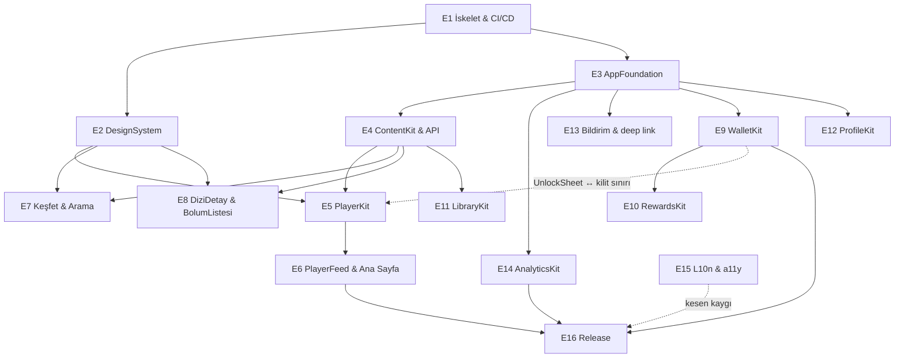
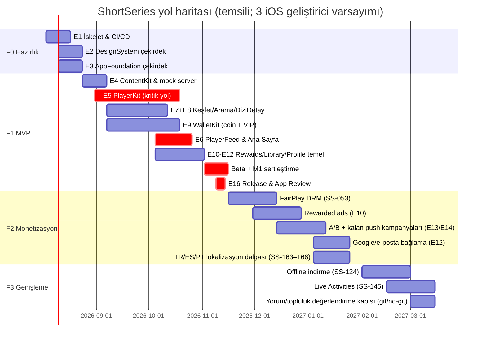

# Yol Haritası, Fazlar ve Task Backlog

**Amaç:** Bu doküman, ShortSeries iOS istemcisinin geliştirme fazlarını (F0–F3), her fazın ölçülebilir çıkış kriterlerini, epik bazlı tam task backlog'unu (ID, tahmin, bağımlılık, faz), kritik yolu, ekip dağılım senaryosunu ve risk/teknik borç yönetimini tanımlar. Geliştirme ekibinin sprint planlamasında doğrudan çalışacağı spesifikasyondur; her task, ilgili detay dokümanına referans verir ve oradaki davranış tanımlarıyla birlikte okunur.

**İlgili dokümanlar:** 00-genel-bakis.md (vizyon ve kuzey yıldızı), 01-ozellik-envanteri.md (özellik kapsamı), 02-ekran-haritasi-navigasyon.md (ekran adları ve akışlar), 03-mimari.md (modül sınırları ve DI), 04-player-engine.md (PlayerKit detay spesifikasyonu), 05-veri-modeli-api.md (API sözleşmeleri), 06-monetizasyon.md (coin/VIP ekonomisi), 07-retention-gamification.md (check-in, görevler, push), 08-analitik-deney.md (event şeması, A/B), 10-arastirma-raporu.md (pazar verisi ve kaynaklar).

---

## 1. Faz özeti

| Faz | Ad | Kapsam özeti | Süre (öngörü) | Çıktı |
|---|---|---|---|---|
| **F0** | Hazırlık | Proje iskeleti, SPM modül yapısı, CI/CD, DesignSystem çekirdeği, AppFoundation temelleri | ~3 hafta | Derlenen modüler iskelet + internal TestFlight |
| **F1** | MVP | İzleme + keşif + kilit/coin/VIP döngüsü: PlayerFeed (Ana Sayfa), player engine, Arama, Kesfet, DiziDetay, BolumListesi, coin satın alma (StoreKit 2) + kilit açma (UnlockSheet, CoinMagazasi), VIPAbonelik + intro offer, misafir hesap + Apple ile hesap bağlama + hesap silme, Listem (Favoriler + Devam Et), OdulMerkezi (günlük check-in + görev listesi), rich push + yeni bölüm/devam-et kampanyaları, yasal sayfalar + ASC operasyonu, temel analitik | ~12 hafta | App Store'da yayınlanan v1.0 |
| **F2** | Monetizasyon derinliği | Rewarded ads (AdMob), kalan push kampanyaları (coin-ödül, kişiselleştirilmiş öneri) + BildirimMerkezi, FairPlay DRM, A/B deney altyapısı, Google/e-posta hesap bağlama, VIP win-back teklifi, earned coin vadesi gösterimi, TR/ES/PT lokalizasyon dalgası | ~10 hafta | v1.x monetizasyon sürümleri |
| **F3** | Genişleme | Offline indirme (İndirilenler), Live Activities; yorum/topluluk YALNIZ F3 sonunda değerlendirilir, iPad bu proje kapsamı dışındadır (01-ozellik-envanteri.md §4 Won't kararları) | ~10 hafta | v2.0 |

Fazlar **artımlı ve kümülatiftir**: her faz bir App Store sürümüne (veya sürüm dizisine) karşılık gelir; F2 ve F3 özellikleri feature flag arkasında geliştirilip kademeli açılır (bkz. 08-analitik-deney.md).

Kuzey yıldızı önceliği faz sıralamasını belirler: (1) akıcı, kesintisiz izleme deneyimi → F1'in merkezi PlayerKit'tir ve performans bütçeleri (TTFF < 500 ms, swipe-to-next < 100 ms, 60 fps) MVP çıkış kriteridir; (2) retention → check-in + görev merkezi + temel push kampanyaları (yeni bölüm, devam et) F1'de; rewarded engagement + kalan kampanya tipleri F2'de; (3) discovery → Kesfet + Arama F1'de tam kapsam.

---

## 2. MVP kesiti (F1) — net tanım

### 2.1 MVP'de OLANLAR

- Uygulama **doğrudan video ile açılır**: Splash → PlayerFeed (Ana Sayfa, For You akışı). Onboarding (dil, isteğe bağlı tür tercihi, bildirim izni + ATT — değer önerisinden SONRA) ilk oturumda araya girer.
- 5 sekme tab bar: **Ana Sayfa, Keşfet, Ödüller, Listem, Profil** — hepsi F1'de mevcut; Ödüller sekmesi (OdulMerkezi) F1'de günlük check-in + görev listesi + coin bakiyesi içerir (rewarded ad kartı F2'de flag'li).
- Player engine tam performans bütçesiyle: PlayerPool (3–5 instance), PrefetchController (~500 KB / ilk 2 sn), 200 MB LRU disk cache, buffer politikası (aktif = 0, idle = 1 sn), hücresel veri tasarrufu modu (480p + prefetch durdur).
- Kilitli bölüm akışı: BolumListesi'nde kilit ikonu + coin fiyatı (`unlockPrice` API'den), kilide gelince UnlockSheet → coin ile aç; coin yetersizse CoinMagazasi. Dizi başına ilk 5–10 bölüm ücretsiz (~ilk 10 dakika), kilit cliffhanger noktasında (backend belirler).
- Coin satın alma: StoreKit 2 consumable, paketler $0.99 / $4.99 / $9.99 / $19.99 / $49.99 / $99.99 + artan bonus kademeleri (%0→%100) + ilk yüklemeye özel 2x bonus. Server-side receipt doğrulama.
- VIPAbonelik: üç plan (haftalık $5.99, aylık $14.99, yıllık $49.99) + intro offer ($3.99/ilk hafta); UnlockSheet'te "VIP ol" seçeneği F1'de canlı (01-ozellik-envanteri.md PAY-05/06/07 Must F1).
- Misafir hesap: ilk açılışta otomatik anonim hesap, token Keychain'de. İçerik erişimi imzalı URL ile. Sign in with Apple ile hesap bağlama + App Store 5.1.1(v) uyumlu hesap silme F1'de (ONB-06/07).
- Rich push (görselli) + yeni bölüm / kaldığın-yerden-devam kampanyaları; sessiz saat + frekans limiti (NTF-01/02 Must F1).
- Temel analitik: kendi event şeması + Firebase Analytics + Crashlytics; TTFF/stall/funnel ölçümü.
- Yalnızca EN arayüz dili (string catalog altyapısı çok dilli hazır; TR/ES/PT ikinci dalga).

### 2.2 MVP'de OLMAYANLAR (bilinçli kesinti)

| Kapsam dışı | Faz | Not |
|---|---|---|
| Rewarded ads (reklamla kilit açma, OdulMerkezi reklam kartı) | F2 | UnlockSheet'te "reklam izle" seçeneği F1'de feature flag ile **gizli** |
| Earned coin son kullanma vadesi gösterimi (SS-115) | F2 | Görev listesi F1'de tamdır (SS-112); vade RWD-05 Should F2 |
| Coin-ödül hatırlatma + kişiselleştirilmiş öneri kampanyaları, BildirimMerkezi | F2 | Rich push + yeni bölüm/devam-et kampanyaları F1'de (SS-141/143) |
| FairPlay DRM | F2 | F1 koruması: imzalı URL (bilinçli teknik borç, §7.2) |
| A/B deney altyapısı (deney atama, exposure) | F2 | F1'de yalnız statik remote-config feature flag |
| Google/e-posta hesap bağlama | F2 | Apple ile bağlama + hesap silme F1'de (SS-132/133; App Store 4.8 ve 5.1.1(v)) |
| Offline indirme (Listem → İndirilenler segmenti) | F3 | Segment F1'de "yakında" boş durumuyla YER ALMAZ; segment tamamen F3'te eklenir |
| Live Activities | F3 | — |
| iPad | Kapsam dışı | 01-ozellik-envanteri.md §4: Won't (bu proje kapsamı); kanon: iPhone-only, portrait-locked |
| Yorum / topluluk keşfi | F3 sonunda değerlendirme | 01 §4: Won't F1–F2; taahhüt değil aday (bkz. §3 M3 ve §4 aday görev notu) |
| TR/ES/PT lokalizasyonu | F2 sonu | Altyapı F0–F1'de hazır; süreç task'ları SS-163–166 |

MVP kesitinin ilkesi: **izle → takıl → kilide çarp → coin al ya da VIP ol → aç** döngüsü uçtan uca, sahada ölçülebilir ve App Review'dan geçmiş olmalı. Bu döngüye hizmet etmeyen her şey ertelenir.

---

## 3. Milestone çıkış kriterleri (ölçülebilir)

Her fazın sonunda "exit review" yapılır; kriterlerin TÜMÜ sağlanmadan sonraki faza geçilmez (istisna: PM + tech lead ortak kararıyla yazılı waiver).

### M0 — F0 çıkışı ("iskelet ayakta")

- [ ] Tüm kanonik SPM modülleri (bkz. 03-mimari.md) boş API yüzeyleriyle derleniyor; modüller arası bağımlılık grafiği CI'da doğrulanıyor (yasak import testi).
- [ ] CI: her PR'da build + unit test + SwiftLint < 15 dk; main branch'i yeşil tutma kuralı aktif.
- [ ] TestFlight internal dağıtım lane'i çalışıyor (tek komutla build → upload).
- [ ] DesignSystem çekirdeği: renk/tipografi token'ları + buton/kart/chip bileşenleri, dark theme first; bileşen katalog demo ekranı internal build'de.
- [ ] Crashlytics aktif, sembolikasyon doğrulanmış.

### M1 — F1 çıkışı (MVP, App Store v1.0)

**Performans (saha, TestFlight beta ≥ 200 kullanıcı, Wi-Fi + LTE karışık):**
- [ ] Time-to-first-frame **< 500 ms P75** (cold start ilk videosu dahil).
- [ ] Swipe-to-next oynatma **< 100 ms P75**.
- [ ] Feed kaydırma **60 fps** (hitch rate < 5 ms/s, Instruments + MetricKit ile).
- [ ] Crash-free users **≥ %99.5** (2 haftalık beta penceresi). (Kalıcı hedef %99.8 — F2 kriteri.)

**Fonksiyonel:**
- [ ] Ödeme akışı sandbox'ta uçtan uca: coin satın al → App Store Server API ile server doğrulama → bakiye güncellenir → bölüm kilidi açılır → uygulama silinip kurulunca açık kalır (unlock server'da).
- [ ] VIP: üç plan + intro offer ($3.99/ilk hafta) sandbox'ta uçtan uca; entitlement değişikliği ≤ 5 sn içinde tüm yüzeylere (kilit durumu, Profil rozeti) yansıyor; Server Notifications V2 ile iptal/yenileme işleniyor (SS-096/097).
- [ ] Kesintili satın alma (interrupted purchase) ve restore senaryoları test matrisi geçer.
- [ ] Misafir hesap: ilk açılışta < 2 sn'de token; Keychain sayesinde reinstall sonrası aynı hesapla devam.
- [ ] Hesap: Sign in with Apple ile bağlama bakiye/ilerleme kaybı SIFIR ile çalışıyor (SS-132); hesap silme akışı uçtan uca ve App Store 5.1.1(v) uyumlu (SS-133).
- [ ] OdulMerkezi: check-in + görev listesi claim'leri server onaylı ve idempotent; görev ilerlemesi gerçek event'lerden besleniyor (SS-111/112).
- [ ] Push: rich push + yeni bölüm / devam-et kampanyaları uçtan uca; sessiz saat + frekans limiti çalışıyor (SS-141/143).
- [ ] Devam Et: kaldığı yer ±5 sn doğrulukla her yüzeyde (Ana Sayfa "devam et" girişi, Listem, DiziDetay CTA) tutarlı.
- [ ] Veri tasarrufu modu: hücreselde 480p cap + prefetch durdurma davranışı ağ yakalama ile doğrulanmış.

**Analitik:**
- [ ] Çekirdek event seti (bkz. 08-analitik-deney.md: `app_open`, `video_start`, `video_complete`, `paywall_view`, `unlock_attempt`, `purchase_success` …) üretimde görünüyor; şema validasyonu %100, event kaybı < %1.
- [ ] TTFF/stall/swipe gecikme metrikleri dashboard'da.

**Yayın:**
- [ ] App Review onayı alınmış; IAP fiyat kademeleri App Store Connect'te kanon §5 ile birebir (fiyatlar lansman öncesi App Store'dan son kez doğrulanmalı).
- [ ] Yasal sayfalar (Kullanım Koşulları / Gizlilik Politikası / EULA) canlı ve uygulamadan (Ayarlar) + App Store Connect alanlarından erişilebilir (SS-175).
- [ ] ASC operasyon kurulumu tamam: banka/vergi formları, tax category, subscription group, review demo hesabı (SS-176).

### M2 — F2 çıkışı (monetizasyon derinliği)

- [ ] Crash-free users **≥ %99.8**.
- [ ] Rewarded ads: AdMob entegrasyonu canlı; 30 sn tamamlama şartı + günde 5–10 cap remote config'ten değiştirilebilir; reklam→coin/unlock kredisi uçtan uca; fill rate ve eCPM dashboard'da.
- [ ] VIP derinliği: reklamsızlık vaadi rewarded ads canlıyken korunuyor (zorunlu reklam YOK); win-back teklif yüzeyi remote config ile açılıp kapanabiliyor (SS-099 F2 kısmı).
- [ ] FairPlay DRM: korumalı içerik lisans alıp oynuyor; lisans hatası fallback'i ve hata event'i tanımlı.
- [ ] A/B: en az bir gerçek deney (ör. UnlockSheet varyant sırası) atama → exposure → hedef metrik zinciriyle uçtan uca koşmuş.
- [ ] Push: kalan kampanya tipleri (coin/ödül hatırlatma, kişiselleştirilmiş öneri) gönderilebiliyor; BildirimMerkezi canlı; push→açılış→izleme atıf zinciri raporlanıyor.
- [ ] Hesap bağlama: misafir → Google/e-posta bağlama (Apple F1'de); bakiye/ilerleme kaybı SIFIR.
- [ ] TR/ES/PT lokalizasyon dalgası: native reviewer ile dil QA'i tamamlanmış; ASC metadata + ekran görüntüleri + IAP display name'leri lokalize (SS-163–166).
- [ ] PiP + arka plan oynatma yeniden değerlendirmesi yapılmış ve karar kaydedilmiş (04-player-engine.md §11: Faz 1'de kapalı, yeniden değerlendirme bu kapıya bağlıdır; karar "aç" ise etkilenen sözleşmeler — background pause, audio session, kilitli bölüm kesişimi — ayrı sürüm planına bağlanır ve 01-ozellik-envanteri.md §4 aynı PR'da güncellenir; karar "kapalı kalsın" ise bir sonraki kapıya taşınır).
- [ ] İş metrikleri **ölçülebilir durumda**: D1/D7/D30 retention ve ödeme dönüşümü dashboard'da, hedeflere (D1 ≥ %30, D7 ≥ %10, D30 ≥ %5, ödeme dönüşümü ≥ %3) karşı izleniyor. (Hedefe ulaşmak M2 çıkış şartı değildir; ölçülebilirlik şarttır.)

### M3 — F3 çıkışı (genişleme)

- [ ] Offline: bölüm indir → uçak modu → oynat; FairPlay persistent key ile DRM'li offline oynatma; indirme kotası ve yönetim UI (İndirilenler) çalışıyor; indirmeler 200 MB akış cache'inden ayrı bütçede.
- [ ] Live Activities: takip edilen dizinin yeni bölüm yayını kilit ekranında canlı; tıklama → doğru bölüme deep link.
- [ ] F3-sonu değerlendirme kapısı: yorum/topluluk için veriye dayalı git/no-git kararı verilmiş ve kaydedilmiş (01-ozellik-envanteri.md §4 "Won't F1–F2; F3 sonunda değerlendirme" kaydıyla uyumlu); karar "git" ise SS-036/075 kapsamı ve App Review UGC gereklilikleri (raporlama + engelleme + moderasyon) ayrı sürüm planına bağlanmış. Aynı kapıda modül kararı verilir: SS-036/075'in ContentKit/DiscoverKit atamalarında mı kalacağı yoksa ayrı bir `CommunityKit` paketinin mi açılacağı (kanonik modül listesi değişikliği = kanon + 03-mimari.md aynı PR'da) ve DiscoverKit'e ait yorum sheet'inin player üstündeki sunum sahipliği sorusu (bkz. SS-075 karar notu) karara bağlanır. iPad 01 §4 gereği bu proje kapsamı dışındadır ve F3 teslimatı DEĞİLDİR.

---

## 4. Task backlog (epik bazlı)

**Tahmin ölçeği:** S = 1–2 kişi-gün, M = 3–5 kişi-gün, L = 6–10 kişi-gün, XL = > 10 kişi-gün (XL task'lar sprint'e girmeden bölünmek ZORUNDADIR; buradaki XL'ler planlama iri taneleridir).
**Bağımlılık:** task başlamadan önce bitmesi (veya API yüzeyi donmuş olması) gereken task'lar. Mock/stub ile erken başlangıç mümkünse notta belirtilir.
**Aday görevler:** Faz sütununda `Aday*` işaretli satırlar (iPad: SS-016/067; yorum: SS-036/075) 01-ozellik-envanteri.md §4 "Won't" kararları gereği taahhüt DEĞİLDİR; iPad kapsam dışıdır, yorum F3 sonunda değerlendirilir. Kapsama alınmaları ancak 01 §4 + kanonun aynı PR'da güncellenmesiyle mümkündür (README kural 3).

### E1 — Proje iskeleti & CI/CD (F0)

Her şeyi bloklayan epik. Hedef: 1. haftanın sonunda her geliştirici PR açabiliyor olmalı.

| ID | Başlık | Açıklama | Modül | Tahmin | Bağımlılık | Faz |
|---|---|---|---|---|---|---|
| SS-001 | Xcode projesi + SPM workspace | App target `ShortSeriesApp` + local SPM paketleri; iOS 17.0 min, Swift 5.10, Xcode 16; portrait-locked, iPhone-only build ayarları. | ShortSeriesApp | S | — | F0 |
| SS-002 | Modül iskeletleri ve bağımlılık kuralları | Kanonik 10 SPM paketi boş API yüzeyleriyle; katman kuralları (ör. DesignSystem hiçbir feature modülüne bağımlı olamaz) derleme-zamanı + CI script'iyle zorlanır. | tümü | M | SS-001 | F0 |
| SS-003 | CI pipeline | PR başına build + unit test + lint; main koruması; test sonuç raporları; paralel modül testleri; < 15 dk hedefi. | — (infra) | M | SS-001 | F0 |
| SS-004 | SwiftLint/SwiftFormat + PR şablonu | Ortak stil konfigürasyonu, pre-commit hook, CODEOWNERS, PR/issue şablonları. | — (infra) | S | SS-003 | F0 |
| SS-005 | TestFlight dağıtım lane'i | Fastlane (veya Xcode Cloud) ile imzalama + internal TestFlight upload; build numarası otomasyonu; dSYM upload. | — (infra) | M | SS-003 | F0 |
| SS-006 | Ortam konfigürasyonu | dev/staging/prod xcconfig + API base URL/anahtar yönetimi; scheme'ler; staging build'i görsel olarak ayırt eden rozet. | AppFoundation | S | SS-002 | F0 |
| SS-007 | Demo/katalog app target'ı | DesignSystem bileşenlerini ve PlayerKit prototiplerini izole çalıştıran dahili demo target (feature ekiplerinin ana app'i beklemeden geliştirmesi için). | — (infra) | M | SS-002 | F0 |

### E2 — DesignSystem (F0 çekirdek, F1 tamamlanır)

Dark theme first (OLED siyahı). Tüm renk/tipografi token'ları tek pakette; feature modülleri ham renk kullanamaz (lint kuralı).

| ID | Başlık | Açıklama | Modül | Tahmin | Bağımlılık | Faz |
|---|---|---|---|---|---|---|
| SS-010 | Renk/tema token'ları | Semantik renk seti (background/surface/primary/coin-gold vb.), OLED siyahı temel; kontrast oranları WCAG AA kontrol listesiyle. | DesignSystem | M | SS-002 | F0 |
| SS-011 | Tipografi ölçeği | Display/heading/body/caption kademeleri, Dynamic Type eşlemesi; player overlay için sabit-boyut istisna kuralı. | DesignSystem | S | SS-010 | F0 |
| SS-012 | Çekirdek bileşenler | Buton (primary/secondary/coin CTA), chip, kart, sheet başlığı, toast, badge; her biri demo katalogda state'leriyle. | DesignSystem | L | SS-010, SS-011 | F0 |
| SS-013 | SeriesCard + skeleton/shimmer | Dizi kapak kartı (2:3 poster, başlık, etiket), yüklenme skeleton'ı, kilitli/yeni bölüm rozetleri. | DesignSystem | M | SS-012 | F1 |
| SS-014 | İkon seti + asset pipeline | SF Symbols eşlemesi + özel ikonlar (coin, kilit, VIP), asset catalog düzeni, app icon varyantları. | DesignSystem | S | SS-010 | F0 |
| SS-015 | Haptics + motion standartları | Unlock başarısı, check-in, swipe geçişleri için haptic sözlüğü; animasyon süre/eğri sabitleri; Reduce Motion desteği. | DesignSystem | S | SS-012 | F1 |
| SS-016 | iPad boyut sınıfları ve layout adaptasyonu | Token ve bileşenlerin regular width davranışı; grid kolonu kuralları. 01 §4 gereği kapsam dışı; yalnız kapsam kararı değişirse. | DesignSystem | L | SS-012 | Aday* |

### E3 — AppFoundation: network / auth / storage (F0–F1 başı)

| ID | Başlık | Açıklama | Modül | Tahmin | Bağımlılık | Faz |
|---|---|---|---|---|---|---|
| SS-020 | APIClient (URLSession async/await) | REST+JSON istemcisi: Codable, tiplenmiş hata modeli, retry/backoff, request interceptor zinciri; birim testleri URLProtocol stub'ıyla. | AppFoundation | L | SS-002 | F0 |
| SS-021 | Misafir hesap + session yönetimi | İlk açılışta otomatik anonim hesap oluşturma; access/refresh token Keychain'de; oturum durumu `@Observable` session store; reinstall'da Keychain'den devam. | AppFoundation | L | SS-020 | F0 |
| SS-022 | Token yenileme + imzalı URL desteği | 401'de tekil (in-flight tekilleştirilmiş) refresh; imzalı içerik URL'lerinin süre/yenileme yönetimi (player'ın istediği anda taze URL). | AppFoundation | M | SS-021 | F1 |
| SS-023 | SwiftData stack (persistence sahibi) | İzleme geçmişi, Listem, cache metadata şemaları; migration stratejisi; arka plan context kuralları (bkz. 05-veri-modeli-api.md). Sahiplik 03-mimari.md §9 kararıyla aynı modüldedir: TÜM `@Model` entity'ler + tek `ModelContainer` AppFoundation persistence katmanında yaşar; feature modülleri (LibraryKit/ContentKit/PlayerKit) yalnız AppFoundation'da tanımlı repository/indeks protokolleriyle erişir; `import SwiftData` yalnız bu modülde geçer (CI lint, SS-002 yasak-import testine eklenir). | AppFoundation | M | SS-002 | F0 |
| SS-024 | Feature flag + remote config istemcisi | UserDefaults destekli flag sarmalayıcı; remote config fetch + cache + varsayılan değerler; F2'de A/B istemcisinin (SS-154) tabanı. | AppFoundation | M | SS-020 | F0 |
| SS-025 | Dependencies konteyneri (DI) | Protokol tabanlı hafif konteyner; init-injection; SwiftUI'ye EnvironmentKey köprüsü; test double kayıt API'si. | AppFoundation | M | SS-002 | F0 |
| SS-026 | Ağ durumu + veri tasarrufu sinyali | NWPathMonitor sarmalayıcı: hücresel/Wi-Fi, kısıtlı mod, kullanıcı "veri tasarrufu" tercihi → PlayerKit'in tükettiği tek sinyal. | AppFoundation | S | SS-020 | F1 |
| SS-027 | Logging & diagnostics | os.Logger kategorileri, ağ istek loglama (PII maskeli), debug menüsü (staging'de flag override, event akış izleyici). | AppFoundation | M | SS-002 | F0 |

Örnek — SS-024 flag yüzeyi (F2 özellikleri F1 kodunda gizli tutulur):

```swift
public enum FeatureFlag: String, CaseIterable {
    case rewardedAdsUnlock      // F2 — UnlockSheet "reklam izle" + OdulMerkezi reklam kartı
    case fairPlayDRM            // F2
    case downloads              // F3 — Listem "İndirilenler" segmenti
}

public protocol FeatureFlags: Sendable {
    func isEnabled(_ flag: FeatureFlag) -> Bool          // remote config + local override
    func value<T: Decodable>(_ key: String, default: T) -> T  // ör. rewarded günlük cap 5–10
}
```

### E4 — ContentKit & API entegrasyonu (F1)

| ID | Başlık | Açıklama | Modül | Tahmin | Bağımlılık | Faz |
|---|---|---|---|---|---|---|
| SS-030 | Series/Episode modelleri | Codable modeller: `unlockPrice`, ücretsiz bölüm sayısı, etiketler, imzalı stream URL alanları; sözleşme 05-veri-modeli-api.md ile birebir. | ContentKit | M | SS-020 | F1 |
| SS-031 | Katalog API istemcisi | Dizi detay, bölüm listesi, kategori rafları uçları; sayfalama; ETag/If-None-Match cache. | ContentKit | M | SS-030 | F1 |
| SS-032 | For You feed API + cursor | Kişiselleştirilmiş feed ucu: cursor sayfalama, "aynı dizide sonraki bölüm / yeni dizi önerisi" karar verisi, dedupe. | ContentKit | M | SS-030 | F1 |
| SS-033 | Release schedule desteği | Bölüm bölüm yayın takvimi alanları; "yeni bölüm ne zaman" verisinin DiziDetay + push hedeflemesine servis edilmesi. | ContentKit | S | SS-031 | F1 |
| SS-034 | Görsel cache katmanı | Kapak/poster görselleri için bellek+disk cache, downsampling, öncelikli ön-yükleme (feed'de görünecek kartlar). | ContentKit | M | SS-030 | F1 |
| SS-035 | API contract testleri + mock server | Fixture tabanlı sözleşme testleri; backend hazır olmadan tüm feature ekiplerinin çalışabildiği lokal mock server. | ContentKit | M | SS-030 | F1 |
| SS-036 | Yorum API istemcisi + modelleri | Yorum listeleme/yazma/raporlama uçları; sayfalama; moderasyon durum alanları. Yalnız F3-sonu değerlendirme "git" derse. **Karar notu:** buradaki ContentKit ataması geçici planlama varsayımıdır; yorum/topluluk kapsamının ayrı bir `CommunityKit` paketi gerektirip gerektirmediği F3-sonu kapısında git/no-git kararıyla BİRLİKTE çözülür (bkz. §3 M3) — kanonik modül listesine paket eklemek kanon değişikliğidir. | ContentKit | M | SS-031 | Aday* |

### E5 — PlayerKit (F1'in kalbi — en detaylı epik)

Tüm davranış spesifikasyonu 04-player-engine.md'dedir; buradaki task'lar teslim birimleridir. E5, E4'ün model yüzeyi donduğu anda mock içerikle başlar (SS-035).

| ID | Başlık | Açıklama | Modül | Tahmin | Bağımlılık | Faz |
|---|---|---|---|---|---|---|
| SS-040 | PlayerPool actor | 3–5 AVPlayer instance'lık havuz (actor); index'e göre atama/geri alma, reuse, durum makinesi (idle/preparing/ready/playing/failed); cold-start maliyetini ölçen birim testleri. | PlayerKit | L | SS-002 | F1 |
| SS-041 | Buffer politikası | `preferredForwardBufferDuration`: aktif player = 0 (otomatik), havuzdaki idle = 1 sn; `automaticallyWaitsToMinimizeStalling` ayarı; ekran dışı player'ların ağ tüketmediğinin ağ yakalama testi. | PlayerKit | M | SS-040 | F1 |
| SS-042 | PrefetchController | Scroll yönü farkındalıklı prefetch: sonraki bölüm ~500 KB veya ilk 2 sn (hangisi önce); iptal/öncelik yönetimi; hücresel veri tasarrufunda tamamen durdurma. | PlayerKit | L | SS-040, SS-026 | F1 |
| SS-043 | Disk video cache (200 MB LRU) | Ön-indirme tabanlı segment cache (`AVAssetDownloadTask` yolu — HLS URL interception ile cache'lenemez, bkz. 04-player-engine.md); LRU eviction, cache metadata AppFoundation persistence'ında (`AssetCacheIndexing` protokolü üzerinden — PlayerKit SwiftData import etmez, şema SS-023'te); bütçe aşımı testleri. | PlayerKit | XL | SS-042, SS-023 | F1 |
| SS-044 | PlayerFeedViewController | `UICollectionView` dikey paging feed (UIKit) + `UIViewControllerRepresentable` SwiftUI köprüsü; hücre yaşam döngüsü ↔ PlayerPool bağlaması; 60 fps kaydırma. | PlayerKit | XL | SS-040 | F1 |
| SS-045 | Oynatma UI overlay'i | İlerleme çubuğu (scrub), play/pause tap, dizi/bölüm meta alanı, ses/altyazı menü girişi; overlay otomatik gizlenme; DesignSystem bileşenleriyle. | PlayerKit | L | SS-044, SS-012 | F1 |
| SS-046 | Altyazı seçimi ve render | HLS altyazı track seçimi (`AVMediaSelectionGroup`), stil ayarları, dil tercihi (SS-161) entegrasyonu. | PlayerKit | M | SS-045 | F1 |
| SS-047 | Oynatma ölçümü | TTFF, stall sayısı/süresi, bitrate geçişleri (`AVPlayerItemAccessLog`), swipe-to-next gecikmesi ölçüm noktaları → AnalyticsKit'e ham event. | PlayerKit | M | SS-044, SS-150 | F1 |
| SS-048 | Veri tasarrufu modu | Hücreselde `preferredPeakBitRateForExpensiveNetwork` ile 480p cap + prefetch durdurma; ayar (SS-131) ve ağ sinyali (SS-026) ile bağlanma. | PlayerKit | M | SS-042, SS-026 | F1 |
| SS-049 | Audio session & interruption | Kategori/aktifleştirme, çağrı/alarm kesintisi, kulaklık çıkması, arka plana geçişte pause, sessiz mod davranışı. | PlayerKit | M | SS-044 | F1 |
| SS-050 | Kilit sınırı entegrasyon noktası | Kilitli bölüme ulaşınca oynatmayı durdurup UnlockSheet tetikleyen delegate/closure yüzeyi; unlock sonrası kesintisiz devam (< 1 sn hedef); prefetch'in kilitli bölümü İNDİRMEMESİ. | PlayerKit | M | SS-044, SS-093 | F1 |
| SS-051 | Hata kurtarma | Oynatma hatasında sınıflandırma (ağ / imzalı URL süresi doldu / decode), otomatik retry + taze URL isteme (SS-022), kullanıcıya toast + feed'de atlama; offline durum ekranı. | PlayerKit | M | SS-044, SS-022 | F1 |
| SS-052 | Performans test harness'ı | XCUITest + MetricKit ile TTFF/swipe/fps regresyon koşusu; CI'da nightly cihaz koşumu; bütçe aşımında alarm. | PlayerKit | L | SS-047 | F1 |
| SS-053 | FairPlay DRM | `AVContentKeySession` + lisans sunucusu entegrasyonu, anahtar ön-alımı (prefetch ile uyum), hata fallback'i; offline persistent key temeli (F3'ün ön şartı). | PlayerKit | XL | SS-044, SS-022 | F2 |

**Öne çıkan kabul kriterleri (E5):** SS-044 bitiminde demo target'ta (SS-007) 100 videoluk mock feed'de 60 fps + swipe-to-next < 100 ms; SS-043 bitiminde cache 200 MB'ı asla aşmaz ve en az %30 tekrar-izleme isabeti mock senaryoda gösterilir; SS-050'de unlock → oynatma devamı arasında görsel siyah kare YOK.

### E6 — PlayerFeed & Ana Sayfa (F1)

| ID | Başlık | Açıklama | Modül | Tahmin | Bağımlılık | Faz |
|---|---|---|---|---|---|---|
| SS-060 | Splash + ön-yükleme | Logo ekranı sırasında ilk feed sayfası + ilk videonun prefetch'i arka planda; hedef: Splash → ilk kare toplamı cold start bütçesi içinde. | ShortSeriesApp | M | SS-032, SS-042 | F1 |
| SS-061 | Tab bar + Ana Sayfa entegrasyonu | 5 sekmeli SwiftUI shell (Ana Sayfa, Keşfet, Ödüller, Listem, Profil); Ana Sayfa'da PlayerFeed köprüsü; sekme değişiminde player pause/resume kuralları. | ShortSeriesApp | M | SS-044, SS-025 | F1 |
| SS-062 | Feed ilerleme mantığı | Bölüm bitince aynı dizinin sonraki bölümü otomatik; dizi bitince/atlanınca yeni dizi önerisi; kilitli bölümde SS-050 akışı; "atlama" sinyalinin feed API'ye geri bildirimi. | PlayerKit | L | SS-032, SS-044 | F1 |
| SS-063 | Feed overlay aksiyonları | Dizi adı → DiziDetay, listeye ekle (Favoriler), paylaş (deep link, SS-142), BolumListesi sheet girişi. | PlayerKit | M | SS-045, SS-082, SS-121 | F1 |
| SS-064 | Onboarding | 2-3 adım: dil seçimi, tür tercihi (atlanabilir), bildirim izni + ATT (değer önerisinden SONRA — ilk izleme değeri gösterildikten sonra istenir); tamamlanma/atlama event'leri. | ShortSeriesApp | L | SS-061, SS-156 | F1 |
| SS-065 | Ana Sayfa "devam et" girişi | Yarım kalan bölümü olan kullanıcıya feed üstünde "kaldığın yerden devam" yüzeyi; tıklamada doğru pozisyondan oynatma. | PlayerKit | M | SS-122, SS-062 | F1 |
| SS-066 | Feed boş/hata durumları | İlk açılış iskeleti, ağ yok ekranı, feed tükenmesi durumu; retry davranışları. | PlayerKit | S | SS-062 | F1 |
| SS-067 | PlayerFeed iPad davranışı | Regular width'te player yerleşimi (pillarbox + arka plan blur), grid tabanlı raflar. 01 §4 gereği kapsam dışı. **Kapsam notu:** size-class adaptasyonu yalnız yerleşim değildir — jest bölgelerinin yeniden haritalanması (04-player-engine.md §8), overlay geometrisinin regular width'e uyarlanması ve "hücre = ekran" varsayımının (SS-044 paging/prefetch/pool eşlemesi hücre boyutu ≠ ekran boyutu olduğunda) yeniden ele alınması bu task'ın kapsamına DAHİLDİR; tahmin buna göre L'dir. | PlayerKit | L | SS-016, SS-044 | Aday* |

### E7 — Keşfet & Arama (DiscoverKit, F1)

| ID | Başlık | Açıklama | Modül | Tahmin | Bağımlılık | Faz |
|---|---|---|---|---|---|---|
| SS-070 | Kesfet ekranı | Banner + koleksiyon rafları + sıralamalar (Trend, Yeni, Top 10); raf başına yatay kaydırma; SeriesCard (SS-013) ile. | DiscoverKit | L | SS-031, SS-013 | F1 |
| SS-071 | Tür filtreleri | Chip tabanlı tür filtresi; filtre + raf kombinasyon davranışı; seçimin kalıcılığı (oturum içi). | DiscoverKit | M | SS-070 | F1 |
| SS-072 | Arama | Arama çubuğu, debounce'lu otomatik tamamlama, popüler aramalar (boş durumda), son aramalar. | DiscoverKit | L | SS-031 | F1 |
| SS-073 | Sonuç ızgarası + boş sonuç | Sonuç grid'i, sayfalama, "sonuç yok" önerili boş durumu; arama → DiziDetay geçişi. | DiscoverKit | M | SS-072 | F1 |
| SS-074 | Kesfet cache & tazeleme | Rafların ETag/TTL cache'i; pull-to-refresh; açılışta bayat-veri-önce-göster stratejisi. | DiscoverKit | S | SS-070 | F1 |
| SS-075 | Yorum UI + topluluk keşfi | Bölüm yorumları sheet'i (okuma/yazma/raporlama), Kesfet'te topluluk sinyalli raflar ("çok konuşulanlar"); moderasyon durumları. Yalnız F3-sonu değerlendirme "git" derse. **Karar notu:** buradaki DiscoverKit ataması geçici planlama varsayımıdır; SS-036 ile birlikte modül kararı (DiscoverKit'te kalma vs olası `CommunityKit`) F3-sonu kapısında verilir (bkz. §3 M3). Açık soru olarak kayda geçirilir: yorum sheet'i player ÜSTÜNDE sunulur — DiscoverKit'e ait bir sheet'in PlayerFeed (PlayerKit/UIKit köprüsü) üzerindeki sunum sahipliği (kim present eder, hangi delegate/Coordinator hattıyla) aynı kapıda karara bağlanmalıdır. | DiscoverKit | XL | SS-036, SS-070 | Aday* |

### E8 — DiziDetay & BolumListesi (F1)

| ID | Başlık | Açıklama | Modül | Tahmin | Bağımlılık | Faz |
|---|---|---|---|---|---|---|
| SS-080 | DiziDetay ekranı | Kapak, özet, etiketler, bölüm ızgarası, listeye ekle, paylaş; release schedule (SS-033) gösterimi ("yeni bölüm Cuma"). | DiscoverKit | L | SS-031, SS-013 | F1 |
| SS-081 | "İzlemeye Başla / Devam Et" CTA | İzleme geçmişine göre CTA metni/hedefi (hiç izlemediyse 1. bölüm; yarım bölüm varsa kaldığı yer); player'a doğru pozisyonla giriş. | DiscoverKit | M | SS-080, SS-122 | F1 |
| SS-082 | BolumListesi sheet | Player içinden açılan bölüm ızgarası; kilitli bölümlerde kilit ikonu + coin fiyatı (`unlockPrice`); açık bölüme atlama; kilitliye dokununca UnlockSheet. | PlayerKit | M | SS-030, SS-093 | F1 |
| SS-083 | Paylaş + deep link üretimi | Dizi/bölüm paylaşım linki (universal link), paylaşım sheet'i, gelen linkin doğru ekrana çözülmesi (SS-142 ile). | DiscoverKit | S | SS-080, SS-142 | F1 |

### E9 — WalletKit: StoreKit 2, UnlockSheet, CoinMagazasi, VIP (F1 çekirdek, F2 derinlik)

Davranış spesifikasyonu 06-monetizasyon.md'dedir. Cüzdan backend beklentileri (idempotency, double-entry, audit trail, fraud) backend ekibinin paralel iş kalemidir; istemci sözleşmesi 05-veri-modeli-api.md'de.

| ID | Başlık | Açıklama | Modül | Tahmin | Bağımlılık | Faz |
|---|---|---|---|---|---|---|
| SS-090 | StoreKit 2 ürün kataloğu + satın alma | Coin paketleri (consumable, $0.99–$99.99 kademeleri) ürün yükleme, satın alma akışı, `Transaction` dinleyicisi; sandbox test matrisi. | WalletKit | L | SS-021 | F1 |
| SS-091 | Server-side receipt doğrulama entegrasyonu | JWS transaction'ın backend'e iletimi, doğrulama sonucu → bakiye kredisi; idempotent istek (aynı transaction iki kez kredi YAZMAZ); başarısızlıkta yeniden deneme kuyruğu. | WalletKit | L | SS-090 | F1 |
| SS-092 | WalletStore actor | Bakiye state'i (actor): purchased vs earned coin ayrımı, harcama önceliği **earned önce**; server'la senkron; optimistic güncelleme + rollback. | WalletKit | L | SS-091 | F1 |
| SS-093 | UnlockSheet | Kilitli bölümde: coin ile aç (bakiye + fiyat gösterimi) / reklam izle (F2, flag'li) / VIP ol (VIPAbonelik'e akış, SS-096); coin yetersizse CoinMagazasi'na akış; iptal → player'da kilit ekranı. | WalletKit | L | SS-092, SS-024 | F1 |
| SS-094 | CoinMagazasi | Paket listesi + artan bonus kademeleri (%0→%100) + ilk yüklemeye özel 2x bonus teklifi (tek seferlik, server kontrollü); satın alma → bakiye animasyonu. | WalletKit | L | SS-090, SS-092 | F1 |
| SS-095 | Kilit açma API akışı | İdempotent unlock isteği (`unlockPrice` server'da doğrulanır), açılan bölümün cihazlar arası kalıcılığı, çakışma durumları (fiyat değişti / zaten açık / bakiye yetersiz-server). | WalletKit | M | SS-092 | F1 |
| SS-096 | VIPAbonelik ekranı + abonelik satın alma | Planlar: haftalık $5.99, aylık $14.99, yıllık $49.99; auto-renewable satın alma, yönetim/iptal yönlendirmesi; VIP ayrıcalıkları (tüm bölümler açık + günlük bonus coin + reklamsız) gösterimi. | WalletKit | L | SS-090 | F1 |
| SS-097 | Entitlement senkronizasyonu | `Transaction.currentEntitlements` + Server Notifications V2 kaynaklı VIP durumu; kilit kontrolü, Profil rozeti ve reklamsızlığın ≤ 5 sn'de güncellenmesi; grace period/billing retry durumları. | WalletKit | M | SS-096 | F1 |
| SS-098 | Restore + satın alma edge case'leri | Restore purchases, interrupted purchase, Ask to Buy (askıda işlem), aile paylaşımı kapsam dışı bildirimi; test matrisi dokümante. | WalletKit | M | SS-090 | F1 |
| SS-099 | VIP intro offer + win-back | $3.99/ilk hafta intro teklif (eligibility StoreKit 2'den), teklif gösterim kuralları; churn sonrası win-back teklif yüzeyi (remote config; A/B varyantları F2'de SS-154'e bağlanır). | WalletKit | M | SS-096, SS-024 | F1 (intro) / F2 (win-back) |
| SS-100 | Client fraud sinyalleri | Jailbreak/tamper temel sinyalleri, anormal kazanç hızına karşı client rate-limit ipuçları; sinyallerin cüzdan isteklerine header olarak eklenmesi (karar backend'de). | WalletKit | M | SS-092 | F2 |

**Öne çıkan kabul kriterleri (E9):** SS-091 — aynı JWS iki kez gönderildiğinde bakiye TEK kez artar; SS-093 — UnlockSheet açılışı kilide çarpma anından ≤ 300 ms; SS-094 — ilk yükleme 2x teklifi kullanıcı başına yalnız bir kez (server kontrolü) ve satın alma sonrası kaybolur. Fiyat kademeleri App Store Connect kurulumunda kanon §5 ile birebir; rakip fiyat karşılaştırmaları (10-arastirma-raporu.md) kaynaklar arasında tutarsız olduğundan **lansman öncesi güncel App Store fiyatları doğrulanmalı**.

### E10 — RewardsKit: check-in, görevler, rewarded ads (F1 check-in + görevler, F2 rewarded ads)

| ID | Başlık | Açıklama | Modül | Tahmin | Bağımlılık | Faz |
|---|---|---|---|---|---|---|
| SS-110 | OdulMerkezi iskeleti | Ödüller sekmesi: coin bakiyesi başlığı, günlük check-in takvimi + görev listesi alanları; F1'de yalnız rewarded ad kartı alanı flag'li gizli. | RewardsKit | M | SS-092, SS-012 | F1 |
| SS-111 | Günlük check-in | 7 günlük artan döngü (10–50 coin), streak sayacı ve bonusu; gün atlanınca sıfırlanma kuralı; server-side claim (client saat oynamasına dayanıklı); claim animasyonu + haptic. | RewardsKit | L | SS-110 | F1 |
| SS-112 | Görev listesi (tam görev merkezi) | İzleme süresi, favorileme, paylaşma, bildirim izni görevleri; ilerleme çubukları; claim akışı; görev tanımları remote config/API'den (01 RWD-02 Must F1). | RewardsKit | L | SS-110, SS-024 | F1 |
| SS-113 | Rewarded ads köprüsü (AdMob) | AdMob SDK entegrasyonu, ön-yükleme, 30 sn tamamlama şartı doğrulaması, günde 5–10 cap (remote config), server-side ödül teyidi (SSV); doldurma yoksa kartın gizlenmesi. | RewardsKit | XL | SS-024, SS-092 | F2 |
| SS-114 | UnlockSheet reklam-ile-aç entegrasyonu | UnlockSheet'teki "reklam izle" seçeneğinin RewardsKit köprüsüne bağlanması; cap dolduğunda seçeneğin durumu; reklam sonrası kesintisiz oynatma devamı. | RewardsKit | M | SS-113, SS-093 | F2 |
| SS-115 | Earned coin vadesi | Son kullanma tarihli earned coin gösterimi (yaklaşan vade uyarısı), harcama önceliğinin (earned önce) UI'da şeffaflaştırılması. | RewardsKit | S | SS-092, SS-112 | F2 |

### E11 — LibraryKit: Listem, devam et (F1), indirmeler (F3)

| ID | Başlık | Açıklama | Modül | Tahmin | Bağımlılık | Faz |
|---|---|---|---|---|---|---|
| SS-120 | Listem ekranı | Segmentli yapı: Favoriler, Devam Et (İndirilenler segmenti F3'te eklenir); boş durumlar; düzenleme (çoklu silme). | LibraryKit | M | SS-013, SS-023 | F1 |
| SS-121 | Favoriler | Listeye ekle/çıkar (feed overlay, DiziDetay, Listem'den); local SwiftData + server senkron; çevrimdışı kuyruklama. | LibraryKit | M | SS-120, SS-031 | F1 |
| SS-122 | Devam Et + izleme geçmişi | Kaldığı yer kaydı (SwiftData + server), bölüm/dizi ilerleme yüzdesi; "devam et" verisinin tüm yüzeylere (Ana Sayfa SS-065, DiziDetay SS-081, push F2) tek kaynaktan servisi. | LibraryKit | L | SS-023, SS-031 | F1 |
| SS-123 | İzleme pozisyonu raporlama | Periyodik progress ping (oynatma sırasında aralıklı + pause/çıkışta), batch gönderim, pil/veri dostu strateji. | LibraryKit | M | SS-122, SS-047 | F1 |
| SS-124 | Offline indirme (İndirilenler) | `AVAssetDownloadTask` ile bölüm indirme, FairPlay persistent key, indirme kuyruğu/ilerleme UI, kota + depolama yönetimi, uçak modu oynatma; İndirilenler segmentinin Listem'e eklenmesi. **Sahiplik:** indirme motoru TEKTİR — 04-player-engine.md §7'deki `AVAssetDownloadTask` tabanlı servisin üzerine kurulur, ikinci bir indirme yığını yazılmaz; LibraryKit yalnız kuyruk/ilerleme UI'ının ve indirme kayıtlarının sahibidir. | LibraryKit | XL | SS-053, SS-120 | F3 |

### E12 — ProfileKit: profil, ayarlar, hesap bağlama (F1–F2)

| ID | Başlık | Açıklama | Modül | Tahmin | Bağımlılık | Faz |
|---|---|---|---|---|---|---|
| SS-130 | Profil ekranı | Hesap özeti (misafir/bağlı), coin bakiyesi + VIP durumu, izleme geçmişi girişi, Ayarlar girişi, CoinMagazasi kısayolu. | ProfileKit | M | SS-092, SS-012 | F1 |
| SS-131 | Ayarlar | Dil (uygulama + altyazı ayrı), bildirim tercihleri, oynatma tercihleri (otomatik oynatma, veri tasarrufu), hesap yönetimi girişi, yasal sayfalar. | ProfileKit | L | SS-130, SS-160 | F1 |
| SS-132 | Hesap bağlama | Misafir → Apple (F1) / Google / e-posta (F2) bağlama; çakışma senaryoları (hedef hesap zaten var → birleştirme kuralları); bağlama sonrası bakiye/ilerleme kaybı SIFIR garantisi; Sign in with Apple zorunluluğu (App Store 4.8; 01 ONB-06 Must F1). | ProfileKit | XL | SS-021, SS-131 | F1 (Apple) / F2 (Google, e-posta) |
| SS-133 | Hesap silme + veri talebi | App Store 5.1.1(v) uyumlu hesap silme akışı (bekleme süresi + geri alma penceresi backend kuralı), veri indirme talebi girişi (01 ONB-07 Must F1 — App Store zorunluluğu). | ProfileKit | M | SS-132 | F1 |

### E13 — Bildirimler & deep link (F1 temel, F2 kampanya, F3 Live Activities)

| ID | Başlık | Açıklama | Modül | Tahmin | Bağımlılık | Faz |
|---|---|---|---|---|---|---|
| SS-140 | APNs kayıt + token yönetimi | İzin akışı (Onboarding SS-064'ten tetiklenir), token'ın backend'e kaydı, izin durumu değişim takibi. | AppFoundation | M | SS-021 | F1 |
| SS-141 | Rich push (görselli) | Notification Service Extension: görsel indirme, kategori/aksiyon butonları; payload sözleşmesi 05-veri-modeli-api.md'de (01 NTF-01 Must F1). | ShortSeriesApp | M | SS-140 | F1 |
| SS-142 | Deep link & universal links | URL şeması + universal link çözümleyici: dizi, bölüm(+pozisyon), sekme, kampanya hedefleri; soğuk/sıcak açılış farkları; Coordinator entegrasyonu. | ShortSeriesApp | L | SS-061 | F1 |
| SS-143 | Push kampanya desteği | Kampanya tipleri için client davranışları: yeni bölüm + kaldığın yerden devam (F1, 01 NTF-02 Must); coin/ödül hatırlatması + kişiselleştirilmiş öneri (F2, Should); sessiz saat + frekans limiti tercihi (SS-131) ile uyum; push→açılış atıf event'leri. | ShortSeriesApp | M | SS-141, SS-142 | F1 (yeni bölüm, devam et) / F2 (coin-ödül, öneri) |
| SS-144 | BildirimMerkezi | Uygulama içi bildirim listesi ekranı: okunmamış rozeti, tıklamada deep link, listeleme API'si. | ShortSeriesApp | M | SS-142 | F2 |
| SS-145 | Live Activities | Yeni bölüm yayın takvimi canlı etkinliği (kilit ekranı + Dynamic Island): başlatma/güncelleme (push token'lı), tıklamada bölüme deep link. | ShortSeriesApp | L | SS-143 | F3 |

### E14 — AnalyticsKit & A/B (F1 temel, F2 deney)

| ID | Başlık | Açıklama | Modül | Tahmin | Bağımlılık | Faz |
|---|---|---|---|---|---|---|
| SS-150 | Event şeması + AnalyticsClient | Tiplenmiş event tanımları (08-analitik-deney.md şemasıyla birebir), batch gönderim + disk kuyruğu, Firebase Analytics köprüsü; şema versiyonlama. | AnalyticsKit | L | SS-020 | F1 |
| SS-151 | Crashlytics | Crash raporlama, dSYM otomasyonu (SS-005 ile), anahtar breadcrumb'lar (ekran, feed index, oynatma durumu). | AnalyticsKit | S | SS-005 | F0 |
| SS-152 | Çekirdek funnel enstrümantasyonu | İzleme (start/complete/skip), paywall (view/option_select), satın alma (initiate/success/fail), check-in event'lerinin feature modüllerine ekimi; event doğrulama test planı. | AnalyticsKit | M | SS-150 | F1 |
| SS-153 | Performans metrik raporlama | SS-047'nin ham ölçümlerini P50/P75/P95 olarak raporlayan pipeline + MetricKit toplama; M1 kriterlerinin ölçüldüğü dashboard tanımı. | AnalyticsKit | M | SS-047, SS-150 | F1 |
| SS-154 | A/B deney istemcisi | Deney atama (deterministik bucketing), exposure logging, feature flag entegrasyonu (SS-024 üstüne); deney yaşam döngüsü (taslak→canlı→karar) client desteği. | AnalyticsKit | L | SS-024, SS-150 | F2 |
| SS-155 | İlk uçtan uca deney | Gerçek bir deneyin (ör. UnlockSheet seçenek sırası) kurulum→atama→exposure→hedef metrik zinciriyle koşulması; M2 kriterinin kanıtı. | AnalyticsKit | S | SS-154, SS-093 | F2 |
| SS-156 | ATT & consent yönetimi | ATT istemi (Onboarding'de değer önerisi sonrası), consent durumuna göre analitik/reklam kimliklerinin gate'lenmesi; consent değişiminde davranış. | AnalyticsKit | M | SS-150 | F1 |

### E15 — Localization & erişilebilirlik (F0 altyapı, F1 uygulama, F2 sonu çeviri dalgası)

| ID | Başlık | Açıklama | Modül | Tahmin | Bağımlılık | Faz |
|---|---|---|---|---|---|---|
| SS-160 | String catalog + çok dilli altyapı | String Catalog kurulumu, anahtar adlandırma sözleşmesi (EN kaynak; TR/ES/PT ikinci dalga F2 sonunda — süreç task'ları SS-163–166); sahte-dil (pseudo-locale) build'i. | tümü | M | SS-002 | F0 |
| SS-161 | Uygulama + altyazı dili ayrımı | Uygulama dili ile altyazı dili tercihlerinin bağımsız yönetimi (Ayarlar + Onboarding); player'ın (SS-046) altyazı seçimini bu tercihten okuması. | ProfileKit | M | SS-160, SS-046 | F1 |
| SS-162 | Erişilebilirlik geçişi | VoiceOver etiketleri (feed, UnlockSheet, CoinMagazasi öncelikli), Dynamic Type (player overlay istisnası SS-011), kontrast denetimi, Reduce Motion; erişilebilirlik smoke test listesi. | tümü | L | SS-012 | F1 |
| SS-163 | Çeviri sağlayıcı / TMS seçimi + terim sözlüğü | TR/ES/PT dalgası için çeviri sağlayıcısı ve TMS aracının seçimi; ürün terimlerinin (coin, unlock, VIP, check-in...) hedef dillerde sabitlendiği terim sözlüğü + stil rehberi. | — (süreç) | S | SS-160 | F2 |
| SS-164 | String freeze + çeviri teslim ritmi | Release train'e bağlı string freeze noktası; freeze → çeviri → teslim → build doğrulama döngüsü takvimi; eksik çeviri raporu CI kontrolü. | — (süreç) | S | SS-163 | F2 |
| SS-165 | Locale QA | Native reviewer ile dil QA'i + cihazda taşma/kesilme turu (pseudo-locale build'in yakalayamadığı gerçek dil sorunları); TR/ES/PT için ekran bazlı kontrol listesi. | tümü | M | SS-164 | F2 |
| SS-166 | ASC lokalizasyonu (TR/ES/PT) | App Store metadata + ekran görüntülerinin TR/ES/PT lokalizasyonu (SS-170 EN tabanı üstüne); IAP display name/description lokalizasyonu (06-monetizasyon.md §3.3 "TR/ES/PT ikinci dalga ile eklenir"). | — | M | SS-163, SS-170 | F2 |

### E16 — Release hazırlığı (her fazın sonunda; ilk koşum F1)

Bu tablo canlıya alma kontrol listesinin TAMAMIDIR: lansmanı bloklayan her operasyonel kalem (metadata, gizlilik, yasal sayfalar, ASC kurulumu, review, phased release) burada bir satırdır ve M1 "Yayın" kriterlerine bağlanır.

| ID | Başlık | Açıklama | Modül | Tahmin | Bağımlılık | Faz |
|---|---|---|---|---|---|---|
| SS-170 | App Store metadata | İsim/alt başlık/anahtar kelimeler, ekran görüntüleri, önizleme videosu (player feed odaklı), yaş derecelendirmesi (drama içerik beyanı). | — | M | SS-061 | F1 |
| SS-171 | Gizlilik beyanları | Privacy Nutrition Labels, privacy manifest (üçüncü parti SDK'lar dahil), ATT açıklama metni, veri saklama/işleme beyanlarının hukukla uyumu. | — | M | SS-156 | F1 |
| SS-172 | App Review hazırlığı | Review notları + demo hesap (kilitli içerik ve coin akışının gösterimi), IAP review kontrol listesi (guideline 3.1.1), reddedilme senaryo planı. | — | M | SS-170, SS-171 | F1 |
| SS-173 | Release checklist + phased release | Sürüm dalı süreci, phased release (%1→%100), crash izleme nöbeti, geri çekme (halt) kriterleri (crash-free < %99 → durdur). | — | S | SS-005 | F1 |
| SS-174 | Fiyat son doğrulaması | Lansman öncesi coin/VIP fiyat kademelerinin App Store Connect + güncel rakip fiyatlarına karşı son kontrolü; rakip fiyatları kaynaklarda tutarsız olduğundan yalnız birincil (mağaza içi) gözlemle doğrulanır. | — | S | SS-090, SS-096 | F1 |
| SS-175 | Yasal sayfalar (ToS / Privacy / EULA) | Kullanım Koşulları, Gizlilik Politikası ve EULA metinlerinin yazımı — earned coin son kullanma politikası ve kapalı-devre coin maddeleri dahil (06-monetizasyon.md §2.1/§2.5 yasal notu); web hosting + support URL; Ayarlar (SS-131) ve ASC alanlarından linklenmesi. | — | M | SS-131 | F1 |
| SS-176 | ASC operasyon kurulumu | Banka/vergi formları, tax category onayı (06-monetizasyon.md §3.3), `VIP` subscription group + IAP ürün girişleri, review için coin bakiyeli demo hesabın hazırlanması (SS-172 ile), AASA (universal links) yayınının doğrulanması (SS-142). | — | M | SS-090, SS-096, SS-172 | F1 |

---

## 5. Sıralama ve kritik yol

### 5.1 Epik bağımlılık grafiği



**Kritik yol (F1):** E1 → E3 → E4 (model yüzeyi) → E5 (SS-040→044→043) → E6 (SS-062) → E16. PlayerKit en uzun zincirdir; SS-043 (disk cache) ve SS-044 (feed VC) XL olduğundan F1 takviminin belirleyicisidir. **Mock-first kuralı:** SS-035 (mock server) sayesinde E5, backend'i beklemez; E9 da cüzdan backend'i hazır olana kadar mock ile ilerler ama **M1'e sandbox + gerçek backend doğrulaması olmadan girilemez**.

**Paralellik:** E2 ∥ E3 (F0 boyunca); E5 ∥ E7 ∥ E8 ∥ E9 (F1'de dört ayrı hat); E10/E11/E12 kısmen E9/E4'e yaslanır ve F1 ortasında başlar. E13–E15 kesen kaygılardır; sahipleri belirlenir, sprint'lere serpiştirilir.

### 5.2 Temsili takvim (gantt — tarihler örnektir, sprint planında güncellenir)



---

## 6. Ekip önerisi ve görev dağılımı senaryosu

Varsayılan ekip: **3 iOS + 1 backend + 1 tasarımcı + 1 PM** (2 iOS ile F1 ~%30 uzar; §8'e bakınız).

| Rol | F0 | F1 | F2 | F3 |
|---|---|---|---|---|
| **iOS-A (player uzmanı, tech lead)** | E1 (SS-001–007), PlayerKit prototipleri demo target'ta | E5'in tamamı + SS-062/065/066; performans harness (SS-052) | SS-053 FairPlay DRM; performans regresyon sahipliği | SS-124 offline |
| **iOS-B (monetizasyon)** | E3 (SS-020–027) | E9 (SS-090–099 — VIP dahil), SS-110–112 check-in + görevler, SS-152 funnel event'leri | SS-113/114 rewarded ads, SS-115 earned coin vadesi, SS-099 win-back, SS-100 fraud sinyalleri | Yorum istemcisi (SS-036/075) — yalnız değerlendirme "git" derse |
| **iOS-C (yüzeyler)** | E2 ile tasarımcı eşleşmesi, SS-160 | E7 + E8 + E11 (SS-120–123) + E12 F1 kısmı (SS-130/131, SS-132 Apple, SS-133) + SS-061/064 + SS-141/142/143 | SS-132 Google/e-posta bağlama, SS-144 BildirimMerkezi + kalan kampanya tipleri, TR/ES/PT lokalizasyon (SS-163–166) | SS-145 Live Activities |
| **Backend** | Auth/misafir hesap ucu, mock sözleşmelerin onayı | Katalog/feed API, cüzdan servisi (idempotency, double-entry, audit trail, fraud — ~4–6 hafta kalem), App Store Server API + Notifications V2, imzalı URL, push kampanya servisi (yeni bölüm / devam et) | FairPlay lisans sunucusu, AdMob SSV ucu, kalan push kampanya tipleri, deney atama servisi | Live Activities push; yorum/moderasyon servisi (değerlendirme "git" derse) |
| **Tasarımcı** | DesignSystem token + bileşen kitaplığı (Figma ↔ SS-010–015) | Ekran tasarımlarının akış sırası: PlayerFeed → UnlockSheet/CoinMagazasi/VIPAbonelik → Kesfet/Arama → DiziDetay → Listem/Profil/OdulMerkezi; App Store görselleri (SS-170) | BildirimMerkezi, rewarded ad kartı; deney varyantları | Yorum UI (değerlendirme "git" derse) |
| **PM** | Backlog rafine etme, M0 kriter sahipliği | Sprint yönetimi, App Review süreci (SS-172), beta programı, M1 exit review | Deney yol haritası (08-analitik-deney.md), fiyat doğrulaması (SS-174), M2 exit | F3 kapsam kararları, moderasyon operasyonu |

Çalışma anlaşmaları: (1) her XL task sprint'e girmeden bölünür; (2) modüller arası API değişikliği PR açıklamasında "breaking" etiketiyle duyurulur; (3) player performans bütçeleri CI'da nightly korunur — bütçeyi bozan PR revert edilir; (4) feature flag'siz F2/F3 kodu main'e giremez.

---

## 7. Riskler ve teknik borç yönetimi

### 7.1 Risk kaydı

| # | Risk | Olasılık | Etki | Azaltma |
|---|---|---|---|---|
| R1 | **App Review reddi** (IAP/coin ekonomisi 3.1.1, ATT metni, drama içerik derecelendirmesi) | Orta | Yüksek (lansman kayması) | SS-172 erken hazırlanır; UnlockSheet'te fiyat şeffaflığı; review notlarında coin akışı videosu; red senaryosu için 1 hafta tampon |
| R2 | **Misafir hesapta satın alma kaybı** (cihaz kaybı → bakiye erişilemez) | Orta | Orta | Keychain kalıcılığı + server-side hesap; Sign in with Apple bağlama (SS-132) ve hesap silme (SS-133) F1'de — App Store 4.8 ve 5.1.1(v) reddedilme riski böylece kapatılır; Google/e-posta bağlama F2'de |
| R3 | **PlayerKit performans bütçelerinin tutmaması** (TTFF/60fps sahada sapma) | Orta | Yüksek (kuzey yıldızı #1) | SS-052 harness F1 ortasında devrede; düşük-uç cihaz matrisi (ör. iPhone 11/SE sınıfı iOS 17 cihazlar); bütçe aşımı = release blocker |
| R4 | **HLS cache kısıtı** — segmentler URL interception ile cache'lenemez; `AVAssetDownloadTask` yaklaşımının karmaşıklığı | Yüksek | Orta | SS-043 XL olarak planlandı; kapsam kademeli (önce prefetch-only, sonra kalıcı cache); alternatif yol (progressive MP4 fast-start + `AVAssetResourceLoaderDelegate`) yalnız değerlendirilen alternatiftir, karar HLS (bkz. 04-player-engine.md) |
| R5 | **FairPlay DRM entegrasyon karmaşıklığı** (lisans sunucusu, anahtar ön-alımı ↔ prefetch etkileşimi) | Orta | Orta | F2'ye ertelendi (bilinçli); SS-053 backend lisans servisiyle eş zamanlı planlanır; DRM'li içerik oranı kademeli artırılır |
| R6 | **Cüzdan tutarlılığı ve fraud** (receipt replay, çift kredi, jailbreak, anormal kazanç hızı) | Orta | Yüksek (gelir + muhasebe) | İdempotency M1 kabul kriteri (SS-091); double-entry + audit trail backend sözleşmesi; SS-100 F2'de; purchased/earned ayrımı ilk günden şemada |
| R7 | **Retention hedeflerinin ıskalama riski** (kategori D1 ~%27, D7 ~%8.6, D14 ~%5.6; hedefimiz D1 ≥ %30) | Yüksek | Orta | Retention temeli (check-in, görevler, yeni bölüm/devam-et push) F1'de; F2 paketi (rewarded engagement, kalan kampanya tipleri) hedef sapmasına göre önceliklendirilir; A/B altyapısı (SS-154) kararları veriye bağlar |
| R8 | **Üçüncü parti SDK gizlilik ayak izi** (AdMob, Firebase — privacy manifest, ATT sonrası sinyal kaybı) | Orta | Orta | SS-171 her SDK eklemede güncellenir; AdMob yalnız F2'de ve consent (SS-156) arkasında |
| R9 | **Backend hazır olmaması** (cüzdan servisi ~4–6 haftalık bağımsız iş) | Orta | Yüksek | Mock-first (SS-035); API sözleşmeleri F0 sonunda donar (05-veri-modeli-api.md); cüzdan backend'i F1'in 1. sprintinde başlar |
| R10 | **İçerik hattı gecikmesi** (AI üretim hattı ayrı proje; katalog derinliği MVP testini kısıtlar) | Orta | Orta | M1 beta için minimum katalog eşiği PM tarafından içerik ekibiyle sözleşmelenir (ör. ≥ 30 dizi × ≥ 40 bölüm); istemci tarafı staging'de sentetik katalogla test eder |

### 7.2 Bilinçli teknik borç kaydı

| Borç | Alındığı faz | Geri ödeme | Not |
|---|---|---|---|
| İçerik koruması yalnız imzalı URL (DRM yok) | F1 | F2 (SS-053) | Kabul edilen sızıntı riski; kilitli bölümlerin URL'leri kısa ömürlü |
| UnlockSheet'te "reklam izle" seçeneği kodda var, flag'le gizli | F1 | F2 (SS-114) | Ölü UI kodu değil, tasarım tamamlandı; flag açılınca A/B ile devreye alınır ("VIP ol" F1'de canlıdır) |
| EN-only arayüz | F1 | F2 sonu (SS-160 ikinci dalga) | String catalog ilk günden; hard-coded string lint'i F0'da |
| A/B yerine statik flag | F1 | F2 (SS-154) | Flag isimlendirmesi deney istemcisiyle uyumlu seçilir, geçiş kırılmasız |
| SwiftUI köprüsü üzerinden UIKit feed (iki dünya bakımı) | Kalıcı karar | — | Borç değil, karar (03-mimari.md); köprü yüzeyi tek dosyada dar tutulur |
| Mock server'ın gerçek backend'le sözleşme kayması | F1 | Sürekli | Contract testleri (SS-035) CI'da her iki tarafa koşar |

Teknik borç kuralı: her borç bu tabloya PR ile eklenir, "geri ödeme fazı" boş bırakılamaz; faz exit review'larında tablo gözden geçirilir.

---

## 8. Tahminleme notları

- **Ölçek:** S = 1–2, M = 3–5, L = 6–10, XL = > 10 kişi-gün. Tahminler *odaklanılmış* kişi-günüdür; toplantı/review yükü için sprint kapasitesine **%20 tampon** uygulanır.
- **Toplama uyarısı:** Backlog toplamı (~114 task) kaba toplamda ≈ 440–540 kişi-gün iOS işidir; 3 iOS geliştiriciyle F0+F1 ≈ 15 hafta öngörüsü bu toplamla tutarlıdır ancak task toplamı ≠ takvim — kritik yol (E5) tek kişiye yığıldığından takvimi PlayerKit belirler. F1 kapsamının 01-ozellik-envanteri.md ile hizalanması sonucu F1'e alınan kalemler (VIP, görev listesi, temel push kampanyaları, Apple bağlama + hesap silme) nedeniyle F0+F1 öngörüsü ilk sprint planlamasında yeniden doğrulanmalıdır.
- **En belirsiz kalemler:** SS-043 (HLS cache — Apple API kısıtları), SS-053 (FairPlay), SS-113 (AdMob SSV), SS-132 (hesap birleştirme). Bu dördü için sprint öncesi 1–2 günlük **spike** task'ı açılır; spike çıktısı tahmini revize eder.
- **2 iOS senaryosu:** iOS-C hattı (E7/E8/E11/E12) iOS-B'ye dağılır; F1 ~12 → ~16 hafta. Kısaltma istenirse ilk kesilecekler: SS-046 (altyazı F1'de tek dil), SS-074, SS-115 — performans bütçeleri ve ödeme akışı ASLA kesilmez.
- **Yeniden tahmin ritmi:** her sprint sonunda kalan backlog'un yalnız *bir sonraki iki sprint'lik* dilimi ince taneli tahmin edilir; uzak task'lar iri kalır (rolling-wave).

---

*Sonraki adım: sprint 0 planlamasında E1–E3 task'larının sahiplenilmesi ve SS-035 API sözleşme dondurma toplantısının takvimlenmesi (PM).*
